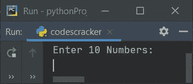
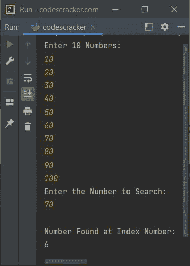
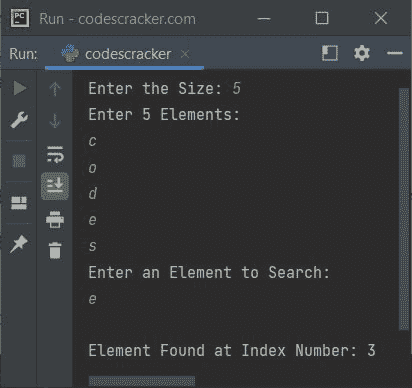
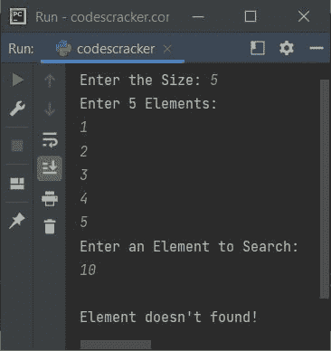
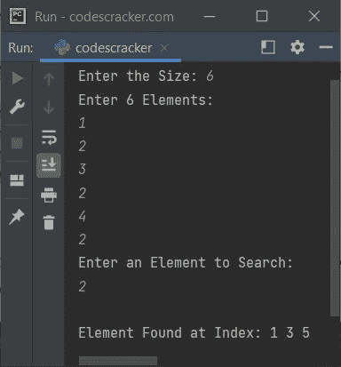

# Python 中的线性搜索程序

> 原文：<https://codescracker.com/python/program/python-linear-search.htm>

本文涵盖了 Python 中执行线性搜索的一些程序。线性搜索是搜索元素的最基本和最简单的技术。以下是线性搜索的程序列表:

*   基于用户输入的 10 个元素或数字的线性搜索
*   基于用户输入的 n 个元素的线性搜索
*   线性搜索以及重复元素

在进行下面给出的程序之前，如果你想对所使用的算法有所了解，那么参考[线性搜索算法&例子](/computer-fundamental/linear-search.htm)文章 来得到每一个需要的东西。也可以直接进行。它不会让你困惑。很简单。

## 基于 10 个元素的线性搜索

问题是，*写一个 Python 程序，对 10 个元素进行线性搜索。下面给出的程序是这个问题的答案:*

```
print("Enter 10 Numbers: ")
arr = []
for i in range(10):
  arr.insert(i, int(input()))
print("Enter the Number to Search: ")
num = int(input())
for i in range(10):
  if num==arr[i]:
    index = i
    break
print("\nNumber Found at Index Number: ")
print(index)
```

下面是它的运行示例:



现在提供输入，比如说 10，20，30，40，50，60，70，80，90，100 作为 10 个数字，然后以 **70** 作为数字来搜索并打印其索引号:



## 基于 n 元素的线性搜索

这是前一个程序的修改版本。这个程序允许用户定义列表的大小及其元素。让我们看一下程序及其示例输出，以便清楚地理解这一部分:

```
print(end="Enter the Size: ")
arrSize = int(input())
print("Enter " +str(arrSize)+ " Elements: ")
arr = []
for i in range(arrSize):
  arr.append(input())
print("Enter an Element to Search: ")
elem = input()
chk = 0
for i in range(arrSize):
  if elem==arr[i]:
    index = i
    chk = 1
    break
if chk==1:
  print("\nElement Found at Index Number: " + str(index))
else:
  print("\nElement doesn't found!")
```

以下是用户输入的示例运行，以 **5** 作为大小， **c、o、d、e、s** 作为五个元素， **e** 作为元素进行搜索:



下面是另一个运行用户输入的示例， **5** 作为大小， **1，2，3，4，5** 作为五个元素， **10** 作为要搜索的元素:



## 具有重复元素的线性搜索

这是本文的线性搜索程序列表的最后一个程序。这个程序也能找到并打印重复元素。比如有六个元素说 *1，2，3，2，4，2* 。并且用户想要从列表中搜索元素 *2* 。因为 2 表示三次。因此，这个程序打印元素的所有三个位置。

```
print(end="Enter the Size: ")
arrSize = int(input())
print("Enter " +str(arrSize)+ " Elements: ")
arr = []
for i in range(arrSize):
  arr.append(input())
print("Enter an Element to Search: ")
elem = input()
k = 0
index = []
for i in range(arrSize):
  if elem==arr[i]:
    index.insert(k, i)
    k = k+1
if k==0:
  print("\nElement doesn't found!")
else:
  if k==1:
    print("\nElement Found at Index Number: " + str(index[0]))
  else:
    print(end="\nElement Found at Index: ")
    indexLen = len(index)
    for i in range(indexLen):
      print(end=str(index[i])+" ")
    print()
```

下面是它的示例运行，使用用户输入， **6** 作为大小， **1，2，3，2，4，2** 作为六个元素，然后使用 **2** 作为 元素来查找并打印所有事件的索引号:



[Python 在线测试](/exam/showtest.php?subid=10)

* * *

* * *