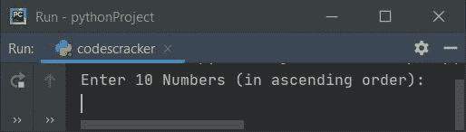
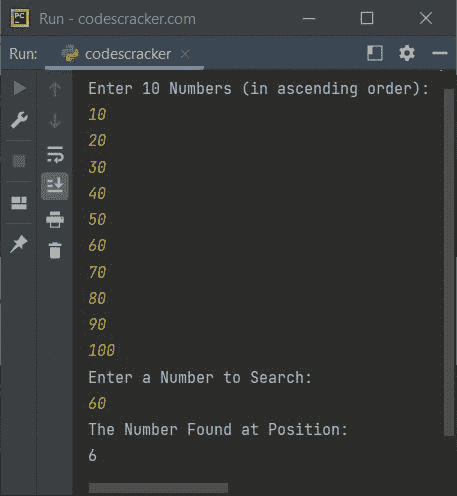
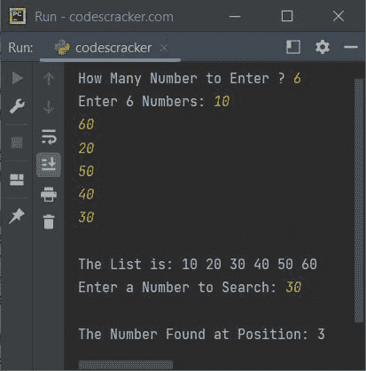
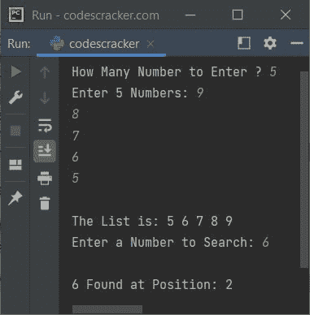

# Python 程序：二分搜索法

> 原文：<https://codescracker.com/python/program/python-binary-search.htm>

在本文中，您将学习并获得在 Python 程序中实现二分搜索法的代码。以下是二分搜索法的节目单:

*   使用有序输入列表的二分搜索法
*   具有给定大小的随机输入的二分搜索法
*   二分搜索法使用 for 循环

在浏览这些程序之前，如果你不知道这个主题，那么参考[二分搜索法逻辑和算法](/computer-fundamental/binary-search.htm)来得到所有需要的东西。

## 二分搜索法使用列表

这个程序使用二分搜索法技术搜索用户输入的数字。该程序从用户那里接收 10 个数字，然后使用二分搜索法搜索一个数字。

```
nums = []
print("Enter 10 Numbers (in ascending order):")
for i in range(10):
    nums.insert(i, int(input()))
print("Enter a Number to Search:")
search = int(input())
first = 0
last = 9
middle = (first+last)/2
middle = int(middle)
while first <= last:
    if nums[middle]<search:
        first = middle+1
    elif nums[middle]==search:
        print("The Number Found at Position:")
        print(middle+1)
        break
    else:
        last = middle-1
    middle = (first+last)/2
    middle = int(middle)
if first>last:
    print("The Number is not Found in the List")
```

下面是它的运行示例:



现在提供任意 10 个数字，比如说 **10，20，30，40，50，60，70，80，90，100** ，然后提供一个数字比如说 **60** 到 搜索。以下是使用这些输入运行的示例:



函数的作用是:返回一系列数值。它的界限取决于它的论点。例如:

```
for i in range(10):
    print(i)
```

从 0 到 9 打印十次 **i** 的值。因此 **0，1，2，3，4，5，6，7，8，9** 得到输出上打印的 。每个数字打印在新的一行。因此下面的代码(来自上面的程序):

```
for i in range(10):
```

用于执行以下语句:

```
nums.insert(i, int(input()))
```

值从 0 到 9 的十个次数。

**注意-****insert()**函数用于向列表中插入一个元素(此处为 **nums[]** )。因此 允许用户输入该值十次。所有的值都以如下方式存储在 **nums[]** 中:

*   用户输入的第一个数字存储在 **nums[i]** 或 **nums[0]** 中
*   第二个数字存储在 **nums[1]** 中
*   第三个数字存储在 **nums[2]** 中
*   依此类推，直到
*   第十个数字存储在 **nums[9]** 中

**注-** 在上述程序中，位置打印有**中间+1** 值，因为分度从 0 开始 。因此 **0 <sup>th</sup>** index 的值被称为第一个数字。

### 具有给定大小的随机用户输入的二分搜索法

这个程序类似于前两个额外的功能程序。第一个是，这个程序允许用户定义列表的大小。第二个是，这个程序不关心顺序，用户输入数据。因为，在应用二分搜索法技术搜索数字之前，我们已经实现了对列表进行排序的代码

```
nums = []
print(end="How Many Number to Enter ? ")
tot = int(input())
print(end="Enter " + str(tot) + " Numbers: ")
for i in range(tot):
    nums.insert(i, int(input()))

for i in range(tot-1):
    for j in range(tot-i-1):
        if nums[j]>nums[j+1]:
            temp = nums[j]
            nums[j] = nums[j+1]
            nums[j+1] = temp

print(end="\nThe List is: ")
for i in range(tot):
    print(end=str(nums[i]) + " ")

print(end="\nEnter a Number to Search: ")
search = int(input())
first = 0
last = tot-1
middle = int((first+last)/2)
while first <= last:
    if nums[middle]<search:
        first = middle+1
    elif nums[middle]==search:
        print("\nThe Number Found at Position: " + str(middle+1))
        break
    else:
        last = middle-1
    middle = int((first+last)/2)
if first>last:
    print("\nThe Number is not Found in the List")
```

以下是用户输入的运行示例:

*   **6** 为数字大小
*   **10，60，20，50，40，30** 为 6 个数字
*   **30** 为要搜索的号码

基于这些输入，下面是运行示例:



**注-** 输入数字的位置比如说 **30** 是基于排序列表计算的，而不是基于原始的 (无序)列表。因为二分搜索法技术适用于排序列表。

## 二分搜索法使用 for 循环

创建与上一个相同的程序，但使用*作为循环*。那么主要要改变的是:

```
while first <= last:
```

有了这个:

```
for first in range(last+1):
```

下面是在 python 中使用 **for 循环**的二分搜索法的完整程序:

```
nums = []
chk = 0
print(end="How Many Number to Enter ? ")
tot = int(input())
print(end="Enter " + str(tot) + " Numbers: ")
for i in range(tot):
    nums.insert(i, int(input()))

for i in range(tot-1):
    for j in range(tot-i-1):
        if nums[j]>nums[j+1]:
            temp = nums[j]
            nums[j] = nums[j+1]
            nums[j+1] = temp

print(end="\nThe List is: ")
for i in range(tot):
    print(end=str(nums[i]) + " ")

print(end="\nEnter a Number to Search: ")
search = int(input())
first = 0
last = tot-1
middle = int((first+last)/2)
for first in range(last+1):
    if nums[middle]<search:
        first = middle+1
    elif nums[middle]==search:
        print("\n" + str(search) + " Found at Position: " + str(middle+1))
        chk = 1
        break
    else:
        last = middle-1
    middle = int((first+last)/2)
if chk!=1:
    print("\n" + str(search) + " is Not Found in the List!")
```

下面是它的运行示例:



[Python 在线测试](/exam/showtest.php?subid=10)

* * *

* * *