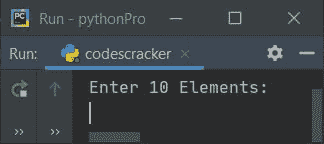
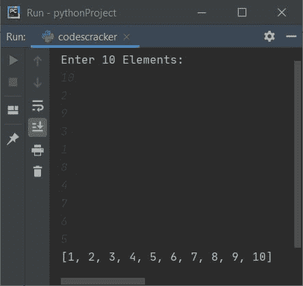
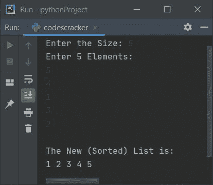
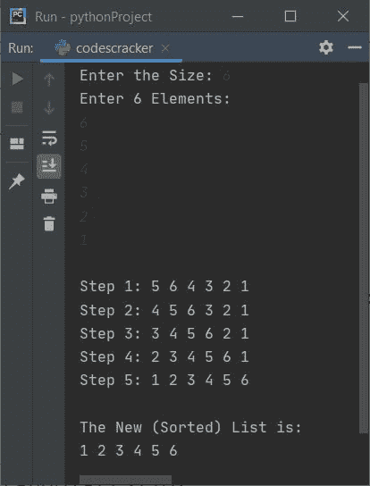

# Python 程序：插入排序

> 原文：<https://codescracker.com/python/program/python-insertion-sort.htm>

本文讨论了 Python 中的一些插入排序程序。插入排序是一种用于在 Python 中对列表进行排序的技术。如果你不知道这个题目，那么参考[插入排序算法](/computer-fundamental/insertion-sort.htm)得到每一个需要的东西。

下面是本文中可用的插入排序程序列表:

*   基于用户输入的 10 个元素列表的插入排序
*   基于 n 元素列表的插入排序
*   插入排序，并在每次排序后打印列表

## 基于 10 个元素列表的插入排序

问题是，*编写一个 Python 程序，使用插入排序技术*对列表元素进行排序。以下是它的答案:

```
arr = []
print("Enter 10 Elements: ")
for i in range(10):
  arr.append(int(input()))

for i in range(1, 10):
  elem = arr[i]
  if elem<arr[i-1]:
    for j in range(i+1):
      if elem<arr[j]:
        index = j
        for k in range(i, j, -1):
          arr[k] = arr[k-1]
        break
  else:
    continue
  arr[index] = elem

print(arr)
```

下面是上述程序示例运行的初始输出:



现在提供输入，比如说 **10，2，9，3，1，8，4，7，6，5** 作为 10 个元素对列表进行排序，并按排序后的顺序打印新列表:



### 允许用户定义列表的大小

这个程序允许用户定义列表的大小及其元素。问题是，*编写一个 python 程序，将插入排序应用于一个包含 **n** 元素*的列表。以下程序是这个问题的答案:

```
arr = []
print(end="Enter the Size: ")
arrSize = int(input())
print("Enter " +str(arrSize)+ " Elements: ")
for i in range(arrSize):
  arr.append(int(input()))

for i in range(1, arrSize):
  elem = arr[i]
  if elem<arr[i-1]:
    for j in range(i+1):
      if elem<arr[j]:
        index = j
        for k in range(i, j, -1):
          arr[k] = arr[k-1]
        break
  else:
    continue
  arr[index] = elem

print("\nThe New (Sorted) List is: ")
for i in range(arrSize):
  print(end=str(arr[i]) + " ")

print()
```

下面是用户输入的运行示例， **5** 作为大小， **5，4，1，3，2** 作为五个元素:



### 每次插入排序后打印列表

这是本文的最后一个程序。这个程序的优点是，你会在每次排序操作后看到列表。让我们看一下程序及其示例输出，以便更好地理解它:

```
nums = []
print(end="Enter the Size: ")
numsSize = int(input())
print("Enter " +str(numsSize)+ " Elements: ")
for i in range(numsSize):
  nums.append(int(input()))

for i in range(1, numsSize):
  elem = nums[i]
  if elem<nums[i-1]:
    for j in range(i+1):
      if elem<nums[j]:
        index = j
        for k in range(i, j, -1):
          nums[k] = nums[k-1]
        break
  else:
    continue
  nums[index] = elem
  print(end="\nStep " +str(i)+ ": ")
  for j in range(numsSize):
    print(end=str(nums[j]) + " ")

print("\n\nThe New (Sorted) List is: ")
for i in range(numsSize):
  print(end=str(nums[i]) + " ")

print()
```

下面是用户输入的运行示例， **6** 作为大小， **6，5，4，3，2，1** 作为六个元素:



[Python 在线测试](/exam/showtest.php?subid=10)

* * *

* * *