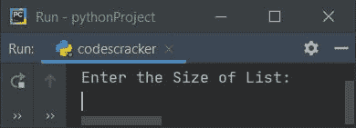
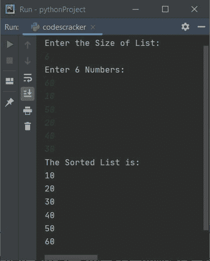
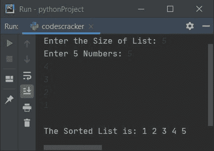

# Python 程序：冒泡排序

> 原文：<https://codescracker.com/python/program/python-bubble-sort.htm>

在本文中，您将学习并获得 Python 中的冒泡排序代码。但是在浏览关于冒泡排序的程序之前，如果你不知道它背后使用的逻辑，请参考[冒泡排序逻辑和示例](/computer-fundamental/bubble-sort.htm)来理解这个主题。

## 使用列表进行冒泡排序

这个程序使用冒泡排序技术对列表进行排序。问题是，**用 Python 写一个程序，应用 冒泡排序技术对列表进行排序。**这个问题的答案如下:

```
nums = []
print("Enter the Size of List: ")
tot = int(input())

print("Enter " + str(tot) + " Numbers: ")
for i in range(tot):
    nums.insert(i, int(input()))

for i in range(tot-1):
    for j in range(tot-i-1):
        if nums[j]>nums[j+1]:
            temp = nums[j]
            nums[j] = nums[j+1]
            nums[j+1] = temp

print("The Sorted List is:")
for i in range(tot):
    print(nums[i])
```

下面是它的运行示例:



现在提供列表的大小，比如说 **6** ，然后输入任意六个数字，比如 **60、10、50、20、40、30** ，按 `ENTER`键使用冒泡排序技术对列表进行排序，如下面给出的示例所示:



**注意-****str()**方法用于将 **int** 类型值转换为字符串类型。

**注意-****range()**返回一个数值序列。默认情况下，该值从 0 开始，以 1 为增量 。它在指定为其参数的数字之前停止。例如，下面的代码块:

```
for i in range(3):
    print(i)
```

在输出上打印 **0 1 2** 。 **print(i)** 语句的总执行次数正好是三次(值 作为 **range()** 的参数给出)。每个数字打印在新的一行。因此从上面的程序，下面的语句:

```
for i in range(tot-1):
```

用于执行以下代码块:

```
for j in range(tot-i-1):
    if nums[j]>nums[j+1]:
        temp = nums[j]
        nums[j] = nums[j+1]
        nums[j+1] = temp
```

( **tot-i-1** )次数。以类似的方式，使用回路(内部回路)的第二个*。*

 *因为在冒泡排序中，如果需要的话，每个相邻的元素都会被比较和交换。因此，在这段代码中，我们应用了冒泡排序技术来对给定的数字列表进行排序。

#### 先前程序的修改版本

这是前一个程序的修改版本。这个程序唯一增加的是 **end** ，输出 Python 中的东西。因为 **print()** 输出括号内的内容，括号以自动换行符结束。 因此，我们使用**结束**来结束括号中给出的内容。

```
nums = []
print(end="Enter the Size of List: ")
tot = int(input())

print(end="Enter " + str(tot) + " Numbers: ")
for i in range(tot):
    nums.insert(i, int(input()))

for i in range(tot-1):
    for j in range(tot-i-1):
        if nums[j]>nums[j+1]:
            temp = nums[j]
            nums[j] = nums[j+1]
            nums[j+1] = temp

print(end="\nThe Sorted List is: ")
for i in range(tot):
    print(end=str(nums[i]) + " ")
print()
```

下面是它的示例运行，用户输入的 **5** 为大小， **5，4，3，2，1** 为五个数字:



[Python 在线测试](/exam/showtest.php?subid=10)

* * *

* * **