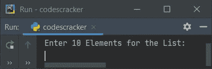
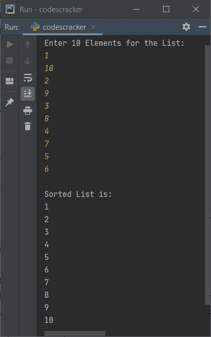
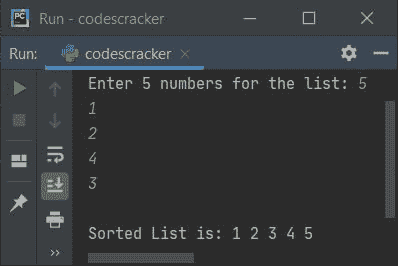
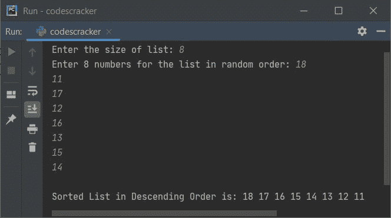

# Python 中的选择排序程序

> 原文：<https://codescracker.com/python/program/python-selection-sort.htm>

本文旨在介绍一些基于选择排序技术的 Python 程序。下面是本文涉及的程序列表:

*   基于列表中有限元素的选择排序程序
*   基于 **n** 元素的选择排序程序
*   选择排序程序，以降序排列列表元素

但在浏览这些程序之前，如果你不知道选择排序中使用的算法或技术，请参考[选择排序算法 和示例](/computer-fundamental/selection-sort.htm)以获得关于它的所有必要信息。现在让我们继续，创建这些选择排序程序。

## 选择分类程序

问题是，*写一个 Python 程序，使用选择排序对一个列表的所有元素进行排序。下面的 节目是对这个问题的回答:*

```
nums = []
print("Enter 10 Elements for the List: ")
for i in range(10):
  nums.append(int(input()))

for i in range(9):
    chk = 0
    small = nums[i]
    for j in range(i+1, 10):
        if small > nums[j]:
            small = nums[j]
            chk = chk + 1
            index = j
    if chk != 0:
        temp = nums[i]
        nums[i] = small
        nums[index] = temp

print("\nSorted List is: ")
for i in range(10):
    print(nums[i])
```

这是它的样本运行。下面给出的快照显示了上述 Python 程序产生的初始输出:



现在提供输入，比如说 **1，10，2，9，3，8，4，7，5，6** 作为列表的十个随机排序的元素，然后 按`ENTER`键使用选择排序技术将所有这些元素按升序排序。 下面给出的快照显示了上述程序在提供完全相同的输入后产生的输出:



## 基于 n 个元素的选择排序

这个程序允许用户定义列表的大小及其元素。所以我们可以说，这基本上是前一个程序的修改版本。其余的事情和之前的程序差不多。

```
nums = []
print("Enter the size of list: ", end="")
tot = int(input())
print("Enter", tot, "numbers for the list: ", end="")
for i in range(tot):
  nums.append(int(input()))

for i in range(tot-1):
    chk = 0
    small = nums[i]
    for j in range(i+1, tot):
        if small > nums[j]:
            small = nums[j]
            chk = chk + 1
            index = j
    if chk != 0:
        temp = nums[i]
        nums[i] = small
        nums[index] = temp

print("\nSorted List is: ", end="")
for i in range(tot):
    print(nums[i], end=" ")
```

以下是用户输入的示例运行，大小为 **5** ，五个元素为 **5，1，2，4，3** :



## 选择按降序排序

要使用选择排序技术对列表项进行降序排序，只需替换下面的 **if** :

```
if small > nums[j]:
```

在上面的程序中，使用选择排序技术对列表项进行升序排序，如果为以下**:**

```
if small < nums[j]:
```

正如你所看到的，只有一个小于()符号的问题，整个程序就颠倒了。以下是该程序的完整版本:

```
nums = []
print("Enter the size of list: ", end="")
tot = int(input())

print("Enter", tot, "numbers for the list in random order: ", end="")
for i in range(tot):
  nums.append(int(input()))

for i in range(tot-1):
    chk = 0
    small = nums[i]
    for j in range(i+1, tot):
        if small < nums[j]:
            small = nums[j]
            chk = chk + 1
            index = j
    if chk != 0:
        temp = nums[i]
        nums[i] = small
        nums[index] = temp

print("\nSorted List in Descending Order is: ", end="")
for i in range(tot):
    print(nums[i], end=" ")
```

以下是用户输入的示例运行，大小为 **8** ，八个元素或数字为 **18，11，17，12，16，13，15，14** :



[Python 在线测试](/exam/showtest.php?subid=10)

* * *

* * *