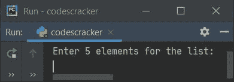
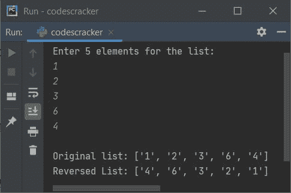
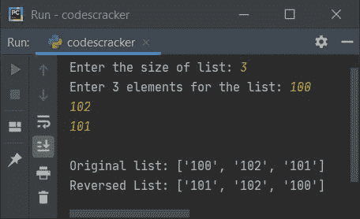
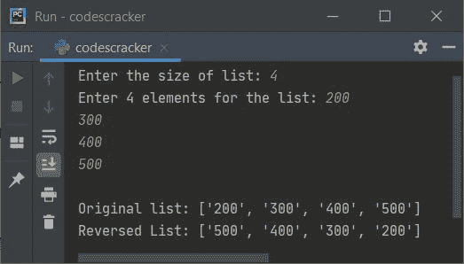

# Python 程序反转一个列表

> 原文：<https://codescracker.com/python/program/python-reverse-a-list.htm>

这篇文章介绍了 Python 中的一些程序，这些程序可以反转用户给定的列表。下面是本文涉及的程序列表:

*   查找并打印列表的背面
*   反转一列 **n** 元素
*   使用逐个元素初始化反转列表

## 查找并打印列表的背面

问题是，*写一个 Python 程序来查找并打印一个列表的逆向。列表中的项目必须是用户在运行时提供的 。*这个问题的答案是下面给出的程序:

```
mylist = list()
print("Enter 5 elements for the list: ")
for i in range(5):
    mylist.append(input())

print("\nOriginal list:", mylist)

revlist = mylist[::-1]
print("Reversed List:", revlist)
```

这是它的样本运行。下面给出的快照显示了上述 Python 程序产生的初始输出:



现在提供输入，比如说 **1、2、3、6、4** 作为五个元素，按`ENTER`键 查找并打印给定列表的反面，如下图所示:



## 反转 n 个元素的列表

基本上这是前一个程序的修改版本。因为这个程序让用户在运行时定义列表的大小。其余的事情与前面的程序相似。

```
mylist = list()
print("Enter the size of list: ", end="")
tot = int(input())
print("Enter", tot, "elements for the list: ", end="")
for i in range(tot):
    mylist.append(input())

print("\nOriginal list:", mylist)

revlist = mylist[::-1]
print("Reversed List:", revlist)
```

以下是用户输入的示例运行，大小为 **3** ，三个元素为 **100、102、101** :



### 使用逐个元素初始化反转列表

这个程序使用另一个列表来初始化原始列表中从最后一个索引到第零个索引的元素。这样，新列表包含原始列表项，但顺序相反，如下面给出的程序所示:

```
mylist = list()

print("Enter the size of list: ", end="")
tot = int(input())
print("Enter", tot, "elements for the list: ", end="")
for i in range(tot):
    mylist.append(input())

print("\nOriginal list:", mylist)

revlist = list()
for i in range(tot-1, -1, -1):
    revlist.append(mylist[i])

print("Reversed List:", revlist)
```

以下是用户输入的示例运行，大小为 **4** ，四个元素为 **200、300、400、500** :



[Python 在线测试](/exam/showtest.php?subid=10)

* * *

* * *