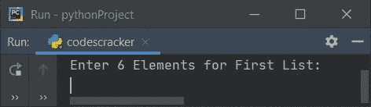
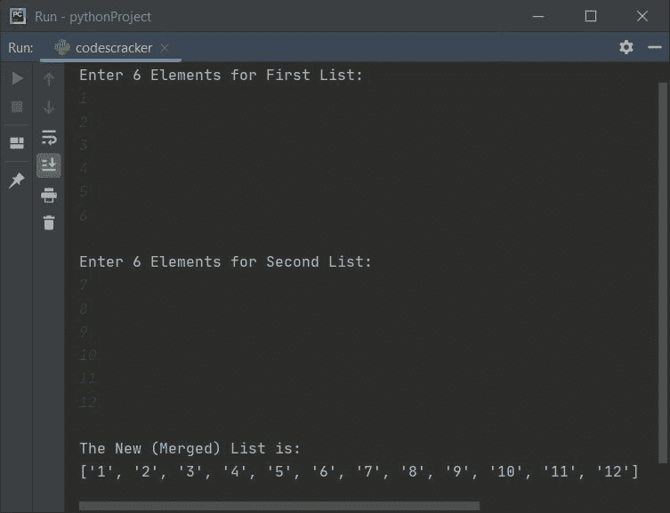
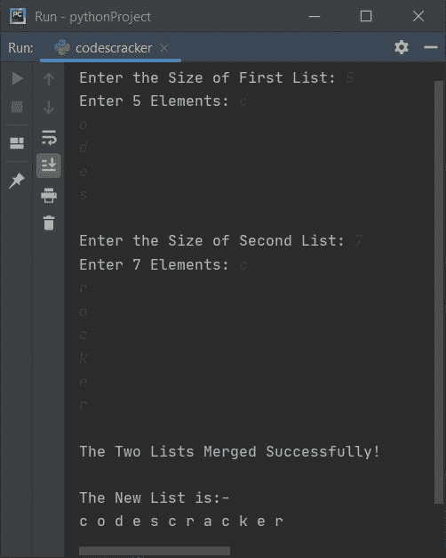
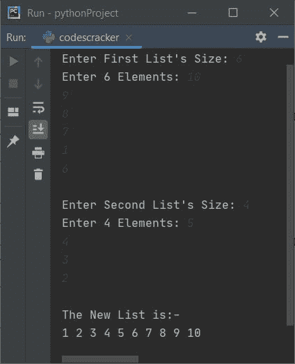
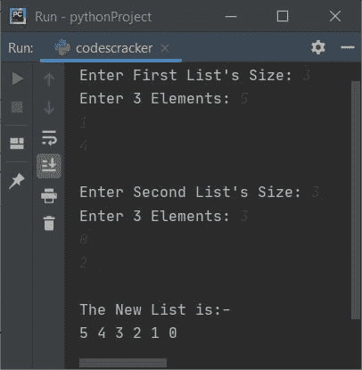

# Python 程序：合并两个列表

> 原文：<https://codescracker.com/python/program/python-merge-two-lists.htm>

创建这篇文章是为了介绍 Python 中以不同方式合并两个列表的一些程序。下面是本文中关于合并两个列表的程序列表:

*   合并两个 6-6 个元素的列表
*   合并两个给定元素大小的列表
*   按升序合并两个列表
*   按降序合并两个列表

## 合并两个相等元素的列表

问题是，*编写一个 Python 程序，合并用户*输入的两个列表。下面是它的答案。 这个程序接收两个列表的 6-6 个元素，然后将列表合并成第三个。让我们来看一下这个程序及其示例运行:

```
listOne = []
listTwo = []

print("Enter 6 Elements for First List: ")
for i in range(6):
  listOne.append(input())
print("\nEnter 6 Elements for Second List: ")
for i in range(6):
  listTwo.append(input())

listThree = []
for i in range(6):
  listThree.append(listOne[i])
for i in range(6):
  listThree.append(listTwo[i])

print("\nThe New (Merged) List is: ")
print(listThree)
```

以下是该程序产生的初始输出:



现在提供输入，比如说第一个列表的六个元素为 **1，2，3，4，5，6** ，第二个列表的六个元素为 **7，8，9，10，11，12** ，合并这两个列表并打印新的合并列表，如下所示:



## 合并两个给定元素大小的列表

这个程序类似于前一个，但有一些额外的功能，如，用户可以在输入元素之前定义两个列表的大小。另外， **end=** 用于跳过使用 **print()** 插入自动 换行符，而 **str()** 将任何值转换为字符串类型。

```
one = []
two = []

print(end="Enter the Size of First List: ")
oneSize = int(input())
print(end="Enter " +str(oneSize)+ " Elements: ")
for i in range(oneSize):
  one.append(input())

print(end="\nEnter the Size of Second List: ")
twoSize = int(input())
print(end="Enter " +str(twoSize)+ " Elements: ")
for i in range(twoSize):
  two.append(input())

three = one+two
threeSize = len(three)

print("\nThe Two Lists Merged Successfully!")
print("\nThe New List is:-")
for i in range(threeSize):
  print(end=three[i] + " ")
print()
```

下面是用户输入的运行示例， **5** 作为第一个列表的大小，然后 **c，o，d，e，s** 作为第一个列表的五个元素 ，现在 **7** 作为大小，然后 **c，r，a，c，k，e，r** 作为第二个列表的七个元素:



## 合并两个列表并排序

要合并两个列表，并在输出时打印最终的合并列表之前对其进行排序，只需以这种方式使用 **sort()** 方法:

```
three.sort()
```

在打印元素列表之前，**三个**。

## 按升序合并两个列表

这个程序合并两个列表，然后在打印合并列表的元素之前按升序对列表进行排序，使用如上所述的 **sort()** 方法:

```
one = []
two = []

print(end="Enter First List's Size: ")
oneSize = int(input())
print(end="Enter " +str(oneSize)+ " Elements: ")
for i in range(oneSize):
  one.append(input())

print(end="\nEnter Second List's Size: ")
twoSize = int(input())
print(end="Enter " +str(twoSize)+ " Elements: ")
for i in range(twoSize):
  two.append(input())

three = one+two
threeSize = len(three)
three.sort()

print("\nThe New List is:-")
for i in range(threeSize):
  print(end=str(three[i]) + " ")
print()
```

以下是用户输入的运行示例， **6** 作为大小， **10，9，8，7，1，6** 作为第一个 列表的六个元素， **4** 作为大小， **5，4，3，2** 作为第二个列表的四个元素:



### 按降序合并两个列表

要按降序合并两个列表，只需在使用 **reverse()** 方法排序后反转列表即可。以下是该程序的完整版本:

```
listOne = list()
listTwo = list()

print(end="Enter First List's Size: ")
listOneSize = int(input())
print(end="Enter " + str(listOneSize) + " Elements: ")
for i in range(listOneSize):
  listOne.append(input())

print(end="\nEnter Second List's Size: ")
listTwoSize = int(input())
print(end="Enter " + str(listTwoSize) + " Elements: ")
for i in range(listTwoSize):
  listTwo.append(input())

listThree = listOne + listTwo
listThreeSize = len(listThree)
listThree.sort()
listThree.reverse()

print("\nThe New List is:-")
for i in range(listThreeSize):
  print(end=str(listThree[i]) + " ")
print()
```

以下是用户输入的运行示例， **3** 作为大小， **5，1，4** 作为第一个列表的元素，**3**T8】作为大小， **3，0，2** 作为第二个列表的元素:



[Python 在线测试](/exam/showtest.php?subid=10)

* * *

* * *