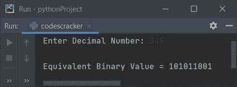

# Python 程序：将十进制转换为二进制

> 原文：<https://codescracker.com/python/program/python-program-convert-decimal-to-binary.htm>

在本文中，我们用 Python 创建了一些程序，将十进制数转换成等价的二进制值。十进制数必须由用户在运行时输入。以下是程序列表:

*   使用**列表**将十进制转换为二进制
*   不使用**列表**
*   使用**功能**
*   使用**类**
*   使用 **bin()**
*   十进制到二进制转换的最短 Python 代码

**注意-** 在创建这些程序之前，如果你不知道用于转换的步骤，那么参考 到[十进制到二进制的公式和步骤](/computer-fundamental/decimal-to-binary.htm)来获得关于该主题的每一个需要的 东西。

## 使用列表将十进制转换为二进制

要在 Python 中将十进制数转换为二进制数，您必须要求用户在十进制数系统中输入一个数，然后将该数转换为二进制数，如下面给出的程序所示:

```
print("Enter the Decimal Number: ")
dnum = int(input())
i = 0
bnum = []
while dnum!=0:
    rem = dnum%2
    bnum.insert(i, rem)
    i = i+1
    dnum = int(dnum/2)

i = i-1
print("\nEquivalent Binary Value is:")
while i>=0:
    print(end=str(bnum[i]))
    i = i-1
print()
```

下面是它的运行示例:


现在输入十进制数字系统中的任意数字，比如 50，然后按`ENTER`键转换并打印其在二进制数字系统中的 等效值，如下图所示:


用户输入 **50** 的上述程序的试运行如下:

*   初始值， **dnum=50** (用户输入)， **i=0**
*   现在的条件**而循环****dnum！=0** 或 **50！=0** 评估为真，因此程序 流程进入循环内部
*   **dnum%2** 或 **50%2** 或 **0** 被初始化为 **rem**
*   使用下面的语句
    `bnum.insert(i, rem)`
    **rem**的值被初始化为 **bnum[i]** 。因此 **rem** 或 **0** 被初始化为 **bnum[I]**或 **bnum[0]**
*   **i+1** 或 **0+1** 或 **1** 被初始化为 **i**
*   **int(dnum/2)** 或 **int(50/2)** 或 **25** 被初始化为 **dnum** 的新值
*   现在程序流程返回并评估**的条件，同时再次循环**。也就是条件 **dnum！=0** 或 **25！=0** 再次评估为真，因此程序流再次进入循环，并且 评估其主体的所有四个语句
*   这个过程继续，直到条件评估为假
*   在条件评估为 false 之前，以下是每次评估循环后的值列表:
*   首次执行时:
    *   rem = 0
    *   bnum[0] = 0
    *   i = 1
    *   dnum = 25
*   第二次执行时:
    *   rem = 1
    *   bnum[0] = 1
    *   i = 2
    *   dnum = 12
*   第三次执行时:
    *   rem = 0
    *   bnum[0] = 0
    *   i = 3
    *   dnum = 6
*   第四次执行时:
    *   rem = 0
    *   bnum[0] = 0
    *   i = 4
    *   dnum = 3
*   第五次执行时:
    *   rem = 1
    *   bnum[0] = 1
    *   i = 5
    *   dnum = 1
*   在第六次执行时:
    *   rem = 1
    *   bnum[0] = 1
    *   i = 6
    *   dnum = 0
*   这样，列表 **bnum[]** 的值为:
    *   bnum[0] = 0
    *   bnum[1] = 1
    *   bnum[2] = 0
    *   bnum[3] = 0
    *   bnum[4] = 1
    *   bnum[5] = 1
*   现在打印 **bnum[]** 列表从最后一个到第 **0 <sup>个</sup>T5 个索引的值。**
*   因此，给定十进制数(50)的二进制等效值为 **110010**

#### 先前程序的修改版本

这是前一个程序的修改版本。 **end=** 用于使用 **print()** 跳过自动 换行符的打印。 **str()** 方法用于将任何类型的值转换为字符串类型。

```
print("Enter Decimal Number: ", end="")
d = int(input())
i = 0
b = []
while d!=0:
    b.insert(i, d % 2)
    i = i+1
    d = int(d / 2)

i = i-1
print(end="\nEquivalent Binary Value = ")
while i>=0:
    print(end=str(b[i]))
    i = i-1
print()
```

以下是用户输入的运行示例， **105** 作为十进制数:


## 无列表的十进制到二进制

这个程序做的工作和前面的程序一样，但是没有使用 list。你可以试着用自己的方式更好地理解它:

```
print("Enter Decimal Number: ", end="")
dnum = int(input())

bnum = 0
mul = 1
while dnum>0:
    rem = dnum%2
    bnum = bnum+(rem*mul)
    mul = mul*10
    dnum = int(dnum/2)

print("\nEquivalent Binary Value =", bnum)
```

以下是用户输入的示例运行， **345** 作为十进制数输入:



## 使用函数将十进制转换为二进制

这个程序使用一个名为 **DecToBin()** 的用户定义函数，该函数接收一个数字作为其参数，并返回 其等价的二进制值。因此，我们将用户输入的十进制数传递给这个函数，这样 的返回值被初始化为 **bnum** 。此变量的值在运行时作为用户给定十进制数的二进制等效值打印在输出上:

```
def DecToBin(d):
    b = 0
    m = 1
    while d>0:
        b = b + ((d%2)*m)
        m = m*10
        d = int(d/2)
    return b

print("Enter Decimal Number: ", end="")
dnum = int(input())

bnum = DecToBin(dnum)
print("\nEquivalent Binary Value =", bnum)
```

这个程序产生与前一个程序相同的输出。

## 使用类将十进制转换为二进制

这是最后一个程序，使用名为 **CodesCracker** 的类创建。类是 Python 的面向对象特性。要访问类的成员函数，我们必须先创建一个对象

因此名为 **ob** 的对象被创建到 **CodesCracker** 类中。这样，我们可以使用**点(.)**操作员做这项工作。其余的事情类似于一个正常的功能。

```
class CodesCracker:
    def DecToBin(self, d):
        b = 0
        m = 1
        while d>0:
            b = b + ((d%2)*m)
            m = m*10
            d = int(d/2)
        return b

print("Enter Decimal Number: ", end="")
dnum = int(input())

ob = CodesCracker()
bnum = ob.DecToBin(dnum)
print("\nEquivalent Binary Value =", bnum)
```

## 使用 bin()将十进制转换为二进制

这是一个使用 **bin()** 的程序，这是 Python 的一个预定义函数，用来完成与之前的程序 相同的工作。 **bin()** 函数返回作为其参数传递的值的二进制等效值。

```
print("Enter Decimal Number: ", end="")
dnum = int(input())

bnum = bin(dnum)
print("\nEquivalent Binary Value =", bnum)
```

下面是用户输入的示例运行， **49** :


**注意-** 要删除前两个字符，在打印其值 时，在 **bnum** 之后添加 **[2:]** ，以打印其从第二个索引开始的所有元素。或者只替换下面的语句:

```
print("\nEquivalent Binary Value =", bnum)
```

下面给出了声明:

```
print("\nEquivalent Binary Value =", bnum[2:])
```

现在，具有相同用户输入的输出，即 **49** 看起来像:


### 十进制到二进制转换的最短 Python 代码

这是最短的十进制到二进制转换的 Python 代码。这个程序不打印任何信息。该程序接收用户的输入，并打印它的二进制等价物，而不像以前的程序那样有任何额外的东西:

```
dnum = int(input())
print(bin(dnum)[2:])
```

下面是它在用户输入 **59** 下的运行示例:


#### 其他语言的相同程序

*   [Java 将十进制转换成二进制](/java/program/java-program-convert-decimal-to-binary.htm)
*   [C 将十进制转换成二进制](/c/program/c-program-convert-decimal-to-binary.htm)
*   [C++将十进制转换成二进制](/cpp/program/cpp-program-convert-decimal-to-binary.htm)

[Python 在线测试](/exam/showtest.php?subid=10)

* * *

* * *