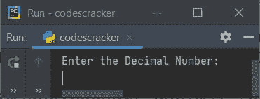
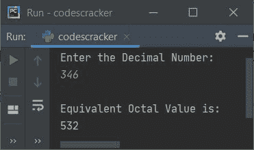
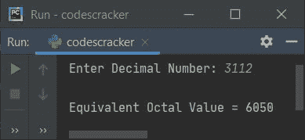
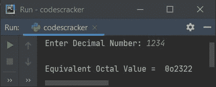
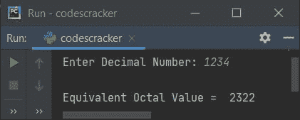

# Python 程序：将十进制转换为八进制

> 原文：<https://codescracker.com/python/program/python-program-convert-decimal-to-octal.htm>

创建这篇文章是为了介绍 Python 中的一些程序，将用户在运行时输入的十进制数转换成等价的八进制值。以下是程序列表:

*   使用**列表**和**将十进制转换为八进制，同时循环**
*   使用 **oct()** 方法
*   使用**功能**
*   使用**类**

**注意-** 在创建这些程序之前，如果你不知道用于转换的步骤，那么参考 [十进制到八进制的转换步骤和示例](/computer-fundamental/decimal-to-octal.htm)以获得关于该主题的每个 所需的东西。

## 使用列表和`while`循环将十进制转换为八进制

要在 Python 中将十进制数转换为八进制数，您必须要求用户输入十进制数，然后将该数转换为八进制数的等值，如下面给出的程序所示。问题是，**写一个 Python 程序，用 list 和`while`循环**把十进制转换成八进制。以下是它的答案:

```
print("Enter the Decimal Number: ")
decnum = int(input())

i = 0
octnum = []
while decnum!=0:
    rem = decnum%8
    octnum.insert(i, rem)
    i = i+1
    decnum = int(decnum/8)

print("\nEquivalent Octal Value is: ")
i = i-1
while i>=0:
    print(octnum[i], end="")
    i = i-1
print()
```

下面是它的运行示例:



现在提供输入，比如说 **346** 作为十进制数，然后按`ENTER`键转换并打印 其等价的八进制值，如下图所示:



用户输入 **346** 的上述程序的试运行如下:

*   初始值， **decnum=346** (用户输入)， **i=0**
*   循环时的条件****decnum！=0** 或者 **346！=0** 评估为真，因此程序 流程进入循环内部**
***   **decnum%8** 或 **346%8** 或 **2** 被初始化为 **rem***   并使用以下语句:
    `octnum.insert(i, rem)`
    **rem**的值被初始化为 **octnum[i]** 。所以 **octnum[i]** 或者 **octnum[0] = 2***   **i+1** 或 **0+1** 或 **1** 被初始化为 **i***   **int(decnum/8)** 或 **int(346/8)** 或 **43** 被初始化为 **decnum***   循环的条件**再次用 **decnum** 的新值进行评估***   也就是条件 **decnum！=0** 或 **43！=0** 再次评估为真，因此程序流 进入循环内部。这个过程一直持续到条件评估为假*   这样，列表 **octnum** 在运行时保存用户给定十进制数的等价八进制值*   退出循环后，递减 **i** 的值。因为在 **`while`循环** 的条件评估为假之前， **i** 的值被递增*   现在打印 **octnum[]** 列表，从其最后一个索引到第 **0 个<sup>第</sup>个**个索引一一列出**

 **#### 先前程序的修改版本

这是前一个程序的修改版本。这个程序使用 **end=** 来跳过使用 **print()** 自动换行的打印

```
print("Enter Decimal Number: ", end="")
dnum = int(input())

i = 0
onum = []
while dnum!=0:
    onum.insert(i, dnum % 8)
    i = i+1
    dnum = int(dnum / 8)

print("\nEquivalent Octal Value = ", end="")
i = i-1
while i>=0:
    print(onum[i], end="")
    i = i-1

print()
```

以下是用户输入 **3112** 作为十进制数输入的运行示例:



## 使用 oct()将十进制转换为八进制

方法 **oct()** 返回作为其参数传递的八进制等值值。

```
print("Enter Decimal Number: ", end="")
dnum = int(input())

onum = oct(dnum)
print("\nEquivalent Octal Value = ", onum)
```

下面是它的示例运行，十进制数输入为 **1234** :



**注-** 要跳过八进制数输出的前两个字符，打印时在 **onum** 后加上**【2:】**。 即替换以下语句(来自上述程序):

```
print("\nEquivalent Octal Value = ", onum)
```

下面给出了声明:

```
print("\nEquivalent Octal Value = ", onum[2:])
```

现在输出看起来像这样:



## 使用函数将十进制转换为八进制

这个程序是使用用户定义的和预定义的函数创建的。名为 **DecToOct()** 的用户定义函数接收一个值作为其参数，并使用 **oct()** 方法返回其八进制等效值。

```
def DecToOct(d):
    return oct(d)

print("Enter Decimal Number: ", end="")
dnum = int(input())

onum = DecToOct(dnum)
print("\nEquivalent Octal Value =", onum[2:])
```

使用以下语句:

```
onum = DecToOct(dnum)
```

**dnum** 变量的值(存储用户输入的十进制数)被传递给 **DecToOct()** 函数。 这个函数返回其等价的八进制值。因此这个值(八进制)被返回并初始化为 **onum** 变量。现在将 **onum** 变量的值打印为给定十进制数的八进制等效值。

## 使用类将十进制转换为八进制

这个程序是使用 class 创建的，class 是 Python 的一个面向对象的特性。也就是用名为 **DecToOct()** 的成员函数创建了一个名为 **CodesCracker** 的类。要访问类的成员函数，可以使用类 的对象。因此，名为 **obj** 的对象被创建到类 **CodesCracker** 中，以使用**点(.)**运算符。

```
class CodesCracker:
    def DecToOct(self, d):
        return oct(d)

print("Enter Decimal Number: ", end="")
dnum = int(input())

obj = CodesCracker()
onum = obj.DecToOct(dnum)
print("\nEquivalent Octal Value =", onum[2:])
```

#### 其他语言的相同程序

*   [Java 将十进制转换成八进制](/java/program/java-program-convert-decimal-to-octal.htm)
*   [C 将十进制转换成八进制](/c/program/c-program-convert-decimal-to-octal.htm)
*   [C++ 将十进制转换成八进制](/cpp/program/cpp-program-convert-decimal-to-octal.htm)

[Python 在线测试](/exam/showtest.php?subid=10)

* * *

* * ***