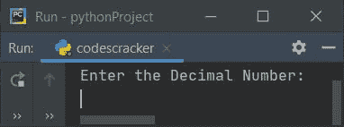
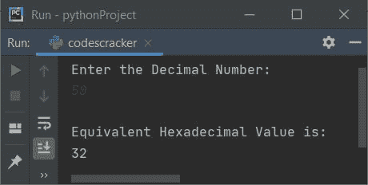
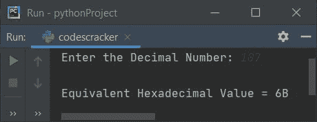
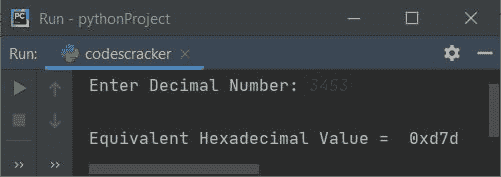
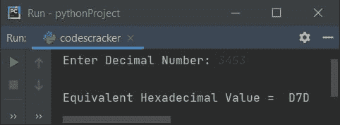
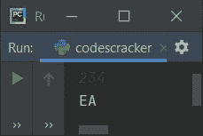

# Python 程序：将十进制转换为十六进制

> 原文：<https://codescracker.com/python/program/python-program-convert-decimal-to-hexadecimal.htm>

在本文中，我们用 Python 创建了一些程序，将用户在运行时输入的十进制数转换成等价的十六进制值。以下是程序列表:

*   使用**将十进制转换为十六进制，同时循环**和**列表**
*   使用 **int()** 和 **hex()** 方法
*   使用用户定义的函数
*   使用类
*   十进制到十六进制转换的最短 Python 代码

**注意-** 在创建这些程序之前，如果你不清楚用于转换的步骤，那么参考 [十进制到十六进制的转换步骤和例子](/computer-fundamental/decimal-to-hexadecimal.htm)来得到每一个需要的东西。

## 使用 while 循环和列表将十进制转换为十六进制

要在 Python 中将十进制数转换为十六进制数，您必须要求用户输入十进制数系统中的一个数，然后将其转换为等效的十六进制值，如下面给出的程序所示:

```
print("Enter the Decimal Number: ")
decnum = int(input())

i = 0
hexdecnum = []
while decnum!=0:
    rem = decnum % 16
    if rem<10:
        rem = rem+48
    else:
        rem = rem+55
    rem = chr(rem)
    hexdecnum.insert(i, rem)
    i = i+1
    decnum = int(decnum / 16)

print("\nEquivalent Hexadecimal Value is: ")
i = i-1
while i>=0:
    print(end=hexdecnum[i])
    i = i-1
print()
```

下面是它的运行示例:



现在输入十进制数，如 **50** ，按`ENTER`键转换并打印十六进制的 等效值，如下图所示:



使用用户输入 **50** 对上述程序进行试运行，如下所示:

*   初始值， **decnum=50** (用户输入)， **i=0**
*   循环时的条件****decnum！=0** 或 **50！=0** 评估为真，因此程序 流程进入循环内部**
***   **decnum%16** 或 **50%16** 或 **2** 被初始化为 **rem***   现在(如果 ) **rem < 10** 或 **2 < 10** 的条件评估为真，因此如果的主体和 **rem+48** 或 **2+48** 被初始化为 **rem** ，程序 流程进入**内部。现在 **rem = 50**。 **50** 是字符 **2** 的 ASCII 码***   现在 **chr(rem)** 或 **chr(50)** 或**‘2’**被初始化为 **rem** 。 **chr()** 方法是 用于将一个值转换为字符类型值。*   现在使用下面的语句:
    `hexdecnum.insert(i, rem)`
    **rem**的值在第 **i <sup>th</sup>** 索引处被初始化为 **hexdecnum** 。也就是说， **rem** 或 T13】2 被初始化为 **hexdecnum[i]** 或 **hexdecnum[0]***   **i+1** 或 **0+1** 或 **1** 被初始化为 **i***   **int(decnum/16)** 或 **int(50/16)** 或 **3** 被初始化为 **decnum***   现在程序流程返回并评估**的条件，同时用 **decnum**的新值再次循环**。那就是， **decnum！=0** 或 **3！=0** 再次评估为真，因此程序进入 循环。这个过程一直持续到条件评估为假*   这样，我们就将用户输入十进制数转换成了相应的十六进制值*   退出循环后，从最后一个索引开始打印 list 的元素， **hexdecnum[]** 。**

 **#### 先前程序的修改版本

这是前一个程序的修改版本。在这个程序中， **end=** 用于跳过使用 **print()** 打印一个 自动换行符。

```
print("Enter the Decimal Number: ", end="")
dn = int(input())

i = 0
hdn = []

while dn!=0:
    rem = dn % 16
    if rem<10:
        rem = rem+48
    else:
        rem = rem+55
    hdn.insert(i, chr(rem))
    i = i+1
    dn = int(dn / 16)

print("\nEquivalent Hexadecimal Value = ", end="")
i = i-1
while i>=0:
    print(end=hdn[i])
    i = i-1

print()
```

下面是它的示例运行，十进制数输入为 **107** :



## 使用 int()和 hex()将十进制转换为十六进制

这个程序使用了 **int()** 和 **hex()** ，这是 Python 语言中预定义的将十进制数转换成十六进制数的方法。

```
print("Enter Decimal Number: ", end="")
dn = input()

hdn = int(dn)
hdn = hex(hdn)

print("\nEquivalent Hexadecimal Value = ", hdn)
```

以下是用户输入的示例运行，十进制数为 **3453** :



**注意-** 跳过十六进制输出的前两个字符。并且还将所有的十六进制数字都大写， 替换下面的语句:

```
print("\nEquivalent Hexadecimal Value = ", hdn)
```

下面给出了声明:

```
print("\nEquivalent Hexadecimal Value = ", hdn[2:].upper())
```

现在，替换上述程序中的语句后的输出如下所示:



在接收输入时，默认情况下，输入类型被视为字符串类型值。因此，我们使用 **int()** 将输入的值转换为整数类型的值，然后使用 **hex()** 方法，整数 (十进制数)被转换为十六进制值。

**注意-****hex()**方法返回作为参数传递的一个数字的等价十六进制值。

## 使用函数将十进制转换为十六进制

这个程序是使用名为 **DecToHex()** 的用户定义函数创建的。该函数将一个数字作为 参数，并返回其等价的十六进制值。

```
def DecToHex(d):
    h = int(d)
    return hex(h)

print("Enter Decimal Number: ", end="")
dn = input()

hdn = DecToHex(dn)
print("\nEquivalent Hexadecimal Value = ", hdn[2:].upper())
```

这个程序产生与前一个程序相同的输出。

## 使用类将十进制转换为十六进制

这是使用 Python 的面向对象特性**类**创建的最后一个程序。这个程序中的 这个类的名字是 **CodesCracker**

```
class CodesCracker:
    def DecToHex(self, d):
        h = int(d)
        return hex(h)

print("Enter Decimal Number: ", end="")
dn = input()

ob = CodesCracker()
hdn = ob.DecToHex(dn)
print("\nEquivalent Hexadecimal Value = ", hdn[2:].upper())
```

因为在 Python 中要访问类的任何成员函数，我们必须创建和使用类的对象。因此名为 **ob** 的对象被创建到 **CodesCracker** 类中。使用这个对象，我们访问了名为 **DecToHex()** 的 **CodesCracker** 类的成员 函数，使用了**点(。)**运算符。

### 十进制到十六进制转换的最短 Python 代码

这是 Python 中最短的代码，将十进制数转换为十六进制数:

```
dn = input()
print(hex(int(dn))[2:].upper())
```

以下是使用 **234** 作为十进制数输入的示例运行:



#### 其他语言的相同程序

*   [Java 将十进制转换成十六进制](/java/program/java-program-convert-decimal-to-hexadecimal.htm)
*   [C 将十进制转换成十六进制](/c/program/c-program-convert-decimal-to-hexadecimal.htm)
*   [C++ 将十进制转换成十六进制](/cpp/program/cpp-program-convert-decimal-to-hexadecimal.htm)

[Python 在线测试](/exam/showtest.php?subid=10)

* * *

* * ***