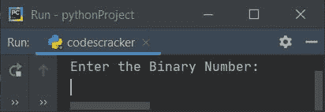
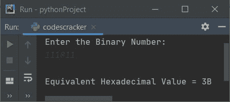
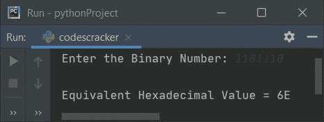
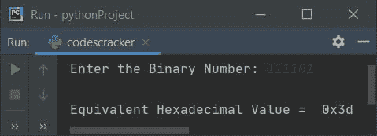
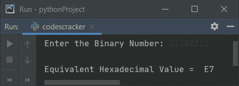

# Python 程序：将二进制转换为十六进制

> 原文：<https://codescracker.com/python/program/python-program-convert-binary-to-hexadecimal.htm>

在这篇文章中，我们用 Python 创建了一些程序，将用户输入的任何二进制数转换成等价的十六进制值。以下是程序列表:

*   使用用户定义的代码将二进制转换为十六进制
*   使用 **int()** 和 **hex()** 方法将二进制转换为十六进制

**注意-** 在创建这些程序之前，如果你不知道一些用于转换的步骤，参考 [二进制到十六进制的转换步骤和公式](/computer-fundamental/binary-to-hexadecimal.htm)就可以得到所有需要的东西。

## 使用用户定义的代码将二进制转换为十六进制

在 Python 中，要将二进制数转换成十六进制数，你必须让用户输入一个二进制数，然后将这个数转换成十六进制数，如下面给出的程序所示。

问题是，**写一个 Python 程序，用`while`循环**把二进制转换成十六进制。以下是它的答案:

```
print("Enter the Binary Number: ")
bnum = int(input())

hex = 0
mul = 1
chk = 1
i = 0
hnum = []
while bnum!=0:
    rem = bnum%10
    hex = hex + (rem*mul)
    if chk%4==0:
        if hex<10:
            hex = hex+48
            val = chr(hex)
            hnum.insert(i, val)
        else:
            hex = hex+55
            val = chr(hex)
            hnum.insert(i, val)
        mul = 1
        hex = 0
        chk = 1
        i = i+1
    else:
        mul = mul*2
        chk = chk+1
    bnum = int(bnum/10)

if chk!=1:
    hex = hex+48
    val = chr(hex)
    hnum.insert(i, val)
if chk==1:
    i = i-1

print("\nEquivalent Hexadecimal Value = ", end="")
while i>=0:
    print(end=hnum[i])
    i = i-1
print()
```

下面是这个 Python 程序产生的初始输出:



现在提供输入，比如说 **111011** ，并按`ENTER`键将其转换为等效的 十六进制值，并在输出上打印该十六进制值，如下图所示:



**注意-****chr()**方法用于返回作为其参数指定的 Unicode 的等价字符。

**insert()** 方法用于向列表中插入一个元素。因此有如下说法:

```
hnum.insert(i, val)
```

可以被视为:

```
hnum[i] = val
```

也就是说， **val** 变量的值被初始化为 **hnum** 列表的**I<sup>th</sup>T5】索引。**

用户输入 **111011** 的上述程序的试运行如下:

*   初始值， **bnum=111011** (用户输入)， **hex=0** ， **mul=1** ， **chk=1** ， **i=0**
*   循环时的条件***bnum！=0** 或者 **111011！=0** 评估为真，因此程序 流程进入循环内部*
**   在循环内部，第一条语句，即:
    `rem = bnum%10`
    被执行*   因此 **bnum%10** 或 **111011%10** 或 **1** 被初始化为 **rem***   **十六进制+ (rem*mul)** 或 **0 + (1*1)** 或 **1** 被初始化为**十六进制***   (如果 ) **chk%4==0** 或 **1%4==0** 的条件评估为假，因此程序流 不进入该 **if** 的块，而是进入其 **else** 的部分*   并且 **mul*2** 或 **1*2** 或 **2** 被初始化为 **mul** 。所以 **mul=2***   **chk+1** 或 **1+1** 或 **2** 被初始化为 **chk** 。所以 **chk=2***   最后， **int(bnum/10)** 或 **int(111011/10)** 或 **11101** 被初始化为 **bnum***   循环时的条件***bnum！=0** 再次用新的值 **bnum** 进行评估。那个 就是， **bnum！=0** 或 **11101！=0** 再次评估为真，因此程序流再次进入循环 内部。这个过程继续，直到条件评估为假***   通过这种方式，用户输入的二进制数被转换成相应的十六进制值**

 **条件:

```
if chk%4==0:
```

用于检查四对二进制数字，将其转换为等效的十六进制数字。

条件是:

```
if hex<10:
```

用于检查等效的十六进制数字是否小于 10。也就是说，如果是 10，11，12，..., 15.然后我们要存储 A，B，C，...，F 代替这些。

例如，如果十六进制数字是 **12** ，那么条件**十六进制< 10** 的计算结果为假，因此它的 **else** 的对应项被执行。代替 **12** ，我们必须存储 **C** 。因此 **C** 通过下面的代码块获得 存储:

```
hex = hex+55
val = chr(hex)
hnum.insert(i, val)
```

由于**十六进制=12** ，因此**十六进制+55** 或 **12+55** 或 **67** 被初始化为**十六进制**。而 **chr(hex)** 返回对应的等于指定为其参数的 Unicode 的字符，即 **hex** ， **67** 的 值。因为 67 是 **C** 的 ASCII 值。因此 **val = C** 。并且 **val** 的值被初始化为 **hnum** 的**I<sup>th</sup>T25】index。**

#### 先前程序的修改版本

这个程序是前一个程序的修改版本。 **end=** 用于使用 **print()** 跳过自动换行的打印。

```
print("Enter the Binary Number: ", end="")
bnum = int(input())

hex = 0
mul = 1
chk = 1
i = 0
hnum = []
while bnum!=0:
    rem = bnum%10
    hex = hex + (rem*mul)
    if chk%4==0:
        if hex<10:
            hnum.insert(i, chr(hex+48))
        else:
            hnum.insert(i, chr(hex+55))
        mul = 1
        hex = 0
        chk = 1
        i = i+1
    else:
        mul = mul*2
        chk = chk+1
    bnum = int(bnum/10)

if chk!=1:
    hnum.insert(i, chr(hex+48))
if chk==1:
    i = i-1

print("\nEquivalent Hexadecimal Value = ", end="")
while i>=0:
    print(end=hnum[i])
    i = i-1
print()
```

下面是用户输入的运行示例， **1101110** :



## 使用 int()和 hex()将二进制转换为十六进制

这个程序使用 **int()** 和 **hex()** 方法来完成将二进制转换为十六进制的工作。

```
print("Enter the Binary Number: ", end="")
bnum = input()

b = int(bnum, 2)
hdnum = hex(b)
print("\nEquivalent Hexadecimal Value = ", hdnum)
```

下面是用户输入的二进制数 **111101** 的运行示例:



接收输入时，我们没有指定类型，因此用户输入的值被视为字符串类型值。并使用以 2 为第二参数的 **int()** 方法，将给定值转换为 一个以 2 为基数的整数类型值，即二进制数。

并使用 **hex()** 方法，将二进制数转换为其等效的十六进制值。

#### 先前程序的修改版本

该程序使用 **hdnum[2:]** 从第二个索引开始打印元素。也就是说，在应用 **[2:]** 后，前 两个字符被跳过。而 **upper()** 用来大写小写字符。

```
print("Enter the Binary Number: ", end="")
bnum = input()

b = int(bnum, 2)
hdnum = hex(b)
print("\nEquivalent Hexadecimal Value = ", hdnum[2:].upper())
```

下面是用户输入的示例运行， **11100111** :



#### 其他语言的相同程序

*   [Java 将二进制转换成十六进制](/java/program/java-program-convert-binary-to-hexadecimal.htm)
*   [C 将二进制转换成十六进制](/c/program/c-program-convert-binary-to-hexadecimal.htm)
*   [C++ 将二进制转换成十六进制](/cpp/program/cpp-program-convert-binary-to-hexadecimal.htm)

[Python 在线测试](/exam/showtest.php?subid=10)

* * *

* * ***