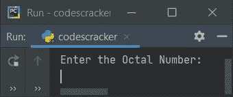
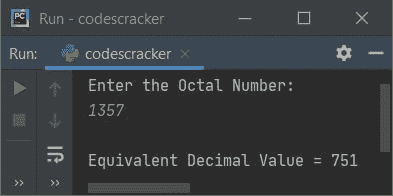
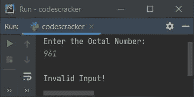
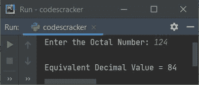

# Python 程序：将八进制转换成十进制

> 原文：<https://codescracker.com/python/program/python-program-convert-octal-to-decimal.htm>

创建这篇文章是为了介绍 Python 中的一些程序，将用户输入的八进制数转换成等价的十进制数。以下是程序列表:

*   使用**将八进制转换为十进制，同时循环**
*   使用 **int()** 方法
*   使用用户定义的函数
*   使用类和对象

**注意-** 在创建这些程序之前，如果你不清楚用于转换的步骤，那么就参考 [八进制到十进制的步骤、公式、例子](/computer-fundamental/octal-to-decimal.htm)来获得每一个关于该主题所需的东西。

## 使用 while 循环将八进制转换为十进制

要在 Python 中将八进制数转换为十进制数，您必须要求用户在八进制数系统中输入一个数，然后将该数转换为等价的十进制值，如下面给出的程序所示:

问题是，**写一个 Python 程序，用 while 循环**把八进制转换成十进制。以下是它的答案:

```
print("Enter the Octal Number: ")
octnum = int(input())

chk = 0
i = 0
decnum = 0
while octnum!=0:
    rem = octnum%10
    if rem>7:
        chk = 1
        break
    decnum = decnum + (rem * (8 ** i))
    i = i+1
    octnum = int(octnum/10)

if chk == 0:
    print("\nEquivalent Decimal Value =", decnum)
else:
    print("\nInvalid Input!")
```

下面是这个 Python 程序产生的初始输出:



现在提供输入如 **1357** 作为八进制数，按`ENTER`键转换并打印其等价的十进制值，如下图所示:



这是另一个使用八进制数输入 **961** 运行的示例:



**注意-** **9** 是无效的八进制数字。

用户输入 **1357** 的上述程序的试运行如下:

*   初始值， **octnum=1357** (用户输入)， **chk=0** ， **i=0** ， **decnum=0**
*   现在的条件**而循环****octnum！=0** 或者 **1357！=0** 评估为真，因此 程序流程进入循环内部
*   **octnum%10** 或 **1357%10** 或 **7** 被初始化为 **rem**
*   现在条件(if**)**rem>7**或 **7 > 7** 评估为假，因此程序 流程不进入 if** 的主体内。创建此条件是为了检查无效的八进制数字。由于 8 和 9 都是无效的八进制数字，因此如果发现任何数字是 8 或 9，那么使用 **break** 关键字， **while 循环**的执行结束， **1** 初始化为 **chk**
*   由于**的条件 if** (inner)评估为假，因此程序流不进入其 主体。而是 **decnum + (rem * (8 ** i))** 或 **0 + (7 * (8 ** 0))** 或 **7 * 8 <sup>0</sup>** 或 **7*1** 或 **7** 被初始化为 **decnum**
*   **i+1** 或 **0+1** 或 **1** 被初始化为 **i**
*   **int(octnum/10)** 或 **int(1357/10)** 或 **135** 被初始化为 **octnum**
*   现在程序流程返回并评估**的条件，同时用 **oct num**的新值再次循环**。
*   也就是条件 **octnum！=0** 或 **135！=0** 再次评估为真，因此程序流 再次进入循环。这个过程一直持续到条件评估为假
*   通过这种方式，给定的八进制值被转换成等价的十进制值
*   因此，在退出循环后，将 **decnum** 的值打印为十进制等效值
*   在打印值之前，我已经应用了条件来检查 **chk** 的值是否为 0(它的 原始值或初始值)
*   如果等于 0，意味着如果在**循环**中，程序流程永远不会进入**的主体。 的意思是，给定数字的所有位数都是有效的八进制数**

## 使用 int()将八进制转换为十进制

这个程序使用 **int()** 方法将八进制数转换为十进制数。 **int()** 方法返回作为参数传递的值的整数 (十进制)等效值。下面给出的程序中使用的 **end=** ，使用 **print()** 跳过打印自动换行符的 :

```
print("Enter the Octal Number: ", end="")
onum = input()

dnum = int(onum, 8)
print("\nEquivalent Decimal Value =", dnum)
```

下面是用户输入 **124** 的运行示例:



## 使用函数将八进制转换为十进制

该程序是使用名为 **OctToDec()** 的用户自定义函数创建的。这个函数将一个值(八进制) 作为它的参数，并使用 **int()** 方法返回它的十进制等效值。

```
def OctToDec(o):
    return int(o, 8)

print("Enter the Octal Number: ", end="")
onum = input()

dnum = OctToDec(onum)
print("\nEquivalent Decimal Value =", dnum)
```

## 使用类将八进制转换为十进制

这个程序是使用一个类创建的，这个类是 Python 的一个面向对象的特性。在这个程序中，创建了一个 **CodesCracker** 类的对象 **obj** ，以使用**点(.)**运算符。 成员函数 **OctToDec()** 返回作为参数传递的八进制值的十进制等效值。

```
class CodesCracker:
    def OctToDec(self, o):
        return int(o, 8)

print("Enter the Octal Number: ", end="")
onum = input()

obj = CodesCracker()
dnum = obj.OctToDec(onum)
print("\nEquivalent Decimal Value =", dnum)
```

#### 其他语言的相同程序

*   [Java 将八进制转换成十进制](/java/program/java-program-convert-octal-to-decimal.htm)
*   [C 将八进制转换成十进制](/c/program/c-program-convert-octal-to-decimal.htm)
*   [C++将八进制转换成十进制](/cpp/program/cpp-program-convert-octal-to-decimal.htm)

[Python 在线测试](/exam/showtest.php?subid=10)

* * *

* * *