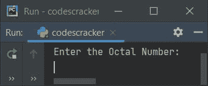
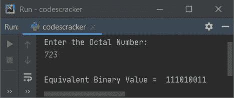
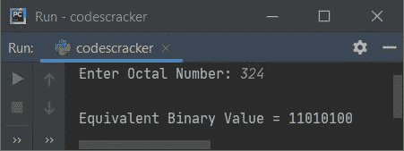

# Python 程序：将八进制转换为二进制

> 原文：<https://codescracker.com/python/program/python-program-convert-octal-to-binary.htm>

在本文中，我用 Python 创建了一些程序，将用户输入的八进制数转换成等价的二进制值。以下是程序列表:

*   使用**将八进制转换为二进制，同时循环**
*   采用 **int()** 和 **bin()** 的方法
*   使用**功能**
*   使用**类**

**注意-** 在创建这些程序之前，如果你不知道用于转换的步骤，那么参考 到[八进制到二进制的公式和例子](/computer-fundamental/octal-to-binary.htm)来得到每一个需要的东西。

## 使用 while 循环将八进制转换为二进制

要在 Python 中将八进制数转换成二进制数，您必须要求用户输入任何八进制数，然后将该数转换成等价的二进制数。问题是，**写一个 Python 程序，用 while 循环**把八进制数转换成二进制数。以下是它的答案:

```
print("Enter the Octal Number: ")
octnum = int(input())

rev = 0
chk = 0

while octnum!=0:
    rem = octnum%10
    if rem>7:
        chk = 1
        break
    rev = rem + (rev*10)
    octnum = int(octnum/10)

if chk == 0:
    octnum = rev
    binnum = ""

    while octnum!=0:
        rem = octnum%10
        if rem==0:
            binnum = binnum + "000"
        elif rem==1:
            binnum = binnum + "001"
        elif rem==2:
            binnum = binnum + "010"
        elif rem==3:
            binnum = binnum + "011"
        elif rem==4:
            binnum = binnum + "100"
        elif rem==5:
            binnum = binnum + "101"
        elif rem==6:
            binnum = binnum + "110"
        elif rem==7:
            binnum = binnum + "111"
        octnum = int(octnum/10)

    print("\nEquivalent Binary Value = ", binnum)

else:
    print("\nInvalid Input!")
```

下面是它的运行示例:



现在提供输入，比如说 **723** 作为八进制数，按`ENTER`键转换并打印其 等效二进制值，如下图所示:



用户输入 **723** 的上述程序的试运行如下:

*   初始值， **octnum=723** (用户输入)， **rev=0** ， **chk=0**
*   现在的条件**而循环****octnum！=0** 或者 **723！=0** 评估为真，因此 程序流程进入循环内部。创建这个循环是为了反转输入的八进制数。因为，我们必须对每一个数字进行二进制转换。但是使用 **rem = octnum%10** 语句，我们第一次得到的数字是 最后一个数字。因此我们颠倒了转换前的数字
*   在循环内部， **octnum%10** 或 **723%10** 或 **3** 被初始化为 **rem** 。所以 **rem=3**
*   现在条件**if****rem>7**或 **3 > 7** 评估为假，因此程序 流程不进入该 **if** 体。这里我们检查了是否有大于 7 的数字。 因为 8、9 都是无效的八进制数字
*   现在 **rem + (rev*10)** 或 **3 + (0*10)** 或 **3** 被初始化为 **rev**
*   **int(octnum/10)** 或 **int(723/10)** 或 **72** 被初始化为 **octnum**
*   程序流程返回并评估**的条件，同时用 **octnum** 的新值再次循环**。
*   也就是条件 **octnum！=0** 或 **72！=0** 再次评估为真，因此程序流 再次进入循环。这个过程一直持续到条件评估为假
*   这样，当其条件评估为假时退出循环后，变量**rev**T6】将其值保存为 **327** 。因此 **rev=327**
*   现在条件 **chk==0** 或 **0==0** 评估为真，因此程序流程进入循环内部
*   **rev** 或 **327** 被初始化为 **octnum** 。并且**“**被初始化为 **binnum** 。 即定义一个内容为空的字符串变量 **binnum**
*   现在的条件(内心**而循环** ) **octnum！=0** 或者 **327！=0** 评估为真， 因此程序流程进入循环内部
*   并且 **octnum%10** 或 **327%10** 或 **7** 被初始化为 **rem**
*   由于 **rem** 的值为 7，因此最后一个 **elif** 的条件，即 **rem==7** 或 T6】7 = = 7 评估为真，因此 **binnum + "111"** 或 **"" + "111"** 或 **"111"** 被初始化为 **binnum**
*   然后 **int(octnum/10)** 或 **int(327/10** 或 **32** 被初始化为 **octnum**
*   现在程序流程返回并评估**的条件，同时再次循环**(内部)
*   也就是条件 **octnum！=0** 或 **32！=0** 再次评估为真，因此程序流 再次进入循环。这个过程一直持续到条件评估为假
*   通过这种方式，给定的八进制值被转换成等价的二进制值
*   退出循环后，现在打印 **binnum** 的值

## 使用 int()和 bin()将八进制转换为二进制

该程序使用 Python 的预定义方法 **int()** 和 **bin()** 来完成与之前程序 相同的工作，使用完整的用户定义代码创建。 **int()** 用于将作为其参数传递的值转换为其等效的 整数。而 **bin()** 返回作为其参数传递的值的二进制等效值。

```
print("Enter Octal Number: ", end="")
onum = input()

bnum = int(onum, 8)
bnum = bin(bnum)

print("\nEquivalent Binary Value =", bnum)
```

下面是用户输入 **324** 的运行示例:


**注-** 要跳过前两个字符，打印时在 **bnum** 后面加上【T2【2:】。也就是说，替换以下语句:

```
print("\nEquivalent Binary Value =", bnum)
```

下面给出了声明:

```
print("\nEquivalent Binary Value =", bnum[2:])
```

现在，输出如下所示，用户输入与之前的示例运行相同:



**注意-****end =**用于使用 **print()** 跳过自动换行的打印

## 使用函数将八进制转换为二进制

这个程序使用名为 **OctToBin()** 的用户自定义函数将八进制转换为二进制。该函数将一个数字(八进制)作为其参数，并使用 **int()** 和 **bin()** 返回其等效的二进制值:

```
def OctToBin(o):
    return bin(int(o, 8))

print("Enter Octal Number: ", end="")
onum = input()

bnum = OctToBin(onum)
print("\nEquivalent Binary Value =", bnum[2:])
```

## 使用类将八进制转换为二进制

这是本文的最后一个程序，使用名为 **CodesCracker** 的类创建。类是 Python 面向对象的特性。

```
class CodesCracker:
    def OctToBin(self, o):
        return bin(int(o, 8))

print("Enter Octal Number: ", end="")
onum = input()

obj = CodesCracker()
bnum = obj.OctToBin(onum)
print("\nEquivalent Binary Value =", bnum[2:])
```

创建一个 **CodesCracker** 类的对象 **obj** 来访问它的成员函数 **OctToBin()** ，使用**点(。)**运算符。

#### 其他语言的相同程序

*   [Java 将八进制转换成二进制](/java/program/java-program-convert-octal-to-binary.htm)
*   [C 将八进制转换成二进制](/c/program/c-program-convert-octal-to-binary.htm)
*   [C++ 将八进制转换成二进制](/cpp/program/cpp-program-convert-octal-to-binary.htm)

[Python 在线测试](/exam/showtest.php?subid=10)

* * *

* * *