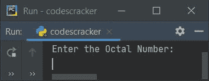
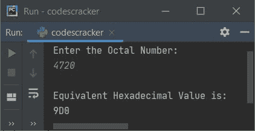
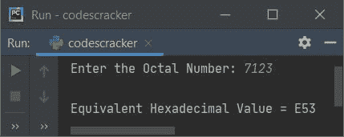
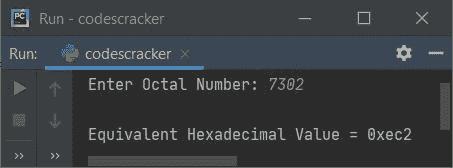
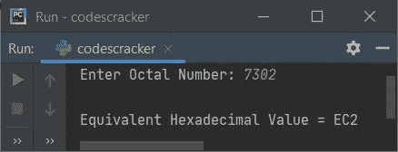

# Python 程序：将八进制转换为十六进制

> 原文：<https://codescracker.com/python/program/python-program-convert-octal-to-hexadecimal.htm>

在这篇文章中，我用 Python 创建了一些程序，将用户输入的八进制数转换成相应的十六进制值。以下是程序列表:

*   使用列表和**将八进制转换为十六进制，同时**循环
*   在循环时使用字符串和
***   使用 **int()** 和 **hex()** 方法*   使用用户定义的函数*   使用类**

 ****注意-** 在创建这些程序之前，如果你不知道用于转换的步骤，参考 到[八进制到十六进制的步骤和公式](/computer-fundamental/octal-to-hexadecimal.htm)来得到每一个需要的东西。

## 使用列表和 while 循环将八进制转换为十六进制

要在 Python 中将八进制数转换成十六进制数，您必须要求用户输入一个八进制数，然后将该数转换成等价的十六进制值。问题是，**写一个 Python 程序，用 list 和 while 循环**把八进制数 转换成十六进制。以下是它的答案:

```
print("Enter the Octal Number: ")
octnum = int(input())

chk = 0
i = 0
decnum = 0
while octnum!=0:
    rem = octnum%10
    if rem>7:
        chk = 1
        break
    decnum = decnum + (rem * (8 ** i))
    i = i+1
    octnum = int(octnum/10)

if chk == 0:
    i = 0
    hexdecnum = []
    while decnum != 0:
        rem = decnum % 16
        if rem < 10:
            rem = rem + 48
        else:
            rem = rem + 55
        rem = chr(rem)
        hexdecnum.insert(i, rem)
        i = i + 1
        decnum = int(decnum / 16)

    print("\nEquivalent Hexadecimal Value is: ")
    i = i - 1
    while i >= 0:
        print(end=hexdecnum[i])
        i = i - 1
    print()

else:
    print("\nInvalid Input!")
```

下面是这个 Python 程序产生的初始输出:



现在提供输入，比如说 **4720** 作为八进制数，按`ENTER`键转换并打印其 等价的十六进制值，如下图所示:



在上面的程序中，下面的代码块:

```
while octnum!=0:
    rem = octnum%10
    if rem>7:
        chk = 1
        break
    decnum = decnum + (rem * (8 ** i))
    i = i+1
    octnum = int(octnum/10)
```

用于将给定的八进制数转换为其等效的十进制值。要深入了解代码的工作原理，请参考 Python 中的[八进制到十进制。和下面的代码块:](/python/program/python-program-convert-octal-to-decimal.htm)

```
while decnum != 0:
    rem = decnum % 16
    if rem < 10:
        rem = rem + 48
    else:
        rem = rem + 55
    rem = chr(rem)
    hexdecnum.insert(i, rem)
    i = i + 1
    decnum = int(decnum / 16)
```

用于将十进制转换为十六进制。要了解其代码的深入工作，请参考 Python 中的[十进制到十六进制](/computer-fundamental/decimal-to-hexadecimal.htm)

## 使用字符串和 while 循环将八进制转换为十六进制

现在这个程序是使用**字符串**而不是之前程序中使用的**列表**创建的。 **end=** 用于跳过自动换行的打印。

```
print("Enter the Octal Number: ", end="")
onum = int(input())

chk = i = dnum = 0
while onum!=0:
    rem = onum % 10
    if rem>7:
        chk = 1
        break
    dnum = dnum + (rem * (8 ** i))
    i = i+1
    onum = int(onum / 10)

if chk == 0:
    hnum = ""
    while dnum != 0:
        rem = dnum % 16
        if rem < 10:
            rem = rem + 48
        else:
            rem = rem + 55
        rem = chr(rem)
        hnum = hnum + rem
        dnum = int(dnum / 16)
    hnum = hnum[::-1]
    print("\nEquivalent Hexadecimal Value =", hnum)

else:
    print("\nInvalid Input!")
```

以下是它在八进制数输入 **7123** 下的运行示例:



以下声明:

```
hnum = hnum[::-1]
```

表示存储在 **hnum** 中的字符串的倒数被初始化为 **hnum** 。也就是说，存储在 **hnum** 中的字符串被反转。

## 使用 int()和 hex()将八进制转换为十六进制

这个程序是使用两个预定义的函数创建的，即 **int()** 和 **hex()** 来做同样的工作，也就是将八进制转换为十六进制的 。 **int()** 返回作为其参数传递的值的整数等效值。并且 **hex()** 返回作为其参数传递的值的十六进制等效值。

```
print("Enter Octal Number: ", end="")
onum = input()

dnum = int(onum, 8)
hnum = hex(dnum)
print("\nEquivalent Hexadecimal Value =", hnum)
```

下面是用户输入 **7302** 的运行示例:



**注意-** 跳过前两个字符，大写**十六进制**数字。替换以下(最后)语句:

```
print("\nEquivalent Hexadecimal Value =", hnum)
```

新声明如下:

```
print("\nEquivalent Hexadecimal Value =", hnum[2:].upper())
```

现在，与之前的示例运行中提供的用户输入相同的输出如下所示:



**注-** 要实现基于用户的代码进行小写到大写的转换，参考 Python 中的[小写到大写](/python/program/python-program-convert-lowercase-to-uppercase.htm)。

## 使用函数将八进制转换为十六进制

这个程序是使用名为 **OctToHex()** 的用户定义函数创建的。这个函数接收一个值(八进制) 作为它的参数，并使用 **int()** 和 **hex()** 方法返回它的等价十六进制值。

```
def OctToHex(o):
    return hex(int(o, 8))

print("Enter Octal Number: ", end="")
onum = input()

hnum = OctToHex(onum)
print("\nEquivalent Hexadecimal Value =", hnum[2:].upper())
```

## 使用类将八进制转换为十六进制

这是使用类和对象创建的最后一个程序。也就是说，对象 **ob** 是由 **CodesCracker** 类创建的。使用这个对象，名为 **OctToHex()** 的成员函数通过使用**点(。)**运算符。

```
class CodesCracker:
    def OctToHex(self, o):
        return hex(int(o, 8))

print("Enter Octal Number: ", end="")
onum = input()

ob = CodesCracker()
hnum = ob.OctToHex(onum)
print("\nEquivalent Hexadecimal Value =", hnum[2:].upper())
```

#### 其他语言的相同程序

*   [Java 将八进制转换成十六进制](/java/program/java-program-convert-octal-to-hexadecimal.htm)
*   [C 将八进制转换成十六进制](/c/program/c-program-convert-octal-to-hexadecimal.htm)
*   [C++将八进制转换成十六进制](/cpp/program/cpp-program-convert-octal-to-hexadecimal.htm)

[Python 在线测试](/exam/showtest.php?subid=10)

* * *

* * ***