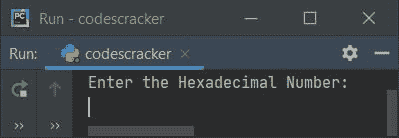
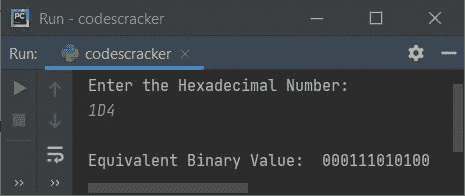
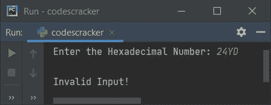
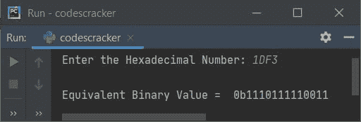
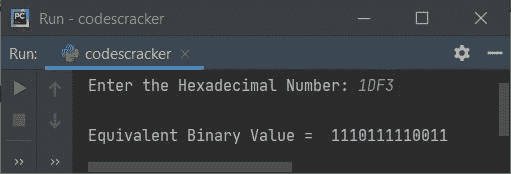

# Python 程序：将十六进制转换为二进制

> 原文：<https://codescracker.com/python/program/python-program-convert-hexadecimal-to-binary.htm>

在本文中，我们用 Python 创建了一些程序，将用户输入的十六进制数转换成等价的二进制值。以下是程序列表:

*   使用**将十六进制转换为二进制，同时循环**
*   采用 **int()** 和 **bin()** 的方法
*   使用用户定义的函数
*   使用类

**注意-** 在创建这些程序之前，如果你不清楚用于转换的步骤，那么参考 到[十六进制到二进制的步骤，公式，例子](/computer-fundamental/hexadecimal-to-binary.htm) 来获得关于这个主题的每一个需要的东西。

## 使用`while`循环将十六进制转换为二进制

要在 Python 中将十六进制数转换为二进制数，您必须要求用户输入十六进制数，然后将该数转换为等效的二进制值，如下面给出的程序所示:

```
print("Enter the Hexadecimal Number: ")
hexdecnum = input()

binnum = ""
hexlen = len(hexdecnum)
i = 0
while i<hexlen:
    if hexdecnum[i] == '0':
        binnum = binnum + "0000"
    elif hexdecnum[i] == '1':
        binnum = binnum + "0001"
    elif hexdecnum[i] == '2':
        binnum = binnum + "0010"
    elif hexdecnum[i] == '3':
        binnum = binnum + "0011"
    elif hexdecnum[i] == '4':
        binnum = binnum + "0100"
    elif hexdecnum[i] == '5':
        binnum = binnum + "0101"
    elif hexdecnum[i] == '6':
        binnum = binnum + "0110"
    elif hexdecnum[i] == '7':
        binnum = binnum + "0111"
    elif hexdecnum[i] == '8':
        binnum = binnum + "1000"
    elif hexdecnum[i] == '9':
        binnum = binnum + "1001"
    elif hexdecnum[i] == 'a' or hexdecnum[i] == 'A':
        binnum = binnum + "1010"
    elif hexdecnum[i] == 'b' or hexdecnum[i] == 'B':
        binnum = binnum + "1011"
    elif hexdecnum[i] == 'c' or hexdecnum[i] == 'C':
        binnum = binnum + "1100"
    elif hexdecnum[i] == 'd' or hexdecnum[i] == 'D':
        binnum = binnum + "1101"
    elif hexdecnum[i] == 'e' or hexdecnum[i] == 'E':
        binnum = binnum + "1110"
    elif hexdecnum[i] == 'f' or hexdecnum[i] == 'F':
        binnum = binnum + "1111"
    i = i+1

print("\nEquivalent Binary Value: ", binnum)
```

下面是它的运行示例:



现在提供输入，比如说 **1D4** 作为十六进制数，按`ENTER`键转换并打印 它的等效二进制值，如下图所示:



使用十六进制数输入 **1D4** 的上述程序的模拟运行如下:

*   初始值， **hexdecnum=1D4** (用户输入)， **i=0** ， **binnum=""**
*   **len()** 方法用于计算字符串的长度。因此使用下面的语句:
    `hexlen = len(hexdecnum)`
    值 **3** (长度 **1D4** 或 **hexdecnum** )被初始化为 **hexlen**
*   现在循环**I<hexlen**或 **0 < 3** 的条件评估为真，因此 程序流程进入循环内部
*   在循环内部，我应用了 Python 的 **if-elif** 语句来逐个比较 **hexdecnum**中存储的值，按照当前值来执行任务
*   也就是说，在循环内部，如果对求值，则为**的第一个条件。由于条件， **hexdecnum[I]= ' 0 '**或**hexdecnum[0]= ' 0 '**或**' 1 ' = ' 0 '**评估为假，因此 程序流不进入这个 **if** 的主体，而是去评估第一个 **elif**的条件**
*   也就是说，条件 **hexdecnum[i] == '1'** 或**hexdecnum[0]= ' 1 '**或**' 1 ' = ' 1 '**评估为 为真，因此程序流进入这个 **elif** 的主体，并且 **binnum + "0001"** 或 "+" 0001 "或**" 0000**
*   并且 **i** 的值增加 1。所以 **i=1**
*   现在程序流程返回并评估**的条件，同时用新的值 **i** 再次循环**
*   也就是说，条件 **i < hexlen** 或 **1 < 3** 再次评估为真，因此程序流 再次进入循环。这个过程一直持续到条件评估为假
*   这样，以十六进制输入的值就可以使用 string 转换为等效的二进制值
*   因此，在退出循环后，只需在运行时将 **binnum** 的值打印为用户给定的 十六进制数的二进制等效值

#### 先前程序的修改版本

这个程序使用 **end=** 跳过使用 **print()** 的自动换行符的打印。在这个程序中， 我还添加了一个 **else** 部分来处理所有条件都为假时的事情。

在 **else** 内部，我已经给 **chk** 赋值 1，并使用 **break** 关键字，跳过**的剩余执行，同时跳过** 循环。在退出循环后，或者通过评估其条件为假，或者通过使用 **break** 关键字，我已经检查了 **chk** 的值。也就是说，如果它等于 0(初始值)，那么程序流程永远不会进入 到 **else** 的主体。表示用户没有输入任何无效的十六进制数字。否则打印一条类似 **无效输入**的信息，如下图程序所示:

```
print("Enter the Hexadecimal Number: ", end="")
hnum = input()

bnum = ""
chk = 0
hlen = len(hnum)
i = 0
while i<hlen:
    if hnum[i] == '0':
        bnum += "0000"
    elif hnum[i] == '1':
        bnum += "0001"
    elif hnum[i] == '2':
        bnum += "0010"
    elif hnum[i] == '3':
        bnum += "0011"
    elif hnum[i] == '4':
        bnum += "0100"
    elif hnum[i] == '5':
        bnum += "0101"
    elif hnum[i] == '6':
        bnum += "0110"
    elif hnum[i] == '7':
        bnum += "0111"
    elif hnum[i] == '8':
        bnum += "1000"
    elif hnum[i] == '9':
        bnum += "1001"
    elif hnum[i] == 'a' or hnum[i] == 'A':
        bnum += "1010"
    elif hnum[i] == 'b' or hnum[i] == 'B':
        bnum += "1011"
    elif hnum[i] == 'c' or hnum[i] == 'C':
        bnum += "1100"
    elif hnum[i] == 'd' or hnum[i] == 'D':
        bnum += "1101"
    elif hnum[i] == 'e' or hnum[i] == 'E':
        bnum += "1110"
    elif hnum[i] == 'f' or hnum[i] == 'F':
        bnum += "1111"
    else:
        chk = 1
        break
    i = i+1

if chk==0:
    print("\nEquivalent Binary Value = ", bnum)
else:
    print("\nInvalid Input!")
```

下面是它的样本运行，十六进制输入 **24YD** :



**注-** 由于 **Y** 不是有效的**十六进制**位，因此产生了上面的输出，**无效输入**。

## 使用 int()和 bin()将十六进制转换为二进制

这个程序使用 **int()** 和 **bin()** 方法，用更精确的代码做同样的工作。

```
print("Enter the Hexadecimal Number: ", end="")
hnum = input()

hnum = int(hnum, 16)
bnum = bin(hnum)
print("\nEquivalent Binary Value = ", bnum)
```

下面是用户输入的示例运行， **1DF3** 作为十六进制数输入:



**注-** 只打印二进制值，即跳过上面输出的前两个字符，打印时将 **【2:】**放在 **bnum** 变量之后。也就是说，替换以下语句:

```
print("\nEquivalent Binary Value = ", bnum)
```

下面给出了声明:

```
print("\nEquivalent Binary Value = ", bnum[2:])
```

现在输出看起来像这样:



## 使用函数将十六进制转换为二进制

该程序是使用用户定义和预定义的函数创建的。本程序中使用的自定义函数名为 **HexToBin()** 。该函数接收一个值作为其参数，并使用 **bin()** 和 **int()** 方法返回其等效的二进制值。

```
def HexToBin(h):
    return bin(int(h, 16))

print("Enter the Hexadecimal Number: ", end="")
hnum = input()

bnum = HexToBin(hnum)
print("\nEquivalent Binary Value = ", bnum[2:])
```

## 使用类将十六进制转换为二进制

这是本文的最后一个程序，使用名为 **CodesCracker** 的类创建，这是 Python 的一个面向对象特性。

```
class CodesCracker:
    def HexToBin(self, h):
        return bin(int(h, 16))

print("Enter the Hexadecimal Number: ", end="")
hnum = input()

obj = CodesCracker()
bnum = obj.HexToBin(hnum)
print("\nEquivalent Binary Value = ", bnum[2:])
```

在这个程序中，创建了一个名为 **obj** 的类 **CodesCracker** 的对象，使用**点(.)**运算符。其余的事情就像一个正常的功能。

#### 其他语言的相同程序

*   [Java 将十六进制转换成二进制](/java/program/java-program-convert-hexadecimal-to-binary.htm)
*   [C 将十六进制转换成二进制](/c/program/c-program-convert-hexadecimal-to-binary.htm)
*   [C++ 将十六进制转换成二进制](/cpp/program/cpp-program-convert-hexadecimal-to-binary.htm)

[Python 在线测试](/exam/showtest.php?subid=10)

* * *

* * *