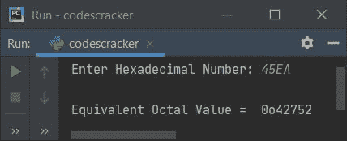

# Python 程序：将十六进制转换为八进制

> 原文：<https://codescracker.com/python/program/python-program-convert-hexadecimal-to-octal.htm>

在本文中，我们用 Python 创建了一些程序，将用户输入的十六进制数转换成八进制数。以下是程序列表:

*   使用**将十六进制转换为八进制，同时循环**
*   采用 **int()** 和 **oct()** 的方法
*   使用用户自定义的**功能**
*   使用**类**和**对象**

**注意-** 在创建这些程序之前，如果你不清楚用于转换的步骤，那么参考 [十六进制到八进制的步骤和公式](/computer-fundamental/hexadecimal-to-octal.htm)来得到每一个需要的东西。

## 使用 while 循环将十六进制转换为八进制

要在 Python 中将十六进制数转换为八进制数，您必须要求用户输入十六进制数系统中的任意数，然后将该数转换为八进制数，如下面给出的程序所示:

```
print("Enter the Hexadecimal Number: ")
hexdecnum = input()

chk = 0
decnum = 0
hexdecnumlen = len(hexdecnum)
hexdecnumlen = hexdecnumlen-1
i = 0
while hexdecnumlen>=0:
    rem = hexdecnum[hexdecnumlen]
    if rem>='0' and rem<='9':
        rem = int(rem)
    elif rem>='A' and rem<='F':
        rem = ord(rem)
        rem = rem-55
    elif rem>='a' and rem<='f':
        rem = ord(rem)
        rem = rem-87
    else:
        chk = 1
        break
    decnum = decnum + (rem * (16 ** i))
    hexdecnumlen = hexdecnumlen-1
    i = i+1

if chk==0:
    i = 0
    octnum = []
    while decnum!=0:
        rem = decnum%8
        octnum.insert(i, rem)
        i = i+1
        decnum = int(decnum/8)

    print("\nEquivalent Octal Value is: ")
    i = i-1
    while i>=0:
        print(octnum[i], end="")
        i = i-1
    print()
else:
    print("\nInvalid Input!")
```

下面是它的运行示例:


现在提供输入，比如说 **23E5F** 作为一个十六进制数，然后按`ENTER`键转换并 打印它的等价八进制值，如下图所示:


在上面的程序中， **while 循环**中的代码块用于将给定的十六进制数转换为其等价的十进制值 。而 **if** 内的代码块( **if** of **if chk==0:** )用于将 十进制值转换为其等价的八进制值。这意味着，十六进制以间接的方式转换成八进制。

**注-** 要深入了解用于十六进制到十进制转换的代码的工作原理，请参考 [Python 十六进制到十进制](/python/program/python-program-convert-hexadecimal-to-decimal.htm)

**注-** 要深入了解用于十进制到八进制转换的代码的工作原理，请参考 [十进制到八进制](/python/program/python-program-convert-decimal-to-octal.htm)。

**注-** 你也可以更喜欢，十六进制到二进制，然后二进制到八进制的方式来做这项工作。由你来决定。

#### 先前程序的修改版本

这是上一个程序的修改版本，使用 **end=** 跳过使用 **print()** 自动换行的打印。 是指，使用**端**，我们已经在同一行接收到输入，在该行打印出消息**输入十六进制数:**:

```
print("Enter Hexadecimal Number: ", end="")
hnum = input()

chk = dnum = i = 0
hlen = len(hnum) - 1
while hlen>=0:
    if hnum[hlen]>='0' and hnum[hlen]<='9':
        rem = int(hnum[hlen])
    elif hnum[hlen]>='A' and hnum[hlen]<='F':
        rem = ord(hnum[hlen]) - 55
    elif hnum[hlen]>='a' and hnum[hlen]<='f':
        rem = ord(hnum[hlen]) - 87
    else:
        chk = 1
        break
    dnum = dnum + (rem * (16 ** i))
    hlen = hlen - 1
    i = i+1

if chk==0:
    i = 0
    onum = []
    while dnum != 0:
        onum.insert(i, dnum % 8)
        i = i + 1
        dnum = int(dnum / 8)

    print("\nEquivalent Octal Value = ", end="")
    i = i - 1
    while i >= 0:
        print(onum[i], end="")
        i = i - 1
    print()
else:
    print("\nInvalid Input!")
```

以下是使用十六进制数字输入 **123F** 运行的示例:


## 使用 int()和 oct()将十六进制转换为八进制

这个程序使用 **int()** 和 **oct()** 方法来完成这项工作。 **int()** 方法用于返回作为参数传递的值的整数(十进制)等效值 。并且 **oct()** 方法用于返回作为其参数传递的八进制 等价值。

```
print("Enter Hexadecimal Number: ", end="")
hnum = input()

onum = int(hnum, 16)
onum = oct(onum)
print("\nEquivalent Octal Value = ", onum)
```

以下是提供 **45EA** 作为十六进制输入后的示例输出:



**注-** 如果想跳过八进制数的前两个字符，打印时在 **onum** 后加上【T2【2:】即可。也就是说，替换以下语句:

```
print("\nEquivalent Octal Value = ", onum)
```

下面给出了声明:

```
print("\nEquivalent Octal Value = ", onum[2:])
```

替换后，重新执行程序并提供相同的用户输入后，输出如下:


## 使用函数将十六进制转换为八进制

现在，这个程序是使用一个名为 **HexToOct()** 的用户定义函数和两个预定义方法 ，即 **oct()** 和 **int()** 创建的，以完成与前面程序相同的工作。

```
def HexToOct(h):
    return oct(int(h, 16))

print("Enter Hexadecimal Number: ", end="")
hnum = input()

onum = HexToOct(hnum)
print("\nEquivalent Octal Value = ", onum[2:])
```

## 使用类将十六进制转换为八进制

这是本文的最后一个程序，使用名为 **CodesCracker** 的**类**创建。也就是说，在 类中，我们定义了一个名为 **HexToOct()** 的成员函数。我们已经创建了这个 类的一个名为 **obj** 的对象，使用**点(.)**运算符。

```
class CodesCracker:
    def HexToOct(self, h):
        return oct(int(h, 16))

print("Enter Hexadecimal Number: ", end="")
hnum = input()

obj = CodesCracker()
onum = obj.HexToOct(hnum)
print("\nEquivalent Octal Value = ", onum[2:])
```

#### 其他语言的相同程序

*   [Java 将十六进制转换成八进制](/java/program/java-program-convert-hexadecimal-to-octal.htm)
*   [C 将十六进制转换成八进制](/c/program/c-program-convert-hexadecimal-to-octal.htm)
*   [C++将十六进制转换成八进制](/cpp/program/cpp-program-convert-hexadecimal-to-octal.htm)

[Python 在线测试](/exam/showtest.php?subid=10)

* * *

* * *