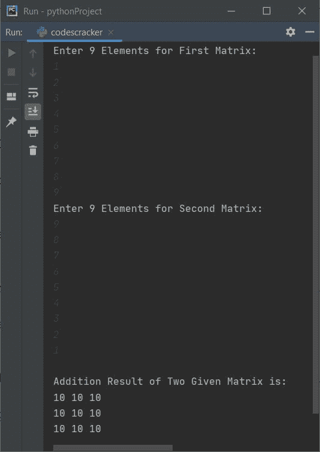

# Python 程序：相加两个矩阵

> 原文：<https://codescracker.com/python/program/python-program-add-two-matrices.htm>

在本文中，您将学习并获得 Python 中的代码来添加用户在运行时输入的两个矩阵。以下是 Python 中矩阵加法的程序列表:

*   添加两个 3*3 矩阵
*   将两个给定大小的矩阵相加

**注意-** 在开始程序之前，如果你不知道任意两个矩阵相加如何得到 的定义，参考[矩阵相加](/nonprog/matrix-addition.htm)得到所有需要的东西。现在让我们开始程序。

## 在 Python 中相加两个矩阵

这个程序查找并打印两个给定的 3*3 矩阵的加法结果。这里的 **3*3** 矩阵是指，3 行 3 列的矩阵。

```
matOne = []
print("Enter 9 Elements for First Matrix: ")
for i in range(3):
    matOne.append([])
    for j in range(3):
        num = int(input())
        matOne[i].append(num)

matTwo = []
print("Enter 9 Elements for Second Matrix: ")
for i in range(3):
    matTwo.append([])
    for j in range(3):
        num = int(input())
        matTwo[i].append(num)

matThree = []
for i in range(3):
    matThree.append([])
    for j in range(3):
        matThree[i].append(matOne[i][j]+matTwo[i][j])

print("\nAddition Result of Two Given Matrix is:")
for i in range(3):
    for j in range(3):
        print(matThree[i][j], end=" ")
    print()
```

下面是这个 Python 程序产生的初始输出:


现在提供输入，比如说 **1，2，3，4，5，6，7，8，9** 作为第一个矩阵的九个元素，提供 **9，8，7，6，5，4，3，2，1** 作为第二个矩阵的九个元素，将这两个给定的矩阵相加，如下图所示:



**注意-** 在上面的程序中，我们已经使用了*嵌套列表*来应用这个东西来执行矩阵加法。也就是说，使用以下语句:

```
matOne = []
```

定义了一个名为 **matOne** 的列表。并使用以下语句:

```
matOne.append([])
```

另一个空列表被附加到 **matOne** 上。现在 **matOne** 变成了嵌套列表。例如，如果用户 输入与上述示例运行中提供的相同的输入。然后**马通**这样保存这些数字:

```
matOne = [[1, 2, 3], [4, 5, 6], [7, 8, 9]]
```

## 由用户添加两个给定大小的矩阵

这个程序做的工作和前一个程序一样。唯一的区别是，这个程序允许用户定义矩阵的大小及其元素。

```
print("Enter Row and Column Size of First Matrix: ", end="")
rowOne = int(input())
colOne = int(input())
print("Enter Row and Column Size of Second Matrix: ", end="")
rowTwo = int(input())
colTwo = int(input())

if rowOne==rowTwo and colOne==colTwo:
    matOne = []
    print("\nEnter " +str(rowOne*colOne)+ " Elements for First Matrix: ")
    for i in range(rowOne):
        matOne.append([])
        for j in range(colOne):
            num = int(input())
            matOne[i].append(num)

    matTwo = []
    print("\nEnter " +str(rowTwo*colTwo)+ " Elements for Second Matrix: ")
    for i in range(rowTwo):
        matTwo.append([])
        for j in range(colTwo):
            num = int(input())
            matTwo[i].append(num)

    matThree = []
    for i in range(rowOne):
        matThree.append([])
        for j in range(colTwo):
            matThree[i].append(matOne[i][j]+matTwo[i][j])

    print("\nAddition Result:")
    for i in range(rowOne):
        for j in range(colOne):
            print(matThree[i][j], end=" ")
        print()
else:
    print("\nDimension Mismatched!")
```

下面是用户输入的示例运行，两个矩阵的行大小为 **2** ，列大小为 **3** 。然后将 **1，2，3，4，5，6** 作为第一矩阵的六个元素，将 **7，8，9，1，2，3** 作为第二矩阵的六个元素:


#### 其他语言的相同程序

*   [Java 相加两个矩阵](/java/program/java-program-add-two-matrices.htm)
*   [C 相加两个矩阵](/c/program/c-program-add-two-matrices.htm)
*   [C++ 相加两个矩阵](/cpp/program/cpp-program-add-two-matrices.htm)

[Python 在线测试](/exam/showtest.php?subid=10)

* * *

* * *