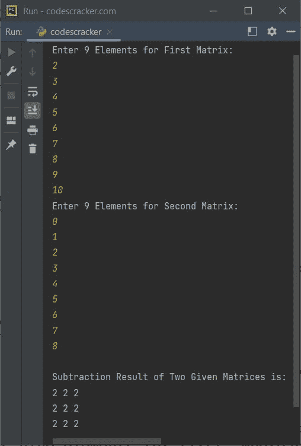
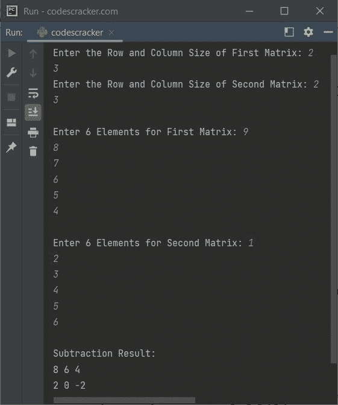

# Python 程序：相减两个矩阵

> 原文：<https://codescracker.com/python/program/python-program-subtract-two-matrices.htm>

本文包含了 Python 中执行矩阵减法的多个程序。以下是本文涵盖的程序列表:

*   减去两个 3*3 矩阵-无需用户输入
*   减去两个 3*3 矩阵-用户输入
*   减去给定阶和元素的两个矩阵

## Python 中两个矩阵相减

问题是，*写一个 Python 程序进行矩阵减法。*下面给出的程序是它的答案:

```
matrix1 = [[10, 11, 12],
           [13, 14, 15],
           [16, 17, 18]]
matrix2 = [[1, 2, 3],
           [4, 5, 6],
           [7, 8, 9]]
rmatrix = [[0, 0, 0],
           [0, 0, 0],
           [0, 0, 0]]

for i in range(len(matrix1)):
    for j in range(len(matrix1[0])):
        rmatrix[i][j] = matrix1[i][j] - matrix2[i][j]

for r in rmatrix:
    print(r)
```

上述 Python 程序产生的输出是:

```
[9, 9, 9]
[9, 9, 9]
[9, 9, 9]
```

上述程序中两个矩阵的相减可以计算为:

*   矩阵 1[0][0] -矩阵 2[0][0] = 10 - 1 = 9 =矩阵[0][0]
*   矩阵 1[0][1] -矩阵 2[0][1] = 11 - 2 = 9 =矩阵[0][1]
*   矩阵 1[0][2] -矩阵 2[0][2] = 12 - 3 = 9 =矩阵[0][2]
*   矩阵 1[1][0] -矩阵 2[1][0] = 13 - 4 = 9 =矩阵[1][0]
*   矩阵 1[1][1] -矩阵 2[1][1] = 14 - 5 = 9 =矩阵[1][1]
*   矩阵 1[1][2] -矩阵 2[1][2] = 15 - 6 = 9 =矩阵 1[2]
*   矩阵 1[2][0] -矩阵 2[2][0] = 16 - 7 = 9 =矩阵 2[0]
*   矩阵 1[2][1] -矩阵 2[2][1] = 17 - 8 = 9 =矩阵 2[1]
*   矩阵 1[2][2] -矩阵 2[2][2] = 18 - 9 = 9 =矩阵[2][2]

## Python 减去两个给定的 3*3 矩阵

问题是，*写一个 Python 程序做两个矩阵相减。两个矩阵的元素必须在程序运行时由用户接收 。*这个问题的答案，是下面给出的程序:

```
matOne = []
print("Enter 9 Elements for First Matrix: ")
for i in range(3):
    matOne.append([])
    for j in range(3):
        num = int(input())
        matOne[i].append(num)

matTwo = []
print("Enter 9 Elements for Second Matrix: ")
for i in range(3):
    matTwo.append([])
    for j in range(3):
        num = int(input())
        matTwo[i].append(num)

matThree = []
for i in range(3):
    matThree.append([])
    for j in range(3):
        sub = matOne[i][j] - matTwo[i][j]
        matThree[i].append(sub)

print("\nSubtraction Result of Two Given Matrices is:")
for i in range(3):
    for j in range(3):
        print(matThree[i][j], end=" ")
    print()
```

下面给出的快照显示了上述 python 程序的示例运行，其中用户输入 **2，3，4，5，6，7，8，9，10** 作为第一矩阵的九个元素，而 **0，1，2，3，4，5，6，7，8** 作为第二矩阵的九个元素:



## Python 减去两个给定矩阵

这是本文的最后一个程序，允许用户定义两个矩阵的顺序和元素。

```
print("Enter the Row and Column Size of First Matrix: ", end="")
rowOne = int(input())
colOne = int(input())
print("Enter the Row and Column Size of Second Matrix: ", end="")
rowTwo = int(input())
colTwo = int(input())

if rowOne==rowTwo and colOne==colTwo:
    matOne = []
    print("\nEnter", rowOne*colOne, "Elements for First Matrix: ", end="")
    for i in range(rowOne):
        matOne.append([])
        for j in range(colOne):
            num = int(input())
            matOne[i].append(num)

    matTwo = []
    print("\nEnter", rowTwo*colTwo, "Elements for Second Matrix: ", end="")
    for i in range(rowTwo):
        matTwo.append([])
        for j in range(colTwo):
            num = int(input())
            matTwo[i].append(num)

    matThree = []
    for i in range(rowOne):
        matThree.append([])
        for j in range(colTwo):
            sub = matOne[i][j] - matTwo[i][j]
            matThree[i].append(sub)

    print("\nSubtraction Result:")
    for i in range(rowOne):
        for j in range(colOne):
            print(matThree[i][j], end=" ")
        print()
else:
    print("\nOrder Mismatched!")
```

上述 Python 程序的运行示例显示在下面给出的快照中:



#### 其他语言的相同程序

*   [Java 相减两个矩阵](/java/program/java-program-subtract-matrices.htm)
*   [C 相减两个矩阵](/c/program/c-program-subtract-matrices.htm)
*   [C++ 相减两个矩阵](/cpp/program/cpp-program-subtract-matrices.htm)

[Python 在线测试](/exam/showtest.php?subid=10)

* * *

* * *