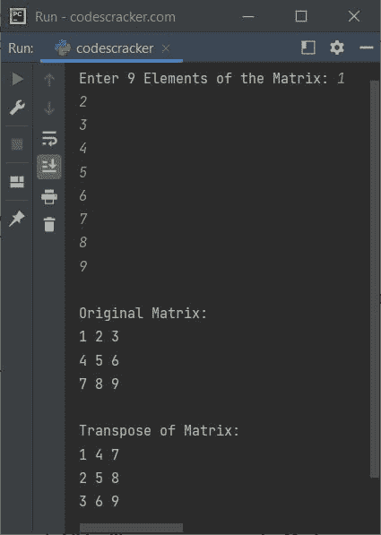

# Python 程序：寻找矩阵转置

> 原文：<https://codescracker.com/python/program/python-program-transpose-matrix.htm>

本文介绍了一个用 Python 编写的程序，它可以找到并打印给定的 3*3 矩阵的转置。

## Python 查找给定 3*3 矩阵的转置

问题是，*写一个 Python 程序，求一个矩阵的转置。矩阵元素必须在程序运行时由用户接收 。*下面给出的程序是它的答案:

```
print("Enter 9 Elements of the Matrix: ", end="")
matrix = []
for i in range(3):
    matrix.append([])
    for j in range(3):
        val = int(input())
        matrix[i].append(val)

print("\nOriginal Matrix:")
for i in range(3):
    for j in range(3):
        print(matrix[i][j], end=" ")
    print()

for i in range(3):
    for j in range(i):
        temp = matrix[i][j]
        matrix[i][j] = matrix[j][i]
        matrix[j][i] = temp

print("\nTranspose of Matrix:")
for i in range(3):
    for j in range(3):
        print(matrix[i][j], end=" ")
    print()
```

下面给出的快照显示了上述 Python 程序的示例运行，用户输入 **1，2，3，4，5，6，7，8，9** 作为矩阵的 九个元素:



#### 其他语言的相同程序

*   [Java 寻找矩阵的转置](/java/program/java-program-transpose-matrix.htm)
*   [C 寻找矩阵的转置](/c/program/c-program-transpose-matrix.htm)
*   [C++寻找矩阵的转置](/cpp/program/cpp-program-transpose-matrix.htm)

[Python 在线测试](/exam/showtest.php?subid=10)

* * *

* * *