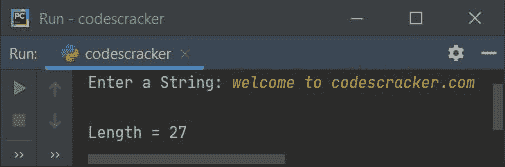

# Python 程序：计算字符串的长度

> 原文：<https://codescracker.com/python/program/python-program-find-length-of-string.htm>

在本文中，我用 Python 创建了一些程序，这些程序可以查找并打印用户输入的字符串长度。以下是使用的方法列表:

*   使用循环的**找到字符串的长度**
*   使用 **while** 循环
*   使用 **len()** 方法
*   使用用户定义的函数

## 使用`for`循环计算字符串长度

要在 Python 中查找任意字符串的长度，您必须要求用户输入任意字符串，然后使用 **for** 循环以逐个字符的方式查找其长度，如下面给出的程序所示:

```
print("Enter the String: ")
text = input()

tot = 0
for ch in text:
    tot = tot+1

print("\nLength =", tot)
```

下面是它的运行示例:


现在提供输入比如说**打码机**作为字符串，按`ENTER`键查找并打印给定字符串 的长度，使用**进行**循环；


当用户输入一个字符串，比如说 **codescracker** ，然后它被存储在一个名为 **text** 的变量中。现在 使用**进行**循环，上述程序的预演如下:

*   初始值， **tot=0**
*   现在**文本**(即**‘c’**)的第一个字符被复制到 **ch** 变量，程序流 进入循环，并且 **tot** 的值增加 1
*   即 **tot+1** 或 **0+1** 或 **1** 被初始化为 **tot** 。所以 **tot=1**
*   现在**文本**的第二个字符(即**‘o’**)被复制到 **ch** ，程序流 再次进入循环，并且 **tot** 的值再次增加 1
*   这个过程继续，直到文本的每个字符都被扫描
*   这样，在退出循环后，变量 **tot** 保存给定字符串中可用字符 的总数。这等于绳子的长度
*   所以在输出上打印出**到**的值，作为字符串的长度

## 使用`while`循环计算字符串长度

问题是，**写一个 Python 程序，用`while`循环**求出给定字符串的长度。以下是它的答案:

```
print("Enter a String: ", end="")
text = input()

tot = 0
while text[tot:]:
    tot = tot+1

print("\nLength =", tot)
```

下面是它使用字符串输入运行的示例**欢迎来到 codescracker.com**:



切分字符串时，**【tot:】**是指从索引号 **tot** 到最后的所有字符。以 为例，如果**文本**=**“codescracker”**是一个给定的字符串。因此在 **(text[0])的**0<sup>th</sup>**索引处，**【c】**可用，在 **1 <sup>st</sup>** 索引处，**【text[1】】【o】可用，以此类推 。所以如果 **tot=2** ，那么 **text[2:]** 返回**“descracker”**(第二个索引的所有字符)。****

 **## 使用 len()计算字符串的长度

这个程序是使用名为 **len()** 的预定义函数创建的，该函数返回作为参数传递的对象的长度。

```
print("Enter a String: ", end="")
text = input()

textlen = len(text)
print("\nLength =", textlen)
```

## 使用函数计算字符串的长度

这是在 Python 中查找给定字符串长度的最终程序，使用名为 **FindLenOfStr()** 的用户定义函数创建。它返回作为参数传递的值的长度。

```
def FindLenOfStr(x):
    return len(x)

print("Enter a String: ", end="")
text = input()

print("\nLength =", FindLenOfStr(text))
```

#### 其他语言的相同程序

*   [Java 计算字符串长度](/java/program/java-program-find-length-of-string.htm)
*   [C 找出字符串的长度](/c/program/c-program-find-length-of-string.htm)
*   [C++ 计算字符串长度](/cpp/program/cpp-program-find-length-of-string.htm)

[Python 在线测试](/exam/showtest.php?subid=10)

* * *

* * ***