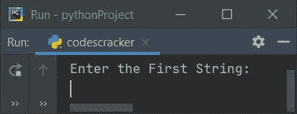
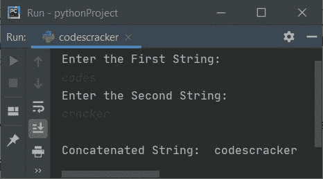
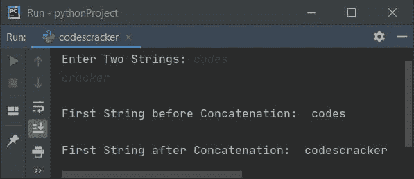
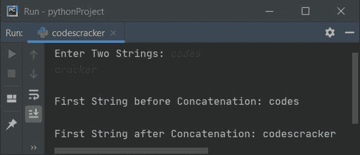
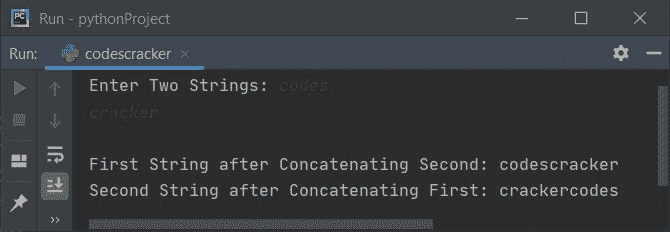
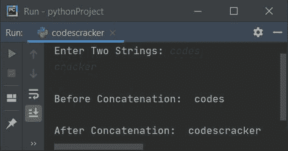
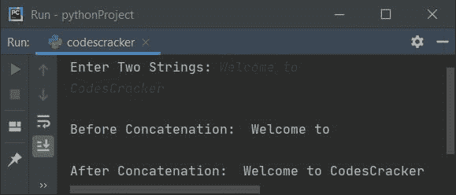

# Python 程序：连接两个字符串

> 原文：<https://codescracker.com/python/program/python-program-concatenate-string.htm>

在本文中，我们用 Python 创建了一些程序，在运行时连接用户输入的字符串。以下是程序列表:

*   使用 **+** 运算符连接字符串
*   使用**列表**
*   使用 **join()**

例如，如果两个给定的字符串是**代码**和**破解**。然后在将第二串 串联成第一串之后。第一串**码**串联后成为**码。**

## 使用+连接两个字符串

要在 Python 中连接两个字符串，您必须要求用户输入第一个和第二个字符串，然后使用 **+** 运算符连接，就像下面给出的程序中显示的加法一样。问题是，**写一个 Python 程序 将一个字符串连接到另一个。**下面是它的回答:

```
print("Enter the First String: ")
strOne = input()
print("Enter the Second String: ")
strTwo = input()
strThree = strOne + strTwo
print("\nConcatenated String: ", strThree)
```

下面是这个 Python 程序产生的初始输出:



现在提供输入，说**代码**为第一串，**破解**为第二串，按`ENTER`键 将给定的两个串连接成第三串，并打印第三串的值，如下图所示:



#### 先前程序的修改版本

这个程序将用户输入的第二个字符串连接到第一个字符串中。 **end=** 用于通过 **print()** 跳过自动换行的 打印

```
print("Enter Two Strings: ", end="")
strOne = input()
strTwo = input()

print("\nFirst String before Concatenation: ", strOne)
strOne = strOne + strTwo
print("\nFirst String after Concatenation: ", strOne)
```

下面是它的示例运行，用户输入与前一个程序的示例运行相同:



## 使用列表连接字符串

这是通过完整的基于用户的代码创建的程序，用于连接两个字符串。也就是说，这个程序使用 list 来完成这项工作。让我们先来看看这个程序:

```
print("Enter Two Strings: ", end="")
strOne = input()
strTwo = input()

print("\nFirst String before Concatenation:", strOne)

oneList = []
twoList = []
oneList[:0] = strOne
twoList[:0] = strTwo
oneLen = len(strOne)
twoLen = len(strTwo)

for i in range(twoLen):
    oneList.insert(oneLen, twoList[i])
    oneLen = oneLen+1

print("\nFirst String after Concatenation: ", end="")
for i in range(len(oneList)):
    print(end=oneList[i])
print()
```

下面是使用用户输入的**代码**和**破解**作为第一和第二字符串的示例运行:



使用与上面的示例运行中给出的用户输入相同的用户输入对上面的程序进行模拟运行，如下所示:

*   用户输入的初始值，**strOne =代码**和**strTwo =破解者**
*   现在使用语句
    `oneList = []`
    定义一个名为 **oneList** 的空列表
*   并且使用
    `oneList[:0] = strOne`
    存储在 **strOne** 中的字符串值，即第一个字符串(代码)从 **0 <sup>th</sup>** index 开始以如下方式存储在 list **oneList**中:
    *   oneList[0] = c
    *   oneList[1] = o
    *   一个列表[2] = d
    *   oneList[3] = e
    *   一个列表[4] = s
*   `oneLen = len(strOne)`
    语句用于查找并存储 **strOne** 到 **oneLen** 的长度。所以执行完这条语句后， **oneLen = 5**。**代码的长度**
*   方法返回一系列的值。默认情况下，它从 0 开始，以 1 递增。 在指定为其参数的数字前停止
*   语句
    `oneList.insert(oneLen, twoList[i])`
    用于将**two list【I】**处的字符插入到其 **oneLen <sup>th</sup>** 索引处的 list **oneList** 中
*   也就是说，在第一次执行时， **twoList[i]** 或 **twoList[0]** 或**c**(cracker 的第一个 c， 第二个字符串)存储在 **oneList[oneLen]** 或 **oneList[5]** 中
*   通过这种方式，第二个字符串的所有字符一个接一个地存储在第一个字符串的列表中

### 一个接一个地连接两个字符串

这个程序使用列表将第一个字符串连接到第二个字符串，并将第二个字符串连接到第一个字符串。

```
print("Enter Two Strings: ", end="")
strOne = input()
strTwo = input()

oneList = []
twoList = []
tmpList = []
oneList[:0] = strOne
twoList[:0] = strTwo
tmpList[:0] = strOne
oneLen = len(strOne)
twoLen = len(strTwo)
tmpLen = oneLen

for i in range(twoLen):
    oneList.insert(oneLen, twoList[i])
    oneLen = oneLen+1

print("\nFirst String after Concatenating Second: ", end="")
for i in range(len(oneList)):
    print(end=oneList[i])

for i in range(tmpLen):
    twoList.insert(twoLen, tmpList[i])
    twoLen = twoLen+1

print("\nSecond String after Concatenating First: ", end="")
for i in range(len(twoList)):
    print(end=twoList[i])
print()
```

下面是它的示例运行，用户输入与前一个程序的示例运行相同:



**注意-** 我们已经使用了名为 **tmpList** 的第三个列表来完成这项工作。也就是说，这个列表用来存储 第一个字符串的值。

## 使用 join()连接两个字符串

这个程序使用 **join()** 函数将任意字符串连接到另一个字符串。因此，使用下面给出的程序所示的 **join()** 方法将字符串 连接起来:

```
print("Enter Two Strings: ", end="")
strOne = input()
strTwo = input()

print("\nBefore Concatenation: ", strOne)
strOne = "".join([strOne, strTwo])
print("\nAfter Concatenation: ", strOne)
```

下面是它的示例运行，用户输入的**代码**和**破解**作为第一个和第二个字符串:



若要用一个空格连接字符串，请替换以下语句:

```
strOne = "".join([strOne, strTwo])
```

下面给出了声明:

```
strOne = " ".join([strOne, strTwo])
```

修改此代码/语句后，示例运行显示在下面给出的快照中:



#### 其他语言的相同程序

*   [Java 连接字符串](/java/program/java-program-concatenate-string.htm)
*   [C 连接字符串](/c/program/c-program-concatenate-string.htm)
*   [C++ 连接字符串](/cpp/program/cpp-program-concatenate-string.htm)

[Python 在线测试](/exam/showtest.php?subid=10)

* * *

* * *