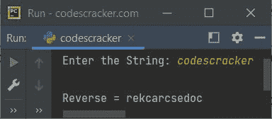
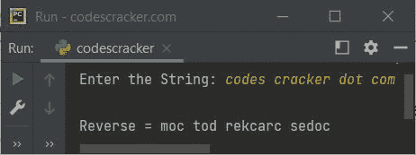
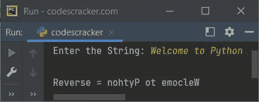

# Python 程序：反转一个字符串

> 原文：<https://codescracker.com/python/program/python-program-reverse-string.htm>

本文介绍了 Python 中的多个程序，这些程序查找并打印用户在程序运行时输入的字符串的反向内容。下面是本文涉及的程序列表:

*   在 Python 中反转字符串
*   在 Python 中，对循环使用**来反转字符串**
*   使用用户定义的函数在 Python 中反转字符串
*   使用递归在 Python 中反转字符串

## Python 反转字符串

问题是，*写一个 Python 程序，找到并打印给定字符串的反向。*下面给出的节目 就是它的答案:

```
print("Enter the String: ", end="")
str = input()

strRev = str[::-1]
str = strRev
print("\nReverse =", str)
```

下面给出的快照显示了上述 Python 程序的示例运行，用户输入 **codescracker** 作为字符串 来查找并打印它的反向:



下面是另一个运行用户输入**代码的例子:**



## Python 使用`for`循环反转字符串

这个程序做的工作和前一个程序一样。但是这个程序是用**代替**循环创建的。

```
print("Enter the String: ", end="")
str = input()

strRev = ""
for ch in str:
    strRev = ch + strRev

str = strRev
print("\nReverse =", str)
```

下面是用户输入的示例运行，**欢迎使用 Python** :



## 使用函数反转字符串

这里是 Python 中的另一个程序，它使用名为 **revStr()** 的用户定义函数查找并打印给定字符串的反向:

```
def revStr(s):
    sReverse = s[::-1]
    return sReverse

print("Enter the String: ", end="")
str = input()

str = revStr(str)
print("\nReverse =", str)
```

您将得到与上一个程序类似的输出。

## 使用递归反转字符串

这是本文的最后一个程序，使用递归函数或递归来反转字符串。

```
def revStr(s):
    if len(s) == 0:
        return s
    else:
        return revStr(s[1:]) + s[0]

print("Enter the String: ", end="")
mystr = input()

mystr = revStr(mystr)
print("\nReverse =", mystr)
```

#### 其他语言的相同程序

*   [Java 反向字符串](/java/program/java-program-reverse-string.htm)
*   [C 反串](/c/program/c-program-reverse-string.htm)
*   [C++ 反向字符串](/cpp/program/cpp-program-reverse-string.htm)

[Python 在线测试](/exam/showtest.php?subid=10)

* * *

* * *