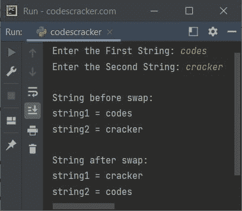
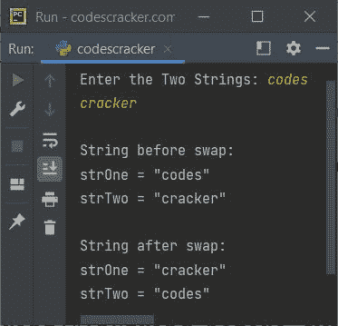

# Python 程序：交换两个字符串

> 原文：<https://codescracker.com/python/program/python-program-swap-two-strings.htm>

本文介绍了一个 Python 程序，它交换用户在程序运行时输入的两个字符串。

## 在 Python 中交换两个字符串

问题是，*写一个 Python 程序来交换两个给定的字符串。*下面给出的程序是它的答案:

```
print("Enter the First String: ", end="")
string1 = input()
print("Enter the Second String: ", end="")
string2 = input()

print("\nString before swap:")
print("string1 =", string1)
print("string2 =", string2)

temp = string1
string1 = string2
string2 = temp

print("\nString after swap:")
print("string1 =", string1)
print("string2 =", string2)
```

下面给出的快照显示了上述 Python 程序的示例运行，用户输入的**代码**和**破解** 作为两个字符串进行交换:



上面的程序也可以这样创建:

```
print("Enter the Two Strings: ", end="")
strOne = input()
strTwo = input()

print("\nString before swap:")
print("strOne = \"", strOne, "\"", sep="")
print("strTwo = \"", strTwo, "\"", sep="")

x = strOne
strOne = strTwo
strTwo = x

print("\nString after swap:")
print("strOne = \"", strOne, "\"", sep="")
print("strTwo = \"", strTwo, "\"", sep="")
```

下面是它的示例运行，用户输入与之前的示例运行相同:



#### 其他语言的相同程序

*   [Java 交换两个字符串](/java/program/java-program-swap-two-strings.htm)
*   [C 互换两根弦](/c/program/c-program-swap-two-strings.htm)
*   [C++互换两个字符串](/cpp/program/cpp-program-swap-two-strings.htm)

[Python 在线测试](/exam/showtest.php?subid=10)

* * *

* * *