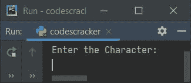
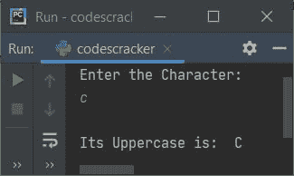
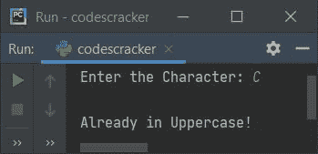
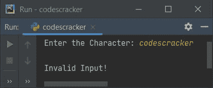
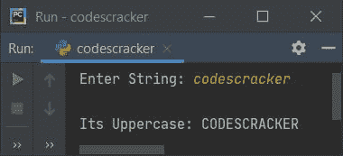

# Python 程序：将小写转换成大写

> 原文：<https://codescracker.com/python/program/python-program-convert-lowercase-to-uppercase.htm>

创建这篇文章是为了介绍 Python 中的一些程序，使用和不使用用户定义和预定义的函数将小写字符或字符串转换成大写。以下是程序列表:

*   使用 ASCII 值将小写字符转换为大写字符
*   使用 ASCII 值将小写字符串转换为大写字符串
*   小写到大写使用 **upper()** 方法
*   使用用户定义的函数
*   使用类和对象

**注-**A 的 ASCII 值为 65， **B** 为 66， **C** 为 67，以此类推。同理， **a** 的 ASCII 值为 97， **b** 为 98， **c** 为 99，以此类推。

## 使用 ASCII 值将小写字符转换为大写字符

问题是，**写一个 Python 程序把用户输入的小写字符转换成大写**。这里 是它的答案。这个程序使用字符的 ASCII 值来转换大写字符。

```
print("Enter the Character: ")
ch = input()

chup = ord(ch)
chup = chup-32
chup = chr(chup)
print("\nIts Uppercase is: ", chup)
```

下面是这个 Python 程序产生的初始输出:



现在提供输入，比如说 **c** 作为小写字符，然后按`ENTER`键转换并打印 的大写字符，如下图所示:



**注意-****ord()**方法用于查找作为参数传递的字符的 Unicode 值。

**注意-****chr()**方法用于查找对应于作为其参数传递的 Unicode 值的字符。

在上面的程序中，下面的语句:

```
chup = chup-32
```

声明用 32 减去 **chup** 的值。该语句用于初始化相应大写字符的 ASCII 值 。例如，如果输入的小写值是 **c** 并且它被存储在 **ch** 变量中 。因此使用下面的语句(来自上面的程序):

```
chup = ord(ch)
```

**c** 的 ASCII 值，即 **99** 被初始化为 **chup** 。并使用以下语句:

```
chup = chup-32
```

**chup-32** 或 **99-32** 或 **67** 被初始化为 **chup** 。最后，使用下面给出的 语句:

```
chup = chr(chup)
```

对应于 **67** 的 ASCII 值的字符，即 **C** 被初始化为 **chup** 。通过这种方式，字符被转换成大写。

#### 先前程序的修改版本

这个程序是前一个程序的修改版本，用来处理无效输入。这个程序使用 **end=** 来跳过使用 **print()** 自动换行的打印

```
print("Enter the Character: ", end="")
ch = input()

chlen = len(ch)
if chlen==1:
    if ch>='a' and ch<='z':
        chup = ord(ch)
        chup = chup-32
        chup = chr(chup)
        print("\nIts Uppercase is: ", chup)
    elif ch>='A' and ch<='Z':
        print("\nAlready in Uppercase!")
    else:
        print("\nInvalid Input!")
else:
    print("\nInvalid Input!")
```

下面是用户输入 **C** 的运行示例:



下面是另一个使用用户输入 **codescracker** 运行的示例:



## 没有函数的小写到大写字符串

这个程序是用来操作字符串的。也就是说，这个程序将用户输入的小写字符串转换成等价的大写字符串。

```
print("Enter String: ", end="")
text = input()

for i in range(len(text)):
    if text[i]>='a' and text[i]<='z':
        ch = text[i]
        ch = ord(ch)
        ch = ch-32
        ch = chr(ch)
        text = text[:i] + ch + text[i+1:]

print("\nIts Uppercase:", text)
```

下面是它使用字符串输入 **codescracker** 运行的示例:



在上面的程序中，我使用循环的**逐个扫描了字符串的所有字符。并比较当前索引处的 字符是否为小写字符。如果找到的字符是小写字符，那么使用下面的语句将那个 字符转换成大写:**

```
text = text[:i] + ch + text[i+1:]
```

将当前索引的字符转换为大写后的新字符串，被初始化为文本**的新值**。 在上述语句中，**文本[:i]** 是指从 **0 <sup>第</sup>** 到 **(i-1) <sup>第</sup>** 索引的所有字符。而 **text[i+1:]** 是指从**(I+1)**到**(len-1)<sup>th</sup>** 索引的所有字符。这里 **len** 是绳子的长度。

例如，如果 **text = "CODEscracker"** ， **i=4** ， **ch="S"** 因此下面的语句:

```
text = text[:i] + ch + text[i+1:]
```

在输入以下值后，计算结果为:

```
text = "CODE" + "S" + "cracker"
```

声明，**“CODEScracker”**被初始化为**文本**作为其新值。使用索引对字符串 进行切片时，即 **[:]** ，包含冒号前的索引号，而排除冒号后的索引号。

## 使用 upper()将小写转换为大写

这个程序使用 **upper()** ，一个预定义的方法来完成与前一个程序相同的工作。

```
print("Enter String: ", end="")
text = input()

text = text.upper()
print("\nIts Uppercase:", text)
```

## 使用函数将小写转换为大写

该程序是使用用户定义和预定义的方法创建的。本程序中使用的自定义函数是**lower top()**。这个函数使用 **upper()** 方法返回作为其参数传递的字符串的大写形式。

```
def LowerToUpper(s):
    return s.upper()

print("Enter String: ", end="")
text = input()

text = LowerToUpper(text)
print("\nIts Uppercase:", text)
```

## 使用类将小写转换为大写

这是本文的最后一个程序，使用一个类(Python 的一个面向对象的特性)创建。

```
class CodesCracker:
    def LowerToUpper(self, s):
        return s.upper()

print("Enter String: ", end="")
text = input()

ob = CodesCracker()
text = ob.LowerToUpper(text)
print("\nIts Uppercase:", text)
```

在上面的程序中，创建了一个名为 **ob** 的对象，属于 **CodesCracker** 类，使用**点(.)**运算符。

#### 其他语言的相同程序

*   [Java 将小写转换成大写](/java/program/java-program-convert-lowercase-to-uppercase.htm)
*   [C 将小写转换成大写](/c/program/c-program-convert-lowercase-into-uppercase.htm)
*   [C++将小写转换成大写](/cpp/program/cpp-program-convert-lowercase-into-uppercase.htm)

[Python 在线测试](/exam/showtest.php?subid=10)

* * *

* * *