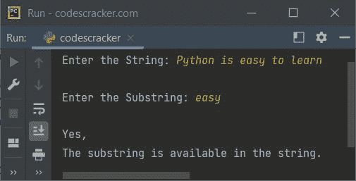
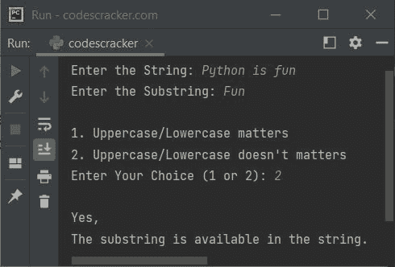
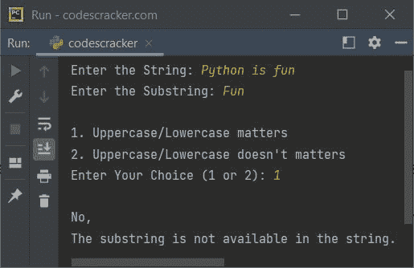
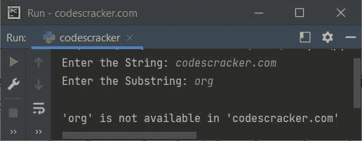

# Python 程序：检查给定字符串中是否存在子字符串

> 原文：<https://codescracker.com/python/program/python-check-substring-is-in-given-string.htm>

本文旨在介绍 Python 中的一个程序，该程序检查指定的子串(一个字符或一个短语)是否出现在给定的[字符串](/python/python-strings.htm)中。本文包含 两个程序:

1.  检查给定字符串中的子字符串是否可用
2.  检查给定字符串中的子字符串是否不可用

## Python 来检查子字符串是否在字符串中

问题是，*写一个 Python 程序，检查一个字符串中是否有子串。两者的值， 字符串和子字符串必须由用户在程序运行时接收。*这个问题的答案，是下面给出的 程序:

```
print("Enter the String: ", end="")
MyStr = input()

print("\nEnter the Substring: ", end="")
MySubStr = input()

if MySubStr in MyStr:
    print("\nYes,\nThe substring is available in the string.")
else:
    print("\nNo,\nThe substring is not available in the string.")
```

下面给出的快照显示了该程序的运行示例，用户输入的 **Python 易学** 为字符串，**易学**为子字符串:



**注-**操作符中的[用于检查 指定值在指定序列中的可用性。](/python/python-in-keyword.htm)

但上述程序的问题是，有时用户需要检查子串是否在给定的字符串中，不管是否考虑大写/小写字符。因此，我们需要创建一个程序，让用户选择继续使用这两者。例如:

```
print("Enter the String: ", end="")
MyStr = input()
print("Enter the Substring: ", end="")
MySubStr = input()

print("\n1\. Uppercase/Lowercase matters")
print("2\. Uppercase/Lowercase doesn't matters")
print("Enter Your Choice (1 or 2): ", end="")
choice = int(input())

if choice == 1:
    if MySubStr in MyStr:
        print("\nYes,\nThe substring is available in the string.")
    else:
        print("\nNo,\nThe substring is not available in the string.")

elif choice == 2:
    if MySubStr.lower() in MyStr.lower():
        print("\nYes,\nThe substring is available in the string.")
    else:
        print("\nNo,\nThe substring is not available in the string.")

else:
    print("\nInvalid Choice!")
```

使用用户输入 **Python 是有趣的**作为字符串，**有趣的**作为子字符串， **2** 作为选项 运行示例，以检查给定字符串中给定短语的可用性，不考虑大写/小写字母，如下面给出的快照中的 所示:



下面的快照显示了另一个示例运行，前两个输入与上面的示例运行相同，选择为 **1** :



## Python 来检查子字符串是否不在字符串中

这是上述程序的反向。也就是说，这个程序检查指定的子字符串是不在字符串中还是在字符串中。做这个任务，用中**前的[不是](/python/python-not-keyword.htm)， 即**中的**不是**中的**。例如:**

```
print("Enter the String: ", end="")
x = input()
print("Enter the Substring: ", end="")
y = input()

if y not in x:
    print("\n'", y, "' is not available in '", x, "'", sep="")
else:
    print("\n'", y, "' is available in '", x, "'", sep="")
```

下面是它的示例运行，用户输入**codescracker.com**作为字符串，**组织**作为短语，以确认 在给定的字符串中是否不可用，或者它在给定的字符串中:



上一节的第二个程序也可以在本节中以类似的方式创建。唯一的区别是，我们需要将中的**替换为**中的**。就是这样。来吧，自己动手。**

[Python 在线测试](/exam/showtest.php?subid=10)

* * *

* * *