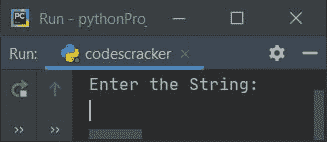
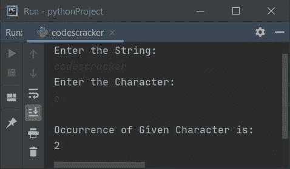
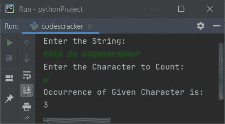
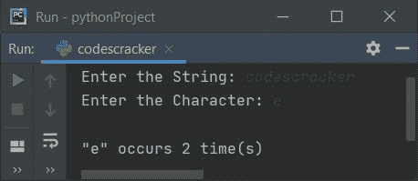
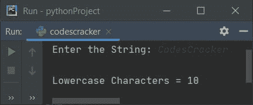
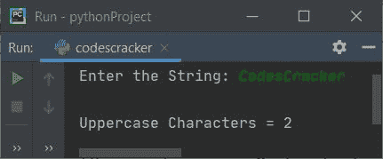
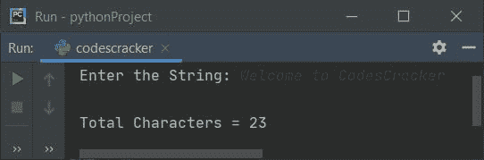

# 计算字符串中字符数的 Python 程序

> 原文：<https://codescracker.com/python/program/python-program-count-character-in-string.htm>

在本文中，我用 Python 创建了一些程序，计算用户输入的字符串中可用的字符数。以下是程序列表:

*   计算字符串中的特定字符。用户必须输入字符和字符串
*   计算字符串中小写字符的个数
*   计算字符串中的大写字符数
*   计算字符串中的所有字符

## 统计字符串中某个字符的出现次数

要计算 Python 中某个字符串中某个特定字符的出现次数或频率，您必须要求用户输入一个字符串和一个字符，然后查找并打印给定字符串中给定字符的频率，如下面给出的程序所示:

问题是，**写一个 Python 程序来计算一个字符在字符串**中的出现次数。以下是它的答案:

```
print("Enter the String:")
text = input()
print("Enter the Character:")
char = input()
textLen = len(text)
sum = 0
for i in range(textLen):
    if char==text[i]:
        sum = sum+1
print("\nOccurrence of Given Character is:")
print(sum)
```

下面是它的运行示例:



现在提供输入，比如说将 **codescracker** 作为字符串，然后将 **e** 作为要计数的字符。按 `ENTER`键，统计并打印给定字符串中 **e** 的出现次数，如下图所示:



使用与上面的示例运行中提供的用户输入相同的用户输入对上面的程序进行模拟运行，如下所示:

*   初始值， **text = "codescracker"** (用户输入)， **char = "e"** (用户输入)
*   然后 **len(text)** 或 **len("codescracker")** 或 **12** 被初始化为 **textLen** ，并且 **sum=0**
*   方法返回一系列的值。默认情况下，从 0 开始，递增 1，并且 在作为其参数给出的值之前继续(如果只给出一个参数)
*   也就是说， **i** 的初始值在循环的**第一次求值时为 **0** ，由于 0 小于 **textLen**的值(即 **12** ，因此条件求值为真，程序流程进入循环内部**
*   在循环内部，我们每次都将 **char** 的值与 **text**的**I<sup>th</sup>T5】索引处的字符进行比较。当发现匹配时，则**总和**的值增加。**
*   也就是说，条件(of**if**)**char = = text[I]**或 **"e" == text[0]** 或**" e " = = " c "** (" c "是给定字符串的第一个字符)的计算结果为假，因此程序流不会进入 if 正文中的 。并且**和**的值不会增加
*   现在， **i** 的值增加了 1。所以 **i=1** 。由于 1 小于**12** (textLen 的值)，因此条件再次评估为真，并且程序流再次进入循环
*   同样，条件 **char == text[i]** 或**“e”= = text[1]**或**“e”= =“o”**评估为假
*   现在 **i** 的值再次增加。所以现在 **i=2** 。在 **i** 的值变为等于 12 之前，该过程继续
*   当 **char** 处的值与 **text** 的**I<sup>th</sup>T5】index 处的值匹配时，那么 增加了 **sum** 的值**
*   这样，在退出循环后，变量 **sum** 保存显示 字符**【e】**在**【codescracker】**中出现频率的值
*   所以只需打印出 **sum** 的值作为字符串中字符的频率

## 使用 count()查找字符串中特定字符的频率

这个程序使用 **count()** 方法在一个字符串(由用户输入)中查找并打印一个特定字符(由用户输入)的频率。

```
print("Enter the String:")
text = input()
print("Enter the Character to Count:")
char = input()
val = text.count(char)
print("Occurrence of Given Character is: ")
print(val)
```

这是用户输入的示例运行**这是 codescracker** 作为字符串，然后 **c** 作为要计数的字符:



#### 先前程序的修改版本

这是前一个程序的修改版本。**结束**用于跳过使用 **print()** 插入自动换行符。 **\**用于打印**。而 **str()** 方法将任何类型的值转换为字符串类型。**

 **```
print(end="Enter the String: ")
text = input()
print(end="Enter the Character: ")
char = input()
val = text.count(char)
print("\n\"" + char + "\" occurs " + str(val) + " time(s)")
```

下面是它的示例运行，将用户输入的 **codescracker** 作为字符串，将 **e** 作为字符:



## 计算字符串中的小写字符

这个程序只计算用户给定字符串中的小写字符(a-z ),使用**进行**循环和索引:

```
print(end="Enter the String: ")
text = input()
textLen = len(text)
sum = 0
for i in range(textLen):
    if text[i]>='a' and text[i]<='z':
        sum = sum+1

print("\nLowercase Characters = " + str(sum))
```

下面是用户输入的示例运行， **CodesCracker** :



## 计算字符串中的大写字符数

这个程序只计算和打印用户在运行时输入的字符串中的大写字符(A-Z ):

```
print("Enter the String: ", end="")
text = input()
textLen = len(text)
sum = 0
for i in range(textLen):
    if text[i]>='A' and text[i]<='Z':
        sum = sum+1

print("\nUppercase Characters = " + str(sum))
```

下面是它的示例运行，用户输入与前一个程序的示例运行相同:



## 计算字符串中的字符总数

现在这个程序计算一个字符串中的所有字符。它不关心字符是什么，如小写，大写，空格，数字等。，一切都会被计算在内:

```
print("Enter the String: ", end="")
text = input()
textLen = len(text)
sum = 0
for i in range(textLen):
    sum = sum+1

print("\nTotal Characters = " + str(sum))
```

这是用户输入的示例运行，**欢迎使用 CodesCracker** :



#### 其他语言的相同程序

*   [Java 计数字符串中的字符](/java/program/java-program-find-frequency-of-character.htm)
*   [C 计算字符串中的字符数](/c/program/c-program-frequency-character.htm)
*   [C++计算字符串中的字符数](/cpp/program/cpp-program-frequency-character.htm)

[Python 在线测试](/exam/showtest.php?subid=10)

* * *

* * ***