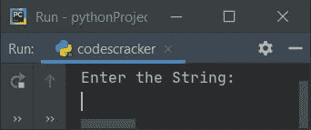
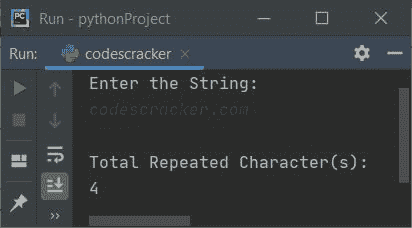
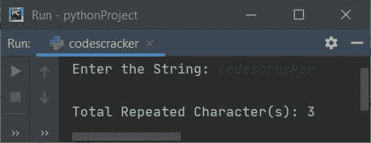

# Python 程序：统计字符串中重复字符

> 原文：<https://codescracker.com/python/program/python-count-repeated-characters-in-string.htm>

创建这篇文章是为了涵盖 Python 中的程序，该程序计算并打印用户在运行时输入的给定字符串中可用的重复字符的总数。

## 统计字符串中重复字符的总数

问题是，*编写一个 Python 程序来计算用户输入的字符串中重复字符的总数。*下面是它的回答:

```
rChar = 0
rCharList = []
k = 0

print("Enter the String: ")
text = str(input())

textList = list(text)
tot = len(text)

for i in range(tot):
  if text[i] in textList:
    if text[i] not in rCharList:
      newText = text[i+1:]
      newTot = len(newText)
      for j in range(newTot):
        if newText[j]==text[i]:
          rChar = rChar+1
          rCharList.insert(k, text[i])
          k = k+1
          break

print("\nTotal Repeated Character(s): ")
print(rChar)
```

下面是它的运行示例:



现在提供输入，比如说**codescracker.com**作为字符串，按`ENTER`键计算并打印 给定字符串中的重复字符数:



**注-** 在字符串【codescracker.com】的**中，重复的字符是 **c，o，e，r****

为了以更好的方式格式化先前程序的输出外观，请更改以下代码:

```
print("Enter the String: ")
```

下面给出了声明:

```
print(end="Enter the String: ")
```

下面给出了代码块:

```
print("\nTotal Repeated Character(s): ")
print(rChar)
```

使用以下语句:

```
print("\nTotal Repeated Character(s): " + str(rChar))
```

在更改这两个代码或代码块之后，这是这次使用用户输入 **codescracker** 的示例运行的新输出外观:



[Python 在线测试](/exam/showtest.php?subid=10)

* * *

* * *