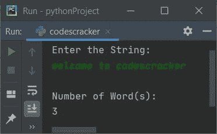

# Python 程序：计算字符串中单词数

> 原文：<https://codescracker.com/python/program/python-program-count-word-in-sentence.htm>

创建这篇文章是为了介绍 Python 中的一些程序，这些程序计算并打印用户在运行时输入的字符串中可用的总字数。以下是完成这项工作的方法列表:

*   使用**对**循环计数字符串中的单词
*   采用 **len()** 和 **split()** 方法
*   使用用户定义的函数
*   使用类

## 使用`for`循环计算字符串中的单词数

要计算 Python 中给定字符串或句子中出现的总字数，您必须要求用户输入一个字符串，然后计算并打印字符串中可用的总字数，如下面给出的程序所示:

```
print("Enter the String: ")
text = input()

chk = 0
countWord = 0
textLen = len(text)

for i in range(textLen):
    if text[i]==' ':
        if chk!=0:
            countWord = countWord+1
        chk = 0
    else:
        chk = chk+1

if chk!=0:
    countWord = countWord+1

print("\nNumber of Word(s): ")
print(countWord)
```

下面是它的运行示例:


现在提供输入，说**欢迎来到 codescracker** 作为字符串，并按`ENTER`键计数，然后 打印给定字符串中可用的总字数:



下面是使用以下用户输入运行的另一个示例:

```
    this   is codescracker
```

也就是 4 个空格然后**这个**，3 个空格然后**是**，单个空格然后 **codescracker** :


**注意-****len()**方法返回作为参数传递的字符串长度。

在上面的程序中，下面的代码(对于循环的代码):

```
for i in range(textLen):
```

用于从 **0** 到 **textLen-1** 执行其体中所有可用的语句， **textLen** 的次数，值为 **i** 。例如，如果 **textLen** 的值是 **5** ，那么这个循环将被评估五次，其中**I**T15】的值从 0 到 4

使用字符串输入**运行上述程序，欢迎使用 codescracker** ，如第一次样本运行中所提供的，如下所示:

*   初始值， **chk=0** ， **countWord=0** ，**text = " welcome to codescracker "**(用户输入)
*   现在下面的语句:
    `textLen = len(text)`
    将 **text** 中存储的字符串长度初始化为 **textLen** 。所以 **textLen=23**
*   现在开始执行循环的**。最初 **i=0** ，由于 0 小于 23，因此条件 评估为真，因此程序流程进入循环内部**
*   在循环内部，**if**)**text[I]= ' '**或**text[0]= ' '**或**' w ' = ' '** 的条件评估为假，因此程序流程不会进入其主体
*   相反，它会转到 **else** 的主体，并且 **chk+1** 或 **0+1** 或 **1** 会被初始化为 **chk**。所以 **chk=1**
*   现在， **i** 的值增加。所以 **i=1** ，因为 1 小于 23，因此程序流 再次进入循环
*   再次，条件(如果)****text[I]= ' '**或**text[1]= ' '**或**‘e’= ' '**评估为 为假，因此 **chk+1** 或 **1+1** 被初始化为 **chk****
*   现在 **i=2** ，由于 2 小于 23，因此第三次也是如此，程序流程进入 **内部进行循环**的主体
*   这个过程继续，直到条件评估为假，或者直到 **i** 的值变为 等于 **23** (字符串长度)
*   在循环内部，当任何一个**I<sup>th</sup>T3】索引处的字符等于一个空格时，那么我已经检查过 的 **chk** 的值是否不等于 0，如果条件评估为真，那么只有变量 T6】count word**加 1
*   这样，在退出循环后，我有了一个名为 **countWord** 的变量来保存单词的总数
*   在退出循环后，应用另一个条件来检查并递增最后一个字的计数字 的值。因为一般来说，任何句子或字符串中的最后一个单词后面都不包含任何空格。
*   现在将 **countWord** 的值打印为用户输入的字符串中可用的字数。

## 使用 len()和 split()计算字符串中的单词数

这个程序还计算并打印一个字符串中可用的单词总数，但是使用了名为 **split()** 的预定义函数。 **split()**方法将字符串拆分成单词。让我们先来看看这个程序:

```
print(end="Enter the String: ")
text = input()

wordLen = len(text.split())
print("\nNumber of Word(s): " + str(wordLen))
```

这是用户输入的运行示例，**这是 Python 程序**:


从上面的程序中，下面的代码(语句):

```
wordLen = len(text.split())
```

也可以替换为下面给出的代码块，使其更容易理解:

```
wordlist = text.split()
wordLen = len(wordlist)
```

也就是说，第一条语句使用 **split()** 创建了一个单词列表。第二条语句使用 **len()** 方法初始化名为 **单词列表**的列表的长度。列表长度表示列表中可用元素的总数。这里的列表元素是单词

## 使用函数计算字符串中的单词数

这个程序使用了一个名为 **CountWords()** 的用户自定义函数，它接收一个字符串作为参数， 返回它的长度，就像前面的程序一样。唯一的区别是，主代码被包装到一个用户定义的函数中。

```
def CountWords(s):
    wlist = s.split()
    wtot = len(wlist)
    return wtot

print("Enter the String: ", end="")
text = input()

wordLen = CountWords(text)
print("\nNumber of Word(s):", wordLen)
```

产生与前一个程序相同的输出。

## 使用类计算字符串中的单词数

这是使用名为 **CodesCracker** 的类创建的最后一个程序。类是 Python 的一个面向对象的特性 。函数作为它的成员函数被调用。

```
class CodesCracker:
    def CountWords(self, s):
        wrds = s.split()
        totwrds = len(wrds)
        return totwrds

print("Enter the String: ", end="")
text = input()

ob = CodesCracker()
textlen = ob.CountWords(text)
print("\nNumber of Word(s):", textlen)
```

要访问一个类的成员函数，需要该类的一个对象。因此创建了一个名为 **ob** 的类 **CodesCracker** 的对象，并使用**点(。运算符，我已经通过它的对象访问了它的成员函数，如上面的程序所示。**

#### 其他语言的相同程序

*   [Java 统计句子中的单词](/java/program/java-program-count-words-in-sentence.htm)
*   [C 计算句子中的单词数](/c/program/c-program-count-words-in-sentence.htm)
*   [C++ 计算句子中的字数](/cpp/program/cpp-program-count-words-in-sentence.htm)

[Python 在线测试](/exam/showtest.php?subid=10)

* * *

* * *