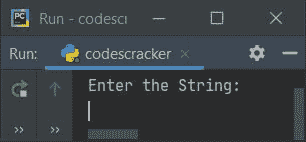
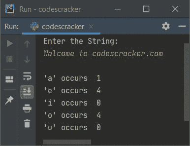
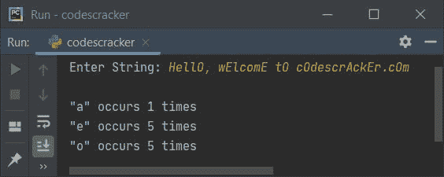
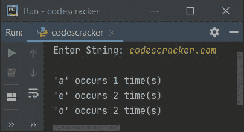
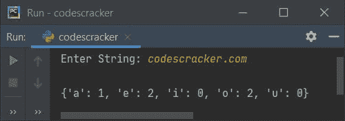

# Python 程序：计算字符串中每个元音的个数

> 原文：<https://codescracker.com/python/program/python-program-count-number-of-each-vowels.htm>

创建这篇文章是为了介绍 Python 中的一些程序，这些程序计算并打印用户输入的字符串中每个元音的数目。以下是使用的方法列表:

*   使用， **for** loop 和 **if-elif** 语句计算字符串中每个元音的个数
*   使用列表
*   使用字典

## 使用 for 循环和 if-else 计算每个元音

这个程序使用**循环**和 **if-elif** 语句，计算并打印一个字符串中每个元音的个数。问题是，**写一个 Python 程序来统计每个元音**的个数。以下是它的答案:

```
print("Enter the String:")
text = input()

vowela = ['a', 'A']
vowele = ['e', 'E']
voweli = ['i', 'I']
vowelo = ['o', 'O']
vowelu = ['u', 'U']
ca = 0
ce = 0
ci = 0
co = 0
cu = 0

for x in text:
    if x in vowela:
        ca = ca+1
    elif x in vowele:
        ce = ce+1
    elif x in voweli:
        ci = ci+1
    elif x in vowelo:
        co = co+1
    elif x in vowelu:
        cu = cu+1

print("\n'a' occurs ", ca)
print("'e' occurs ", ce)
print("'i' occurs ", ci)
print("'o' occurs ", co)
print("'u' occurs ", cu)
```

该程序产生以下输出:



现在提供输入说**欢迎来到 codescracker.com**作为字符串，然后按`ENTER`键 计数并打印给定字符串中每个元音的数量，如下图所示:



使用与上面的示例运行中提供的用户输入相同的用户输入对上面的程序进行模拟运行，如下所示:

*   初始值，**text = " Welcome to codescracker . com "**(用户输入)， **ca=0** ， **ce=0** ， ， **ci=0** ， **co=0** ， **cu=0**
*   现在开始执行循环的**，也就是下面的代码:
    `for x in text:`
    表示，每个字符被一个接一个地复制到 **x** 。也就是说，首先，**" W "**(**文本**的第一个 字符)被复制到 **x** ，在第二个 **"e"** 被复制到 **x** ，以此类推，直到 文本**的最后一个字符****
*   在循环内部，下面的代码:
    `if x in vowela:`
    声明如果 **x** 的值在名为 **vowela** 的列表中可用，那么条件(如果**) 评估为真，程序流进入其主体内部，并且 **ca** 的值增加 1**
*   因此，在第一次对循环的**求值时， **x="W"** 。并且**【W】**在所有 五个列表 **ca、ce、ci、co** 和 **cu** 中均不存在**
*   因此， **x="e"** ，第二个字符被复制到 **x** 并再次检查匹配
*   这一次， **"e"** 在列表 **vowele** 中可用，因此 vowele 中的条件(第一个**elif**) **x 或['e '，' E']** 中的 **"e】评估为真，因此程序流程进入这个 **elif**的主体和 **ce+1** 或 **0+1****
*   这个过程一直持续，直到每个字符都被扫描和检查
*   通过这种方式，所有五个元音都被计算在内。所以只需在退出循环后打印它的值

#### 先前程序的修改版本

这个程序是前一个程序的修改版本。这个程序使用 **end** 来跳过使用 **print()** 插入自动换行符

```
print("Enter String: ", end="")
text = input()

v = ['a', 'e', 'i', 'o', 'u', 'A', 'E', 'I', 'O', 'U']
va = ['a', 'A']
ve = ['e', 'E']
vi = ['i', 'I']
vo = ['o', 'O']
vu = ['u', 'U']
ca = 0
ce = 0
ci = 0
co = 0
cu = 0

for x in text:
    if x in v:
        if x in va:
            ca += 1
        elif x in ve:
            ce += 1
        elif x in vi:
            ci += 1
        elif x in vo:
            co += 1
        elif x in vu:
            cu += 1

print()
if ca>0:
    print("\"a\" occurs", ca, "times")
if ce>0:
    print("\"e\" occurs", ce, "times")
if ci>0:
    print("\"i\" occurs", ci, "times")
if co>0:
    print("\"o\" occurs", co, "times")
if cu>0:
    print("\"u\" occurs", cu, "times")
```

下面是用户输入的运行示例，**你好，欢迎来到 cOdescrAckEr.cOm**为字符串:



**注-****用于打印**

 ****## 使用列表计算每个元音的数量

这个程序使用 list 来完成与前一个程序相同的工作。该列表的使用方式是，在第 **0 <sup>个</sup>个**索引处，**【a】**的 个频率被存储，在第 **1 <sup>个</sup>** 索引处，**【e】**个频率被存储，以此类推，顺序为 **a、e、I、o、u** 。 **count[0]** 是指名为 **count** 的表的第**0**索引处的值(元素)。

```
print("Enter String: ", end="")
text = input()

count = [0, 0, 0, 0, 0]
text = text.casefold()
vowels = ['a', 'e', 'i', 'o', 'u']

for ch in text:
    if ch in vowels:
        if ch=='a':
            count[0] += 1
        elif ch=='e':
            count[1] += 1
        elif ch=='i':
            count[2] += 1
        elif ch=='o':
            count[3] += 1
        elif ch=='u':
            count[4] += 1

print()
for i in range(len(count)):
    if i==0:
        if count[i]>0:
            print("'a' occurs", count[i], "time(s)")
    if i==1:
        if count[i]>0:
            print("'e' occurs", count[i], "time(s)")
    if i==2:
        if count[i]>0:
            print("'i' occurs", count[i], "time(s)")
    if i==3:
        if count[i]>0:
            print("'o' occurs", count[i], "time(s)")
    if i==4:
        if count[i]>0:
            print("'u' occurs", count[i], "time(s)")
```

下面是使用**codescracker.com**作为字符串输入的示例运行:



**注意-****casefold()**方法用于将作为参数传递的整个字符串转换成小写。

## 使用字典计算每个元音

这是本文的最后一个程序，在运行时使用字典计算用户输入的字符串中每个元音的个数。字典用于存储**键:值**对中的信息

```
print("Enter String: ", end="")
text = input()

vowels = ['a', 'e', 'i', 'o', 'u']
text = text.casefold()
count = {}.fromkeys(vowels, 0)

print()

for ch in text:
    if ch in count:
        count[ch] += 1

print(count)
```

以下是上一个程序运行时用户输入的运行示例:



**注-** 字典是用 **{}** (花)括号定义的。

**注意-****from keys()**方法返回带有指定键和值的字典。也就是说，第一个参数指向 键，而第二个参数指向一个值。

以下语句(来自上述程序):

```
count[ch] += 1
```

用指定的键取值，即 **ch** 并将值增加 1。

[Python 在线测试](/exam/showtest.php?subid=10)

* * *

* * *****