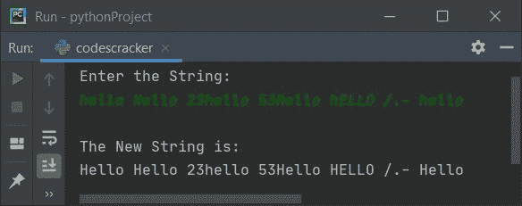

# Python 程序将字符串中的每个单词大写

> 原文：<https://codescracker.com/python/program/python-capitalize-each-word-in-string.htm>

在这篇文章中，我们用 Python 创建了一些程序，将用户输入的字符串中的每个单词大写。以下是程序列表:

*   给定字符串中每个单词的首字母大写
*   使用**列表**将每个单词的首字母大写
*   使用**列表**和 **upper()** 大写字符串中的所有单词
*   使用 **title()**

## 给定字符串中每个单词的首字母大写

这个程序将用户输入的字符串中每个单词的首字母大写。问题是，**写一个 Python 程序来大写给定字符串**的每个单词。以下是它的答案:

```
print("Enter the String: ")
text = str(input())
textLen = len(text)
for i in range(textLen):
    ch = text[i]
    if i==0:
        ascVal = ord(ch)
        if ascVal>=97 and ascVal<=122:
            ascVal = ascVal-32
            ascVal = chr(ascVal)
            index = 0
            text = text[:index] + ascVal + text[index+1:]
    if ch==" ":
        ch = text[i+1]
        ascVal = ord(ch)
        if ascVal>=97 and ascVal<=122:
            ascVal = ascVal-32
            ascVal = chr(ascVal)
            index = i+1
            text = text[:index] + ascVal + text[index+1:]
print("\nThe New String is:")
print(text)
```

下面是它的运行示例:


现在输入字符串，说**欢迎使用 python** ，并按`ENTER`键大写给定字符串的所有三个 单词，如下图所示:


**注意-****ord()**函数用于将一个字符转换成一个整数(ASCII 值)。因为它 返回作为参数传递的字符的 Unicode。

**注意-****chr()**用于返回作为参数传递的 Unicode 值的等价字符。

用户输入**欢迎使用 python** 的上述程序的预演如下:

*   当用户输入字符串时，它被存储到**文本**中。所以 **text= "欢迎来到 python"**
*   **len(text)** 或 **len(欢迎使用 python)** 或 **17** 被初始化为 **textLen**
*   现在开始执行循环的**。默认情况下， **range()** 方法返回一系列值，从 开始，递增 1。它在指定为其参数的值之前停止**
*   第一次执行时， **i=0** 且条件 **i < textLen** 或 **0 < 17** 评估为真， 因此程序流程进入循环内部
*   **text[i]** 或 **text[0]** 或 **w** 被初始化为 **ch**
*   (如果 ) **i==0** 或 **0==0** 的条件评估为真，因此程序流程进入 **if** 的主体内
*   并且 **ord(ch)** 或 **ord(w)** 或**119**(**w**的 Unicode)被初始化为 **ascVal**
*   现在第一个条件(第二个**if**)**as cval>= 97**或 **119 > =97** 评估为真， 和第二个条件(第二个**if**)**as cval<= 122**或 **119 < =122** 评估为真。 由于两个条件都评估为真，因此程序流程进入第二个 **if** 的主体
*   **ascVal-32** 或 **119-32** 或 **87** (大写 W 的 ASCII 值)被初始化为 **ascVal**
*   **chr(ascVal)** 或 **chr(87)** 或 **W** 被初始化为 **ascVal**
*   **0** 被初始化为**索引**。而下面的语句
    `text = text[:index] + ascVal + text[index+1:]`
    表示**文本**的**索引<sup>第</sup>** 或 **0 <sup>第</sup>** 索引的字符得到 大写
*   现在，条件(另一个 **if** ) **ch==" "** 得到评估，因为 **ch** 的值现在不等于 一个空格，因此条件评估为假，并且程序流程返回(到*用于循环* ) 并且递增 **i** 的值。也就是说，现在 **i** 的值变为 1，并检查它是否小于 **textLen**
*   由于条件 **i < textLen** 或 **1 < 17** 再次评估为真，因此程序流程 再次进入循环。这个过程一直持续到条件评估为假
*   这样，给定字符串中的每个单词都变成了大写

在上面的程序中，循环中有两个 **if** 。第一个条件用于检查和大写 字符串的第一个字符，或第一个单词的第一个字符。而第二个**如果**被用于检查 空格，然后用该空格中的下一个字符进行操作，以检查并大写。

## 使用列表大写每个单词的第一个字母

该程序使用**列表**完成与前一程序相同的工作。 **join()** 方法连接或追加东西。

```
print("Enter the String: ")
text = str(input())
textLen = len(text)
textList = list(text)
for i in range(textLen):
    ch = textList[i]
    if i==0:
        ascVal = ord(ch)
        if ascVal>=97 and ascVal<=122:
            ascVal = ascVal-32
            ascVal = chr(ascVal)
            index = 0
            textList[index] = ascVal
            text = "".join(textList)
    if ch==" ":
        ch = textList[i+1]
        ascVal = ord(ch)
        if ascVal>=97 and ascVal<=122:
            ascVal = ascVal-32
            ascVal = chr(ascVal)
            index = i+1
            textList[index] = ascVal
            text = "".join(textList)
print("\nThe New String is:")
print(text)
```

下面是它在用户输入下运行的示例，**Hello Hello 23 Hello 53 Hello Hello/。-你好**:



## 使用 List 和 upper()将字符串中的所有单词大写

这个程序使用 **upper()** 函数在运行时将用户给定字符串中的所有单词大写。

```
print(end="Enter the String: ")
text = str(input())
textLen = len(text)
textList = list(text)
for i in range(textLen):
    ch = textList[i]
    if i==0:
        ascVal = ord(ch)
        if ascVal>=97 and ascVal<=122:
            index = 0
            textList[index] = ch.upper()
            text = "".join(textList)
    if ch==" ":
        ch = textList[i+1]
        ascVal = ord(ch)
        if ascVal>=97 and ascVal<=122:
            index = i+1
            textList[index] = ch.upper()
            text = "".join(textList)
print("\nThe New String is: " + text)
```

这是用户输入的示例运行，**欢迎使用 codescracker** :


## 使用 title()函数将字符串中的所有单词大写

这是使用 **title()** 函数大写给定字符串中所有单词的最短程序:

```
print(end="Enter the String: ")
text = str(input())
text = text.title()
print("\nThe New String is: " + text)
```

这个程序产生与前一个程序相同的输出。

[Python 在线测试](/exam/showtest.php?subid=10)

* * *

* * *