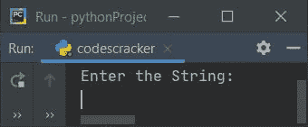
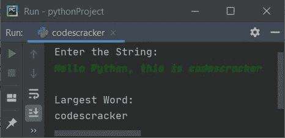
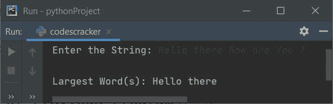
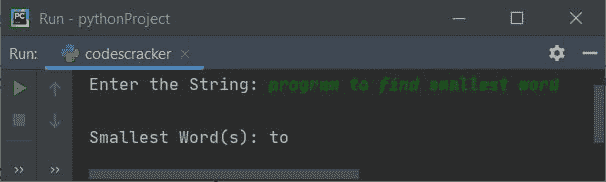
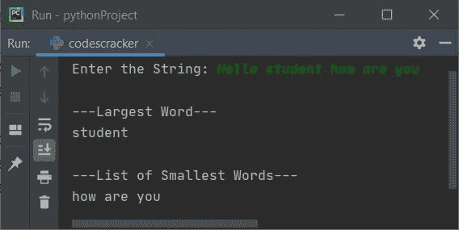
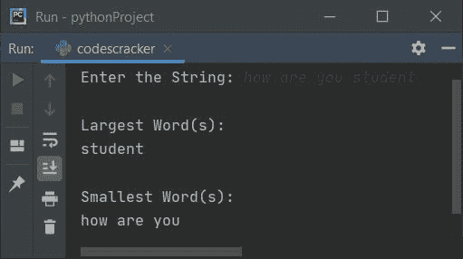

# Python 程序打印字符串中最小和最大的单词

> 原文：<https://codescracker.com/python/program/python-print-smallest-and-biggest-word.htm>

This article deals with some Python programs that find and prints largest and smallest word in a given string. Here are the list of programs covered in this article:

*   查找并打印字符串中最大的单词
*   打印字符串中最小的单词
*   打印字符串中最大和最小的单词

## 打印字符串中最大的单词

问题是，*编写一个 Python 程序，在运行时由用户查找并打印给定字符串中的最大单词。* 下面给出的程序是对这个问题的回答:

```
print("Enter the String: ")
text = input()
text = text.split()
bigWordLen = 0

for wrd in text:
  wrdLen = len(wrd)
  if wrdLen>bigWordLen:
    bigWordLen = wrdLen

print("\nLargest Word: ")
for wrd in text:
  wrdLen = len(wrd)
  if wrdLen==bigWordLen:
    print(wrd)
```

以下是该程序产生的初始输出:



现在提供字符串，说**你好 Python，这是 codescracker** ，按`ENTER`键从给定的字符串中找到并打印出 最大的单词，如下图所示:



#### 先前程序的修改版本

这是前一个程序的修改版本。这里使用的**结束**，使用 **print()** 跳过自动换行符的插入。

```
print(end="Enter the String: ")
text = input()

text = text.split()
bigWordLen = 0

for wrd in text:
  wrdLen = len(wrd)
  if wrdLen>bigWordLen:
    bigWordLen = wrdLen

print("\nLargest Word(s): ", end="")
for wrd in text:
  wrdLen = len(wrd)
  if wrdLen==bigWordLen:
    print(end=wrd +" ")
print()
```

这是用户输入的运行示例，**你好，你好吗**:



## 打印字符串中最小的单词

这个程序查找并打印用户输入的字符串中最小的单词。在这个程序中，我们假设给定字符串中第一个单词的长度是最小的单词。然后进一步比较这个长度和所有其他单词的长度，并决定哪个单词是最小的。让我们看一下这个程序及其示例运行，以便更清楚地了解它。

```
print(end="Enter the String: ")
text = input()

text = text.split()
smallWordLen = len(text[0])

for wrd in text:
  wrdLen = len(wrd)
  if wrdLen<smallWordLen:
    smallWordLen = wrdLen

print("\nSmallest Word(s): ", end="")
for wrd in text:
  wrdLen = len(wrd)
  if wrdLen==smallWordLen:
    print(end=wrd +" ")
print()
```

下面是用户输入的示例，**程序查找最小的单词**:



## 查找字符串中最大和最小的单词

这是两个程序的组合版本。也就是找到并打印一个字符串中最小和最大的单词。

```
print(end="Enter the String: ")
text = input()
text = text.split()
sWrdLen = len(text[0])
bWrdLen = 0

for wrd in text:
  wrdLen = len(wrd)
  if wrdLen<sWrdLen:
    sWrdLen = wrdLen
  if wrdLen>bWrdLen:
    bWrdLen = wrdLen

bWrdCount = 0
bWrdList = []
b = 0
sWrdCount = 0
sWrdList = []
s = 0

for wrd in text:
  wrdLen = len(wrd)
  if wrdLen==bWrdLen:
    bWrdCount = bWrdCount+1
    bWrdList.insert(b, wrd)
    b = b+1
  if wrdLen==sWrdLen:
    sWrdCount = sWrdCount+1
    sWrdList.insert(s, wrd)
    s = s+1

if bWrdCount==1:
  print("\n---Largest Word---")
  print(bWrdList[0], end="")
else:
  print("\n---List of Largest Words---")
  for i in range(bWrdCount):
    print(bWrdList[i], end=" ")
print()
if sWrdCount==1:
  print("\n---Smallest Word---")
  print(sWrdList[0], end="")
else:
  print("\n---List of Smallest Words---")
  for i in range(sWrdCount):
    print(sWrdList[i], end=" ")
print()
```

下面是用户输入的运行示例，**你好，学生，你好吗**:



### 查找字符串中最大/最小单词的最小程序

这是最小的程序，执行与前一个程序相同的任务。

```
print(end="Enter the String: ")
text = input()
print("\nLargest Word(s): ")
print(*[i for i in text.split() if len(i) == max([len(k) for k in text.split()])])
print("\nSmallest Word(s): ")
print(*[i for i in text.split() if len(i) == min([len(k) for k in text.split()])])
```

下面是用户输入运行示例，**你好学生**:



[Python 在线测试](/exam/showtest.php?subid=10)

* * *

* * *