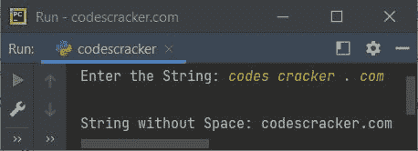
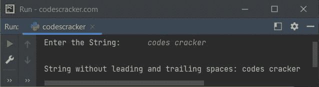
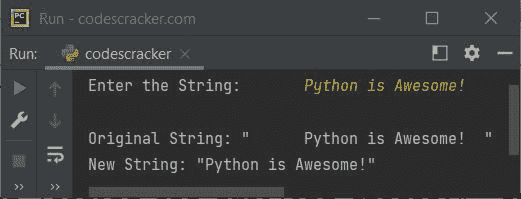

# Python 程序：从字符串中删除空格

> 原文：<https://codescracker.com/python/program/python-program-remove-spaces-from-string.htm>

这篇文章包含了 Python 中的多个程序，这些程序从用户在程序运行时输入的字符串中删除空格。以下是本文涵盖的程序列表:

*   使用 Python 中的内置函数删除给定字符串中的所有空格
*   删除给定字符串中的所有空格，而不使用 Python 中的内置函数
*   在 Python 中删除字符串两端的空格

## Python 使用 replace()方法从字符串中删除空格

问题是，*写一个 Python 程序，去掉一个字符串中的所有空格。该字符串必须由用户 在运行时接收。*下面给出的程序是它的答案:

```
print("Enter the String: ", end="")
str = input()

str = str.replace(" ", "")
print("\nString without Space:", str)
```

下面给出的快照显示了上述程序的示例运行，带有用户输入的**代码破解程序。com** 作为字符串:



## Python 不使用 replace()方法从字符串中删除空格

这个程序做的工作和前一个程序一样。唯一的区别是，这个程序是在没有使用名为 **replace()** 的内置函数的情况下创建的

```
print("Enter the String: ", end="")
str = input()

newstr = ""
for i in range(len(str)):
    ch = str[i]
    if ch != ' ':
        newstr = newstr + ch

str = newstr
print("\nString without Space:", str)
```

这个程序产生与前一个程序相同的输出。

## 在 Python 中删除字符串两端的空格

这是本文的最后一个程序，创建它是为了从给定的字符串中只删除前导和尾随空格。也就是说，程序删除了字符串开头和结尾的空格。基本上，这个程序删除了字符串两端的空格。

```
print("Enter the String: ", end="")
str = input()

index = 0
strLen = len(str)
for i in range(strLen):
    if str[i] == ' ':
        continue
    else:
        index = i
        break
newStr = ""
for i in range(index, strLen):
    newStr = newStr + str[i]
newStrLen = len(newStr)
for i in range(newStrLen-1, 0, -1):
    if newStr[i] == ' ':
        continue
    else:
        index = i
        break
resStr = ""
for i in range(index+1):
    resStr = resStr + newStr[i]

str = resStr
print("\nString without leading and trailing spaces:", str)
```

上面 Python 程序的运行示例，带有包含前导和尾随空格的字符串输入，如下面给出的快照所示:



在新字符串中，删除的前导空格很容易被发现，但不可能发现删除的尾随空格。因此，请替换上述程序中的以下语句:

```
str = resStr
print("\nString without leading and trailing spaces:", str
```

有了这些声明:

```
print("\nOriginal String: \"", str, "\"", sep="")
str = resStr
print("New String: \"", str, "\"", sep="")
```

现在，使用另一个用户输入运行示例，字符串两端都有空格，如下所示:



#### 其他语言的相同程序

*   [Java 从字符串中删除空格](/java/program/java-program-remove-spaces-from-string.htm)
*   从字符串中删除空格
*   [C++ 从字符串中删除空格](/cpp/program/cpp-program-remove-spaces-from-string.htm)

[Python 在线测试](/exam/showtest.php?subid=10)

* * *

* * *