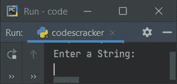
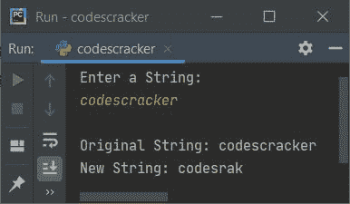
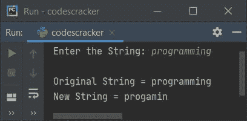

# 从字符串中删除重复字符的 Python 程序

> 原文：<https://codescracker.com/python/program/python-remove-duplicate-characters-from-string.htm>

这篇文章介绍了 Python 中的一个程序，它可以在运行时删除用户给定字符串中的所有重复字符。

## 从字符串中删除重复字符

问题是，*写一个 Python 程序，去掉字符串中的重复字符。该字符串必须由用户*输入。以下是它的答案:

```
print("Enter a String: ")
str = input()

strlist = []
for i in range(len(str)):
    strlist.append(str[i])

newlist = []
j = 0
for i in range(len(strlist)):
    if str[i] not in newlist:
        newlist.insert(j, str[i])
        j = j+1

print("\nOriginal String:", str)

str = ""
str = str.join(newlist)
print("New String:", str)
```

下面是这个 Python 程序产生的初始输出:



现在提供输入，比如说 **codescracker** 作为字符串，按`ENTER`键从给定的字符串 中删除所有重复的字符，并打印新的字符串，如下图所示:



**注意-** 如果任何字符在给定的字符串中出现不止一次，那么所有出现的字符都被认为是重复的，除了第一个字符。

#### 先前程序的修改版本

因为在上面的程序中， **join()** 方法用于将列表转换为字符串。但是在这个程序中，我用自定义代码做了同样的工作。

```
print("Enter the String: ", end="")
str = input()

strlist = list()
for i in range(len(str)):
    strlist.append(str[i])

newlist = list()
j = 0
for i in range(len(strlist)):
    if str[i] not in newlist:
        newlist.insert(j, str[i])
        j = j+1

print("\nOriginal String =", str)

newstr = ""
for c in newlist:
    newstr = newstr + c
print("New String =", newstr)
```

下面是用户输入的示例运行，**编程**:



[Python 在线测试](/exam/showtest.php?subid=10)

* * *

* * *