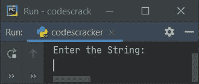
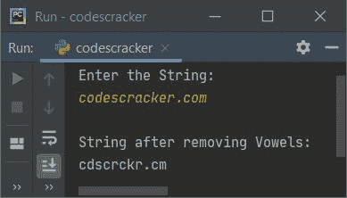
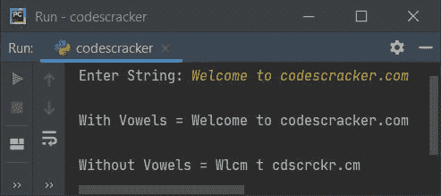
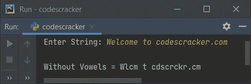

# Python 程序：从字符串中删除元音

> 原文：<https://codescracker.com/python/program/python-program-remove-vowels-from-string.htm>

本文介绍了 Python 中的一些程序，这些程序从用户输入的字符串中删除元音字母。以下是使用的方法列表:

*   使用 **for** 循环删除字符串中的元音
*   使用字符串切片
*   使用 **replace()** 方法

**注-** **a，E，I，O，U，A，E，I，O，U** 都是元音。

## 使用 for 循环删除字符串中的元音

要在 Python 中删除一个字符串中的所有元音，您必须让用户输入一个字符串，然后删除其中的所有元音，如下面给出的程序所示。问题是，**写一个 Python 程序，去掉字符串**中的元音。以下是它的答案:

```
print("Enter the String: ")
text = input()

vowels = ['a', 'e', 'i', 'o', 'u', 'A', 'E', 'I', 'O', 'U']
newtext = ""
textlen = len(text)

for i in range(textlen):
    if text[i] not in vowels:
        newtext = newtext + text[i]

print("\nString after removing Vowels: ")
text = newtext
print(text)
```

下面是这个 Python 程序产生的初始输出:



现在提供输入，比如说**codescracker.com**并按`ENTER`键从这个 字符串中删除所有元音并打印没有元音的新字符串，如下图所示:



上述程序的工作方式是:

*   我已经列出了所有 10 个元音。5 个小写和 5 个大写元音
*   然后初始化字符，一个接一个地到一个新的字符串，比如说 **newtext** ，只有当字符(即将被 初始化)不存在于(或等于)列表中可用的 10 个元音中的任何一个时

**注意-****len()**方法返回作为参数传递的字符串长度。

**注意-****range()**方法返回一系列值。默认情况下，从 0 开始，每次递增 1 。继续，直到作为其参数提供的值。

用户输入**codescracker.com**的上述程序的预演如下:

*   初始值， **text = "codescracker.com"** (用户输入)， **newtext = ""** ， **textlen = 16** (由于给定字符串长度为 16)
*   现在开始执行循环的**，最初是 **i=0** ，由于 0 小于 **textlen**或 **16** ，因此条件评估为真，程序流程进入循环内部**
*   条件(of **if** ) **text[i] not in 元音**或**text[0】not in 元音**或**“c”not in 元音**评估为真，因为**“c”**是在名为 **元音**的列表中不可用的字符。因此，如果的主体和 **newtext + text[i]** 或 **" "+text[0]**或 **"" + "c"** 或 **"c"** 被初始化为 **newtext** ，则程序流程进入此
***   现在 **i** 的值增加，因此 **i=1** ，因为 1 再次小于 16，因此条件 再次评估为真，因此程序流再次进入循环*   这一次， **text[i] not in 元音**或 **text[1] not in 元音**或**“o”not in 元音**评估 为假，因为**“o”**是在名为**元音**的列表中可用的字符。因此程序 流程不会进入**体内***   现在 **i=2** 并且这一次， **if** 的条件，即 **text[i]不在元音**或**text[2】 不在元音**或**【d】不在元音**中被评估为真，因此 **newtext + text[i]** 或 **【c】+【d】**或**【CD】**被初始化为*   这个过程继续，直到 **i** 的值变为 16*   这样，变量 **newtext** 保存用户输入的字符串值，但是没有任何元音*   因此，将其值初始化为**文本**并且**文本**的值被打印为不带元音的字符串**

 **#### 先前程序的修改版本

这是前一个程序的修改版本。这个程序使用**作为**循环的方式是，字符串的每一个 字符被一个接一个地复制到 **c** 中，并且使用 **c** 的值，我已经检查并完成了 的去除元音的工作，就像前面的程序一样。唯一不同的是 **c** 在这里被当作**text【I】**。

```
print("Enter String: ", end="")
text = input()

vowels = ['a', 'e', 'i', 'o', 'u', 'A', 'E', 'I', 'O', 'U']
newtext = ""

for c in text:
    if c not in vowels:
        newtext = newtext + c

print("\nWith Vowels =", text)
text = newtext
print("\nWithout Vowels =", text)
```

下面是它使用字符串输入运行的示例**欢迎来到 codescracker.com**:



**注意-****end =**用于跳过插入换行符使用 **打印 ()**

## 使用字符串切片从字符串中删除元音

这个程序使用字符串切片来完成从字符串中删除元音的工作。这个程序从字符串中删除元音字母，而不使用任何其他(第二)变量。

```
print("Enter String: ", end="")
text = input()

vowels = ['a', 'e', 'i', 'o', 'u', 'A', 'E', 'I', 'O', 'U']
i = 0
for c in text:
    if c in vowels:
        text = text[:i] + text[i+1:]
        i = i-1
    i = i+1

print("\nWithout Vowels =", text)
```

以下是它的示例运行，其字符串输入与之前的示例运行相同:



在上面的程序中，下面的语句:

```
text = text[:i] + text[i+1:]
```

说明除了索引**I<sup>th</sup>T3】处的字符外，索引 **i <sup>th</sup>** 前后的所有字符都被添加并初始化到**文本**中作为其新值。**

**注-** 使用方括号内的索引对进行字符串切片时，即 **[:]** ，<u>包含冒号前的索引号</u> ，冒号后的索引号<u>不包含</u>。

**注-**:**(冒号) **[:]** 前为空表示 0， **:** (冒号) **[:]** 后为空表示字符串的长度值。**

## 使用 replace()从字符串中删除元音

这个程序使用 **replace()** 方法将元音替换为 nothing(" ")。这样一来，所有的元音 都被**一一去掉，那就是空的。让我们看一下节目单**

 **```
print("Enter String: ", end="")
text = input()

vowels = ['a', 'e', 'i', 'o', 'u', 'A', 'E', 'I', 'O', 'U']
for c in text:
    if c in vowels:
        text = text.replace(c, "")

print("\nWithout Vowels =", text)
```

#### 其他语言的相同程序

*   [Java 从字符串中删除元音](/java/program/java-program-delete-vowels-from-string.htm)
*   [C 从字符串中删除元音](/c/program/c-program-delete-vowels-from-string.htm)
*   [C++ 从字符串中删除元音](/cpp/program/cpp-program-delete-vowels-from-string.htm)

[Python 在线测试](/exam/showtest.php?subid=10)

* * *

* * *****