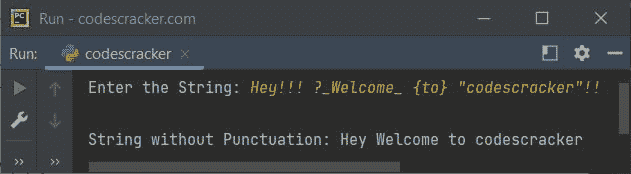

# Python 程序删除字符串中的标点符号

> 原文：<https://codescracker.com/python/program/python-program-remove-punctuations-from-string.htm>

本文介绍了一个用 Python 编写的程序，该程序删除了用户在程序运行时输入的字符串中的所有标点符号。

下面给出的程序处理英语中的 14 种标点符号。所有 14 个标点符号的列表是:

1.  句号()
2.  问号(**？**)
3.  感叹号(**！**)
4.  逗号(**，**)
5.  冒号(**:T1)**
6.  分号(**；**)
7.  破折号( **-** )
8.  连字符( **_** )
9.  括号( **[ ]** )
10.  大括号( **{ }** )
11.  括号( **( )** )
12.  撇号( **'** )
13.  引号( **"** )
14.  省略号(**...**)

问题是，*写一个 Python 程序，去掉给定字符串中的标点符号。*下面给出的节目是 它的回答:

```
print("Enter the String: ", end="")
str = input()

punctuation = ".?!,:;-_[]{}()\'\"..."

for ch in str:
    if ch in punctuation:
        str.replace(ch, "")

print("\nString without Punctuation:", str)
```

下面给出的快照显示了用户输入的上述程序的示例运行**嘿！！！？_ Welcome _ { to }“codescracker”！！** 作弦:



**注-** 在上面给出的程序中， **\'** 指的是 **'** 。其中**\** 是指**的代码。**

 **也要去掉一些其他的字符，比如 **&** 、 **<** 、 **>** 、 **@** 、 **$** 、 **#** 等。然后将所有这些字符初始化为变量 say **标点符号**。其余的代码都是一样的。

[Python 在线测试](/exam/showtest.php?subid=10)

* * *

* * ***