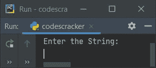
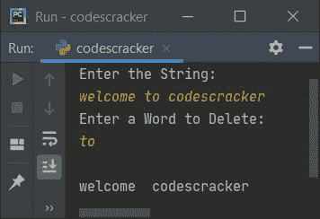
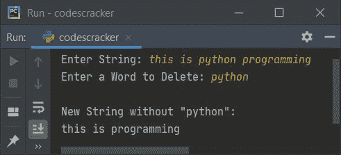
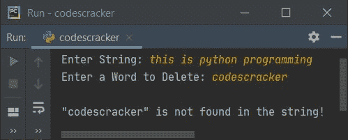
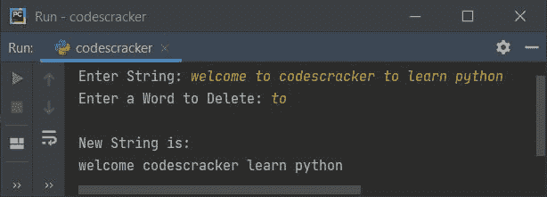
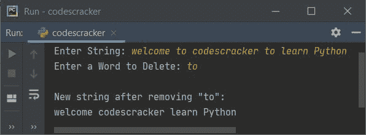

# Python 程序：从句子中删除单词

> 原文：<https://codescracker.com/python/program/python-program-remove-word-from-sentence.htm>

创建本文是为了介绍 Python 中的一些程序，这些程序从字符串(由用户输入)中删除特定的单词(由用户输入)。以下是完成该任务的方法列表:

*   使用 **replace()** 从字符串中删除一个单词
*   使用列表

## 使用 replace()从字符串中删除单词

要在 Python 中从给定的句子或字符串中移除或删除所需的单词，您必须要求用户输入字符串，然后要求输入字符串中存在的单词，以从字符串中删除该单词的所有出现，并打印新字符串，如下面给出的程序所示:

```
print("Enter the String: ")
text = input()

print("Enter a Word to Delete: ")
word = input()

text = text.replace(word, "")

print()
print(text)
```

下面是这个 Python 程序产生的初始输出:



现在提供输入说**欢迎来到 codescracker** 作为字符串，然后**到**作为要删除的单词。以下是输入完全相同的示例输出:



从上面的程序中，下面的代码(语句):

```
text = text.replace(word, "")
```

声明存储在**文本**中的给定字符串中的**字**的值被替换为**(无)。 也就是说，在每一个**字**的值中，没有任何("")被放置。这样，这个词就被删除了**

 **#### 先前程序的修改版本

本程序中使用的**结束**，跳过插入自动换行符使用 **打印 ()** 。 **+** 是用来连接字符串的 。 **\"** 用于在输出上打印 **"** :

```
print("Enter String: ", end="")
text = input()

print("Enter a Word to Delete: ", end="")
word = input()

wordlist = text.split()
if word in wordlist:
    text = text.replace(word, "\b")
    print("\nNew String without \"" +word+ "\":")
    print(text)
else:
    print("\n\"" +word+ "\" is not found in the string!")
```

下面是它的示例运行，字符串输入为**这是 python 编程**，然后单词输入为 **python** :



这是另一个示例，使用相同的字符串输入，但单词输入为 **codescracker** :



**注意-****split()**方法将字符串拆分成单词。

例如，如果存储在**文本**中的字符串是**这是 python 编程**，那么在执行以下代码后:

```
wordlist = text.split()
```

名为**单词列表**的列表是用其值(元素)创建的，如下所示:

```
['this', 'is', 'python', 'programming']
```

**注-****" \ b "**用于在输出上插入退格。这个转义字符用于将即将发生的事情从这里转移到后面一个空格。

## 使用列表从字符串中删除单词

这个程序做同样的工作，即从一个字符串中删除单词，但是使用**列表**。让我们先来看看这个程序:

```
print("Enter String: ", end="")
text = input()
print("Enter a Word to Delete: ", end="")
word = input()

wordlist = text.split()
newtext = [x for x in wordlist if x not in word]

print("\nNew String is:")
for x in newtext:
    print(x, end=" ")
print()
```

下面是它在用户输入下的运行示例，**欢迎来到 codescracker 学习 Python** 作为字符串，**到**作为单词删除:



从上面的程序中，下面的语句:

```
newtext = [x for x in wordlist if x not in word]
```

是以下代码块的简称:

```
newtext = []
for x in wordlist:
    if x not in word:
        newtext.append(x)
```

#### 先前程序的修改版本:

这是前一个程序的修改版本。这个程序中的 **join()** 方法使用的方式是，将 list **newtext** 转换成一个字符串:

```
print("Enter String: ", end="")
text = input()
print("Enter a Word to Delete: ", end="")
word = input()

wordlist = text.split()
if word in wordlist:
    newtext = [x for x in wordlist if x not in word]
    newtext = ' '.join(newtext)
    print("\nNew string after removing \"" +(word)+ "\":")
    print(newtext)
else:
    print("\n\"" +(word)+ "\" is not found in the string!")
```

下面是它的示例运行，用户输入与前一个程序的示例运行相同:



#### 其他语言的相同程序

*   [Java 从句子中删除单词](/java/program/java-program-delete-words-from-sentence.htm)
*   从句子中删除单词
*   [C++从句子中删除单词](/cpp/program/cpp-program-delete-words-from-sentence.htm)

[Python 在线测试](/exam/showtest.php?subid=10)

* * *

* * ***