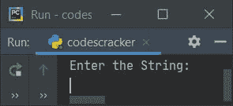
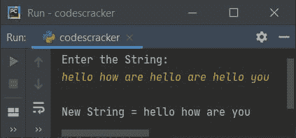
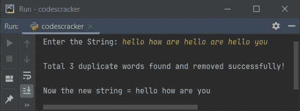

# 从字符串中删除重复单词的 Python 程序

> 原文：<https://codescracker.com/python/program/python-remove-duplicate-words-from-string.htm>

这篇文章讲述了 Python 中的一个程序，它从给定的字符串中删除所有重复的单词。在一个字符串中出现不止一次的所有单词，除了第一次出现的以外，都被认为是重复的。

## 从字符串中删除重复的单词

问题是，*写一个 Python 程序，从一个字符串中删除重复的单词。该字符串必须由用户在运行时输入。*下面是它的回答:

```
print("Enter the String: ")
str = input()

old_word_list = str.split()
new_word_list = []
j = 0

for i in range(len(old_word_list)):
    if old_word_list[i] not in new_word_list:
        new_word_list.insert(j, old_word_list[i])
        j = j+1

new_str = ""
for i in range(len(new_word_list)):
    new_str = new_str + new_word_list[i] + " "

print("\nNew String =", new_str)
```

下面是上述程序产生的初始输出的快照:



现在提供输入，说**hello how are hello are hello you**，并按`ENTER`键从给定的字符串中删除所有 重复的单词，如下面给出的示例输出所示:



#### 先前程序的修改版本

我说这个程序是前一个程序的修改版本，因为这个程序包括一些额外的功能，如根据重复单词的可用性显示消息。也就是说，我在所有三种情况下都包含了三条单独的消息，比如没有找到重复项、只找到一个重复项和找到多个重复单词。让我们看一下这个程序及其示例运行，以便清楚地理解它:

```
print("Enter the String: ", end="")
str = input()

old_word_list = str.split()
new_word_list = []
j = 0
count = 0

for i in range(len(old_word_list)):
    if old_word_list[i] not in new_word_list:
        new_word_list.insert(j, old_word_list[i])
        j = j+1
    else:
        count = count+1

new_str = ""
for i in range(len(new_word_list)):
    new_str = new_str + new_word_list[i] + " "

if count==0:
    print("\nNo duplicate word found!")
elif count==1:
    print("\nA single duplicate word found and removed successfully!")
    print("\nNow the new string =", new_str)
else:
    print("\nTotal", count, "duplicate words found and removed successfully!")
    print("\nNow the new string =", new_str)
```

下面给出的快照显示了上述程序在提供与之前程序的示例运行完全相同的输入后的示例运行:



[Python 在线测试](/exam/showtest.php?subid=10)

* * *

* * *