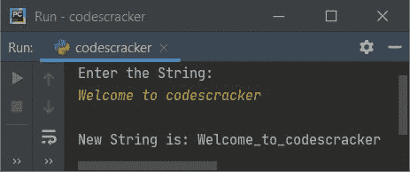

# Python 程序：用连字符替换空格

> 原文：<https://codescracker.com/python/program/python-replace-blank-space-with-hyphen.htm>

这篇文章讲述了 Python 中一个非常简单的程序，这个程序用连字符替换给定字符串中的所有空格。下面是本文涉及的程序列表:

*   用连字符替换空格，不带 **replace()**
*   使用 **replace()** 将空格替换为连字符

## 用连字符替换字符串中的空格

问题是，*编写一个 Python 程序，用连字符替换给定字符串中可用的空格。* 这个问题的答案是下面这个程序给出的:

```
print("Enter the String: ")
str = input()

newstr = ""
for i in range(len(str)):
    if str[i] == ' ':
        newstr = newstr + '_'
    else:
        newstr = newstr + str[i]

print("\nNew String is:", newstr)
```

这是它的样本运行。下面给出的快照是初始输出:


现在提供输入，说 **Welcome to codescracker** 作为字符串，并按`ENTER`键到 用连字符替换所有可用的空格，如下面给出的示例输出所示:



## 使用 Replace()将空格替换为连字符

现在这个程序使用了 **replace()** ，这是 Python 的一个预定义方法，主要接受两个参数。 第一个参数的值被第二个参数的值替换。也可以提供第三个参数 作为替换东西的次数。但是在这里，我们只需要两个参数来用连字符替换所有空格。

```
print("Enter the String: ", end="")
str = input()

str = str.replace(' ', '_')
print("\nBlank spaces replaced with hyphens successfully!")
print("\nThe new string =", str)
```

这是用户输入的运行示例，**这是一个 Python 程序。**:


[Python 在线测试](/exam/showtest.php?subid=10)

* * *

* * *