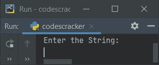
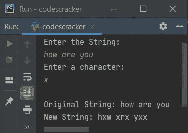
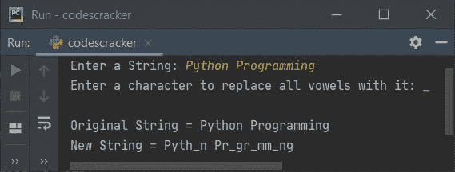

# 用给定字符替换所有元音的 Python 程序

> 原文：<https://codescracker.com/python/program/python-replace-vowels-in-string-by-given-character.htm>

创建本文是为了介绍 Python 中的一些程序，这些程序用给定的字符查找并替换给定字符串中所有可用的元音字母。例如，如果用户输入字符串 **codescracker** 和一个 字符 **x** ，那么来自 **codescracker** 的所有元音都将被替换为 **x** 。 因此，替换元音后的最后一个字符串变成了 **cxdxscrxckxr**

## 用给定字符替换所有元音

问题是，*写一个 Python 程序，用一个字符替换 string 中的所有元音字母。字符串和 字符必须由用户在运行时输入。下面给出的程序是这个问题的答案:*

```
print("Enter the String: ")
str = input()

print("Enter a character: ")
char = input()

newstr = ""
for i in range(len(str)):
    if str[i]=='a' or str[i]=='e' or str[i]=='i' or str[i]=='o' or str[i]=='u':
        newstr = newstr + char
    else:
        newstr = newstr + str[i]

print("\nOriginal String:", str)
print("New String:", newstr)
```

下面是它的运行示例:



现在提供输入，将 **how are you** 作为字符串，将 **x** 作为字符，用 **x** 替换给定字符串中所有可用的元音 ，如下面给出的示例输出所示:



**注-** 上面给出的程序只对小写字符串输入正确。因为我们没有在条件检查部分包含 大写元音。因为我们下面有另一个程序，它是前一个程序的修改版本。

#### 先前程序的修改版本

这个程序使用列表来存储所有的元音字母(包括大写字母)。使用这个列表，我们检查了当前索引处的字符是否在列表(存储元音的地方)中。根据条件，我们已经用给定的字符替换了元音，如下面给出的程序所示:

```
print("Enter a String: ", end="")
str = input()

print("Enter a character to replace all vowels with it: ", end="")
char = input()

newstr = ""
vowels = ['a', 'e', 'i', 'o', 'u', 'A', 'E', 'I', 'O', 'U']

for i in range(len(str)):
    if str[i] in vowels:
        newstr = newstr + char
    else:
        newstr = newstr + str[i]

print("\nOriginal String =", str)
print("New String =", newstr)
```

下面是用户输入的示例运行，使用 **Python 编程**作为字符串，使用 **_** (下划线)作为字符，用它替换所有元音:



[Python 在线测试](/exam/showtest.php?subid=10)

* * *

* * *