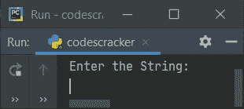
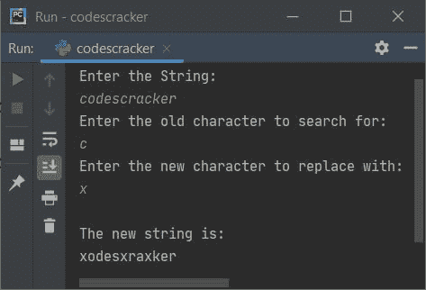
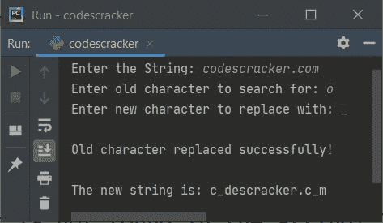
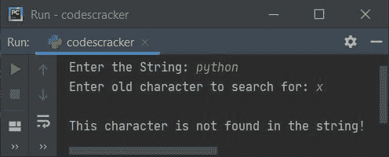

# Python 程序：替换字符串中的字符

> 原文：<https://codescracker.com/python/program/python-replace-character-in-string.htm>

本文介绍了用新字符替换字符串中任何特定字符的 Python 程序。这里是字符串，新旧字符都必须由用户在运行时输入。例如，如果用户输入**编程**作为字符串， **g** 作为要搜索的字符， **x** 作为要替换的字符。因此 新的字符串成为**program inx**。

## 用字符串中的新字符替换旧字符

问题是，*编写一个 Python 程序，替换给定字符串中的任何特定字符。* 下面给出的程序是对这个问题的回答:

```
print("Enter the String: ")
str = input()
print("Enter the old character to search for: ")
oldchar = input()
print("Enter the new character to replace with: ")
newchar = input()

str = str.replace(oldchar, newchar)
print("\nThe new string is: ")
print(str)
```

这是它的样本运行。这是上面的 Python 程序产生的初始输出:



现在提供输入，比如说 **codescracker** 作为字符串， **c** 作为要搜索的字符，**x**T6】作为要替换的字符。以下是提供完全相同的输入后的示例输出:



#### 先前程序的修改版本

这个程序是这样创建的，如果输入的旧字符在给定的字符串中不存在。然后，程序不再要求输入新的字符来替换，而是产生一条消息，说明在给定的字符串中没有找到该字符，并跳过程序的其余执行。而如果找到了这个字符，那么程序的执行方式与前面的程序类似:

```
print("Enter the String: ", end="")
str = input()
print("Enter old character to search for: ", end="")
oldchar = input()

if oldchar not in str:
    print("\nThis character is not found in the string!")
else:
    print("Enter new character to replace with: ", end="")
    newchar = input()
    str = str.replace(oldchar, newchar)
    print("\nOld character replaced successfully!")
    print("\nThe new string is:", str)
```

下面是用户输入的运行示例，**codescracker.com**作为字符串， **o** 作为要搜索的字符， **_** (下划线)作为要替换的字符:



这是另一个运行用户输入的示例，使用 **python** 作为字符串，使用 **x** 作为要搜索的字符。由于 **x** 在给定字符串中不可用，因此程序显示消息并跳过进一步接收用户输入:



[Python 在线测试](/exam/showtest.php?subid=10)

* * *

* * *