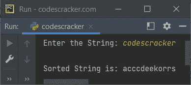
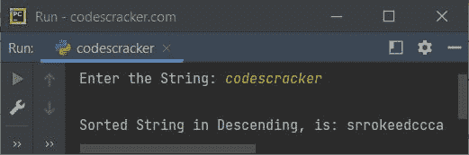
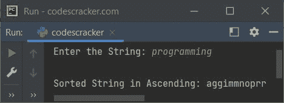
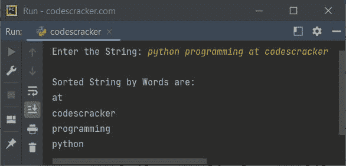

# Python 程序按字母顺序对字符串进行排序

> 原文：<https://codescracker.com/python/program/python-program-sort-string-in-alphabetical-order.htm>

这篇文章包含了 Python 中的多个程序，对用户在程序运行时输入的字符串进行排序。本文涵盖的程序列表:

*   使用 **sorted()** 方法对字符串进行升序排序
*   使用 **sorted()** 方法对字符串进行降序排序
*   不使用 **sorted()** 方法对字符串进行排序
*   按字母顺序按单词对字符串排序

无论是升序还是降序，字符串都会按字母顺序排序。

## Python 按升序对字符串排序

问题是，*写一个 Python 程序，对一个字符串进行升序排序。该字符串必须由用户 在运行时接收。*下面给出的程序是它的答案:

```
print("Enter the String: ", end="")
str = input()

str = sorted(str)
str = ''.join(str)

print("\nSorted String is:", str)
```

下面给出的快照显示了上述 Python 程序的示例运行，用户输入的 **codescracker** 作为字符串对 进行排序，并按字母顺序以升序打印排序后的字符串:



在上面的程序中， **sorted()** 方法按字母顺序对字符串进行排序。但是字符串被排序并且以列表的形式被转换成 。也就是说，如果从上述程序中删除以下语句:

```
str = ''.join(str)
```

那么输出将是:

```
Sorted String is: ['a', 'c', 'c', 'c', 'd', 'e', 'e', 'k', 'o', 'r', 'r', 's']
```

所以在上面的程序中使用了 **join()** 方法，将一个 iterable 的所有项连接成一个 字符串。

## Python 按降序对字符串进行排序

这个程序对给定的字符串进行降序排序。与之前的程序相比，我在这个程序中做的唯一改变是在 **sorted()** 方法中增加了第二个参数。那个论点是`reverse=True`。其余的 所有代码保持不变。

```
print("Enter the String: ", end="")
str = input()

str = sorted(str, reverse=True)
str = ''.join(str)

print("\nSorted String in Descending, is:", str)
```

下面是它的示例运行，用户输入与前一个程序的示例运行相同:



## Python 不使用 sorted()函数对字符串进行排序

下面是 Python 中的另一个程序，用来对给定的字符串进行升序排序，但没有使用 **sorted()** 方法:

```
print("Enter the String: ", end="")
str = input()

strLen = len(str)
for i in range(strLen):
    for j in range(strLen-1):
        if str[j] > str[j+1]:
            str = str[:j] + str[j+1] + str[j] + str[j+2:]

print("\nSorted String in Ascending:", str)
```

用户输入**编程**的上述程序运行示例显示在下面给出的快照中:



由于**字符串**对象在 Python 中是不可变的，因此我们不能通过索引来执行初始化，以 一个字符串。因此我做了切片来完成这项工作。在上面的程序中，下面的语句:

```
str = str[:j] + str[j+1] + str[j] + str[j+2:]
```

基本上说明了索引 **j** 处的字符与索引 **j+1** 处的字符互换。

## Python 按字母顺序对单词进行排序

这是本文的最后一个程序，用来按单词对字符串进行排序，当然是按字母顺序:

```
print("Enter the String: ", end="")
str = input()

words = []
for word in str.split():
    words.append(word.lower())

words.sort()
print("\nSorted String by Words are:")
for word in words:
    print(word)
```

下面是它的示例运行，使用 codescracker 上的用户输入 **python 编程作为字符串按单词排序:**



#### 其他语言的相同程序

*   [Java 按字母顺序排序字符串](/java/program/java-program-sort-string.htm)
*   [C 按字母顺序排列字符串](/c/program/c-program-sort-string.htm)
*   [C++按字母顺序排序字符串](/cpp/program/cpp-program-sort-string.htm)

[Python 在线测试](/exam/showtest.php?subid=10)

* * *

* * *