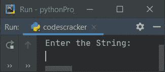
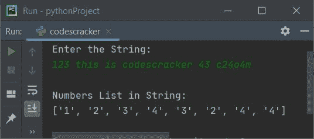
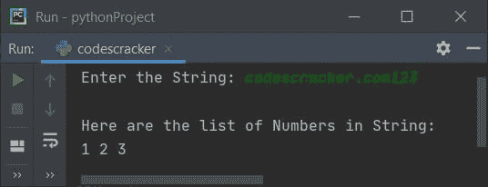
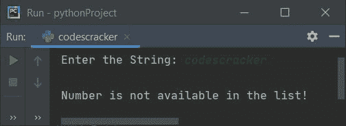

# Python 程序：从字符串中提取数字

> 原文：<https://codescracker.com/python/program/python-extract-numbers-from-string.htm>

本文涵盖了 Python 中的一些程序，这些程序在运行时由用户从给定的字符串中提取所有数字(0-9)。下面是本文涉及的程序列表:

*   使用**为**循环从字符串中提取数字
*   使用循环的**和 **isdigit()** 方法从字符串中提取数字**

## 使用`for`循环从字符串中提取数字

问题是，*编写一个 Python 程序，使用`for`循环*从给定的字符串中提取数字。以下是它的答案:

```
print("Enter the String: ")
text = input()
textLen = len(text)
nums = []
for i in range(textLen):
  if text[i]>='0' and text[i]<='9':
    nums.append(text[i])
print("\nNumbers List in String:")
print(nums)
```

下面是它的运行示例:



现在提供输入，比如说 **123 这是 codescracker 43 c24o4m** 作为字符串，并按`ENTER`键从该字符串中提取所有数字:



## 使用 isdigit()从字符串中提取数字

现在这个程序使用 **isdigit()** 方法来检查当前字符是否是一个数字(0-9) ，然后据此进一步处理。这个程序中的**结尾**用于跳过自动换行的插入。

```
print(end="Enter the String: ")
text = input()
textLen = len(text)
nums = []
chk = 0
for i in range(textLen):
  if text[i].isdigit():
    nums.append(text[i])
    chk = 1
if chk==1:
  print("\nHere are the list of Numbers in String: ")
  numsLen = len(nums)
  for i in range(numsLen):
    print(end=nums[i] + " ")
else:
  print("\nNumber is not available in the list!")
```

下面是用户输入的示例运行， **codescracker.com123** :



下面是另一个使用用户输入运行的示例， **codescracker** (没有数字的字符串):



[Python 在线测试](/exam/showtest.php?subid=10)

* * *

* * *