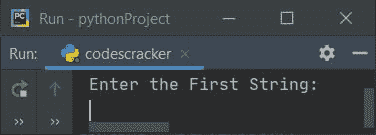
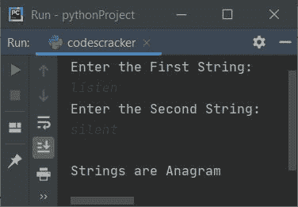
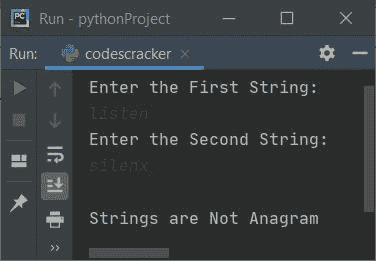
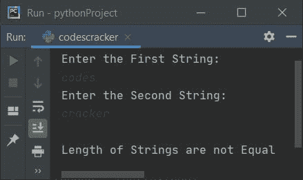
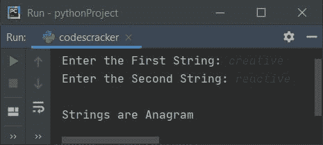
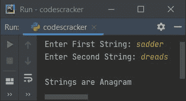

# Python 程序：检查两个字符串是否是变位词

> 原文：<https://codescracker.com/python/program/python-check-anagram-string.htm>

创建本文是为了介绍 Python 中的一些程序，这些程序在运行时由用户接收两个字符串，并检查这两个字符串是否是变位词。以下是程序列表:

*   检查两个字符串是否是变位词，不使用**进行**循环，不对字符串进行排序
*   使用 **sorted()** 函数
*   使用用户定义的函数
*   使用类

在创建这些程序之前，让我们先了解一下字谜。

### 什么是变位字符串？

两个字符串可以称为变位词，当:

*   两者都包含相同数量的字符
*   字符的顺序无关紧要
*   <u>一串可以重新排列成另一串</u>

比如 **abc** 和 **cba** 就是两个变位字符串。同样，**创意**和**无功**都是 也是字谜。即**创意**的人物可以重新排列形成**反应**，反之亦然。

## 使用`for`循环检查两个字符串是否是变位词

这个程序是使用 **for** 循环创建的，用于检查用户输入的两个字符串是否是变位词。 问题是，**在不对字符串排序的情况下，写一个 Python 程序检查变位词与否。**下面是它的回答:

```
print("Enter the First String:")
textOne = str(input())
print("Enter the Second String:")
textTwo = str(input())
found=0
notFound=0
lenOne = len(textOne)
lenTwo = len(textTwo)
if lenOne == lenTwo:
    for i in range(lenOne):
        found = 0
        for j in range(lenOne):
            if textOne[i] == textTwo[j]:
                found = 1
                break
        if found==0:
            notFound = 1
            break
    if notFound==1:
        print("\nStrings are Not Anagram")
    else:
        print("\nStrings are Anagram")
else:
    print("\nLength of Strings are not Equal")
```

下面是它的运行示例:



现在提供两个字符串输入，说**听**为第一，说**沉默**为第二，按`ENTER` 键检查并打印这两个字符串是否是变位词，如下图所示:



下面是另一个例子，用户输入**监听**和 **silenx** 作为第一和第二字符串:



下面是第三个示例运行，用户输入的**代码**和**破解**作为第一个和第二个字符串:



**注意-****str()**方法用于将任何类型的值转换为字符串类型。而 **len()** 方法返回作为其参数传递的字符串长度。

用户输入**听**和**沉默**的上述程序的试运行如下:

*   初始值， **textOne = listen** (用户输入)， **textTwo = silent** (用户输入)， **found = 0**， **notFound = 0**
*   现在使用 **len()** 方法，第一个和第二个字符串的长度被初始化为 **lenOne** 和 T4】lenTwo 变量。所以 **lenOne=6** 和 **lenTwo=6**
*   由于条件(if**)**lenOne = = len two**或 **6 == 6** 评估为真，因此 程序流程进入该 **if** 主体**
*   默认情况下， **range()** 返回一系列值，从 0 开始，每次递增 1。 一直持续到**勒诺-1** ，因为**勒诺**提供了它的自变量
*   因此在第一次执行时 **i** 的值为 0，所以 **i < lenOne** 或 **0 < 6** 评估 为真，因此程序流程进入循环的主体**内**
*   并且 **0** 被初始化为**发现**。现在，循环的另一个**被执行**
*   所以 **j=0** 并且由于 **0** 小于 **lenOne** 的值，因此条件评估为 真，并且程序流程进入循环主体的**内**
*   在这个循环中，我比较了第一个字符串当前索引处的字符和第二个字符串的所有字符。也就是说，如果第一个字符串的字符与第二个字符串的任何字符匹配，那么 **1** 被存储到**发现**并使用**中断**关键字，剩余的**循环的执行**被跳过
*   并且使用 **found==0** 的条件，我们已经检查了程序流是否进入前一个 **if** 的主体 中。也就是说，如果前面的 **if** 的条件评估为真，那么我们必须继续，否则， 初始化 **1** 到 **notFound** 并使用 **break** 关键字，跳过循环的外 T12 的剩余执行
*   这样，我以逐个字符的方式进行了比较，并检查了用户输入的两个字符串是否是变位词
*   由于第一个字符串的每一个字符在第二个字符串中都是可用的，所以如果的条件是**被发现==0** ，那么程序流程永远不会进入**的主体。这样 1 永远不会被初始化为 **not found**变量。并且条件 **notFound==1** 不评估为真，因此 **else**语句被执行**
*   打印出的**字符串是一个变位词**

#### 先前程序的修改版本

该程序使用 **sorted()** 方法对字符串进行排序，并逐字符比较字符串， 检查两个字符串是否为变位词。 **end=** 用于跳过使用 **print()** 插入自动换行符

```
print(end="Enter the First String: ")
textOne = str(input())
print(end="Enter the Second String: ")
textTwo = str(input())
lenOne = len(textOne)
lenTwo = len(textTwo)
notFound=0
if lenOne == lenTwo:
    textOne = sorted(textOne)
    textTwo = sorted(textTwo)
    for i in range(lenOne):
        if textOne[i] != textTwo[i]:
            notFound=1
            break
    if notFound==0:
        print("\nStrings are Anagram")
    else:
        print("\nStrings are Not Anagram")
else:
    print("\nLength of Strings are not Equal")
```

下面是用户输入**创意**和**反应**作为两个字符串运行的示例:



## 使用 sorted()检查变位词字符串

这个程序使用 **sorted()** 方法来做与前一个程序相同的工作。使用 **==** 操作符直接比较用户输入的两个字符串。

```
print("Enter First String: ", end="")
textOne = str(input())
print("Enter Second String: ", end="")
textTwo = str(input())

lenOne = len(textOne)
lenTwo = len(textTwo)

if lenOne == lenTwo:
    if sorted(textOne) == sorted(textTwo):
        print("\nStrings are Anagram")
    else:
        print("\nStrings are Not Anagram")
else:
    print("\nLength of Strings are not Equal")
```

下面是它在用户输入**悲伤**和**恐惧**的情况下运行的示例:



## 使用函数检查变位字符串

这个程序是使用名为 **CheckAnag()** 的用户自定义函数创建的。该函数接收两个字符串 作为其参数，如果两个字符串都是变位词，则返回 1。

```
def CheckAnag(sOne, sTwo):
    if sorted(sOne) == sorted(sTwo):
        return 1

print("Enter First String: ", end="")
textOne = str(input())
print("Enter Second String: ", end="")
textTwo = str(input())

rVal = CheckAnag(textOne, textTwo)
if rVal==1:
        print("\nStrings are Anagram")
else:
    print("\nStrings are Not Anagram")
```

## 使用类检查变位词字符串

这是使用 class 创建的最后一个程序，class 是 Python 的一个面向对象的特性。要访问类的成员函数，需要一个对象。因此一个名为 **obj** 的对象被创建到 **CodesCracker** 类中，以便 使用**点来访问其名为 **CheckAnag()** 的成员函数。)**运算符。

```
class CodesCracker:
    def CheckAnag(self, sOne, sTwo):
        if sorted(sOne) == sorted(sTwo):
            return 1

print("Enter First String: ", end="")
textOne = str(input())
print("Enter Second String: ", end="")
textTwo = str(input())

obj = CodesCracker()
rVal = obj.CheckAnag(textOne, textTwo)

if rVal==1:
        print("\nStrings are Anagram")
else:
    print("\nStrings are Not Anagram")
```

[Python 在线测试](/exam/showtest.php?subid=10)

* * *

* * *