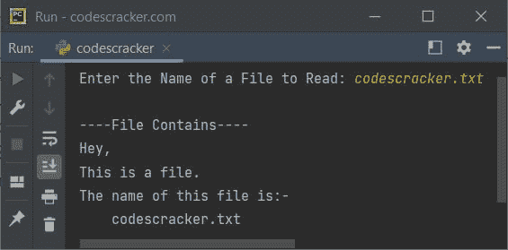
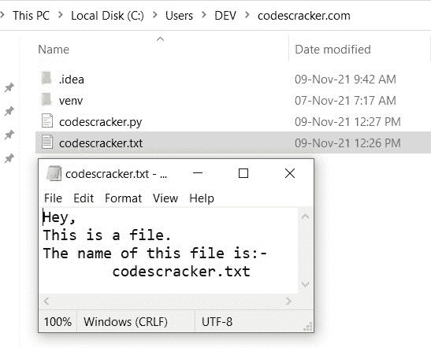

# Python 程序：读取文件

> 原文：<https://codescracker.com/python/program/python-program-read-file.htm>

本文介绍了一个 Python 程序，它读取用户在程序运行时输入的文件。

## 用 Python 读取文件

问题是，*写一个 Python 程序读取一个文件。用户必须在运行时收到文件名。* 下面给出的程序是它的答案:

```
print("Enter the Name of a File to Read: ", end="")
fileName = input()

fileHandle = open(fileName, "r")
content = fileHandle.read()
print("\n----File Contains----")
print(content)
```

下面给出的快照显示了上述 Python 程序的示例运行，用户输入 **codescracker.txt** 作为要读取的文件的 名



文件 **codescracker.txt** 必须在当前目录中可用，该目录中保存了上述 Python 的源代码。在我的例子中，这是当前目录的快照，带有打开的文件:



**注-**[read()方法](/python/python-read-function.htm)用于读取 文件的全部内容。

**注意-**[open()方法](/python/python-open-function.htm)用于打开一个文件。 欲了解详情，请参阅其单独教程。

**注意-** 上述程序中使用的[结束参数](/python/python-end.htm)，使用 [print()](/python/python-print-statement.htm) 跳过一个 自动换行符的插入。

## 用 Python 逐行读取文本文件

这个程序做的工作和前面的程序一样，就是读取一个文件。但是这个程序是以逐行读取文件的方式创建的。也就是说，使用 **readlines()** 方法，将文件的所有行初始化为一个变量，比如列表项或元素的 形式的**行**。

```
print("Enter the Name of a File to Read: ", end="")
fileName = input()

fileHandle = open(fileName, "r")
lines = fileHandle.readlines()
print("\n----File Contains----")
for line in lines:
    print(line, end="")
```

这个程序产生与前一个程序相同的输出。

**注意-**[read lines()方法](/python/python-readlines-function.htm)以列表的形式返回一个 文件的内容，其中每个元素指的是文件的行。关于该方法的详细说明，请参见单独教程中的 。

#### 其他语言的相同程序

*   [Java 读取文件](/java/program/java-program-read-file.htm)
*   [C 读取文件](/c/program/c-program-read-file.htm)
*   [C++ 读取文件](/cpp/program/cpp-program-read-file.htm)

[Python 在线测试](/exam/showtest.php?subid=10)

* * *

* * *