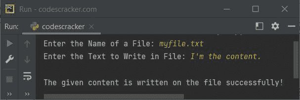
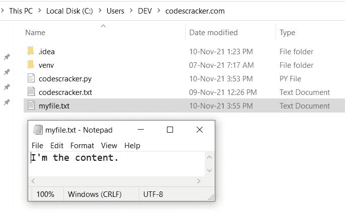
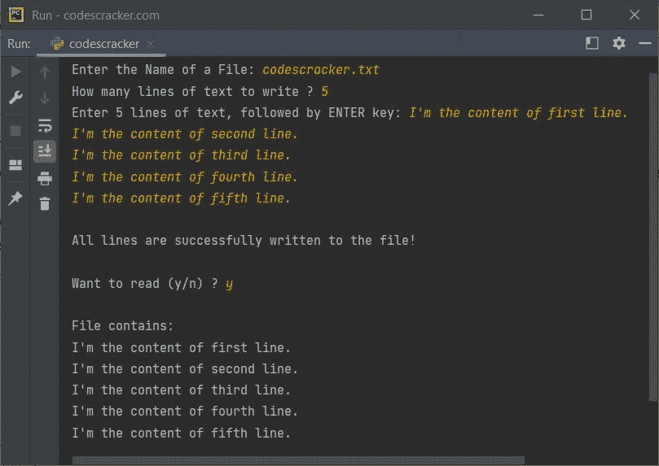

# 要写入文件的 Python 程序

> 原文：<https://codescracker.com/python/program/python-program-write-to-file.htm>

本文介绍了一个 Python 程序，它将用户在程序运行时输入的一些文本或内容写入文件。

## Python 将文本写入文件

问题是，*写一个 Python 程序把一些文本写到一个文件里。文本和文件名，必须是用户在运行时收到的 。*下面给出的程序是它的答案:

```
print("Enter the Name of a File: ", end="")
fileName = input()
print("Enter the Text to Write in File: ", end="")
text = input()

fileHandle = open(fileName, "w")
fileHandle.write(text)
fileHandle.close()
print("\nThe given content is written on the file successfully!")
```

下面给出的快照显示了上述 Python 程序的运行示例，用户输入 **myfile.txt** 作为 文件的名称，内容为 **I。**作为文本写入文件:



在执行了上面的程序之后，使用上面快照中给出的相同的示例运行，如果你打开当前目录，那么一个名为 **myfile.txt** 的文件将会可用，其内容为**我是内容。**写在里面。这里是 当前目录的快照，在我的例子中:



**注意-** 因为在我当前的目录下没有文件 **myfile.txt** 。因此，文件得到了 创建。但是如果该文件可用，那么该文件将被覆盖。

**注意-**[open()方法](/python/python-open-function.htm)打开一个文件，并作为 file 对象返回。

**注意-**[write()方法](/python/python-write-function.htm)用于将内容写入文件。

**注意-**[close()方法](/python/python-close-function.htm)用于从程序中断开文件 的链接，使用它的对象或处理程序，用于打开文件。

## Python 逐行写入文件

创建该程序是为了允许用户将多行文本或内容写入当前目录(保存 Python 程序源代码的目录)中的所需文件。

```
print("Enter the Name of a File: ", end="")
fileName = input()
fileHandle = open(fileName, "w")
print("How many lines of text to write ? ", end="")
noOfLines = int(input())
print("Enter", noOfLines, "lines of text, followed by ENTER key: ", end="")

for i in range(noOfLines):
    text = input()
    fileHandle.write(text)
    fileHandle.write("\n")

fileHandle.close()
print("\nAll lines are successfully written to the file!")

print("\nWant to read (y/n) ? ", end="")
choice = input()
if choice == 'y':
    fileHandle = open(fileName, "r")
    print("\nFile contains:")
    print(fileHandle.read())
    fileHandle.close()
```

上面 Python 程序的运行示例，用户输入 **codescracker.txt** 作为文件名， **5** 作为要写入的文本的总 行；

1.  我是第一线的内容。
2.  我是二线的内容。
3.  我是三线的内容。
4.  我是第四行的内容。
5.  我是五行的内容。

随着五行文本写入文件，最后选择 **y** 作为查看文件的内容，回到 输出屏幕，如下图所示:



**注意-**[read()方法](/python/python-read-function.htm)用于读取 文件的内容。

要详细了解 [Python 文件处理](/python/python-file-io.htm)，请参考其单独的教程。

#### 其他语言的相同程序

*   [Java 写入文件](/java/program/java-program-write-to-file.htm)
*   [C 写入文件](/c/program/c-program-write-file.htm)
*   [C++写入文件](/cpp/program/cpp-program-write-file.htm)

[Python 在线测试](/exam/showtest.php?subid=10)

* * *

* * *