# Python 程序：将文本追加到文件中

> 原文：<https://codescracker.com/python/program/python-append-text-to-file.htm>

在本文中，您将学习并获得使用 Python 程序将一些内容(文本)追加到文件中的代码。以下是程序列表:

*   将文本附加到文件中
*   向文件添加文本并显示文件内容

### 计划前要做的事情

因为下面给出的程序将用户输入的文本(字符串或内容)附加到一个文件中，比如说 **codescracker.txt** 。因此在执行程序之前，我们必须创建一个名为 **codescracker.txt** 的文件，其内容如下:

```
Hello Python,
I'm a File
My Name is codescracker.txt
```

将该文件保存在当前目录中。当前目录是指保存 Python 源代码的目录。也就是说，文件和 Python 程序(向文件追加文本)必须在同一个文件夹中。这是我们保存该文件的文件夹的快照:


这是打开文件的快照， **codescracker.txt** :

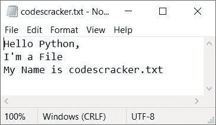

现在让我们创建一个 python 程序，在这个文件的最后添加新内容。

## 用 Python 向文件追加文本

此 Python 程序要求用户输入文件名，然后要求输入文本(一行或多行)以将其附加到给定的文件，如以下程序所示:

```
print("Enter the Name of File: ")
fileName = str(input())
fileHandle = open(fileName, "a")
print("Enter the Text to Append in Given File: ")
while True:
    text = str(input())
    if len(text)>0:
        fileHandle.write("\n")
        fileHandle.write(text)
    else:
        break
fileHandle.close()
```

下面是它的运行示例:

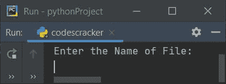

现在输入文件名，比如说 **codescracker.txt** ，然后按`ENTER`。以下是您将看到的输出:

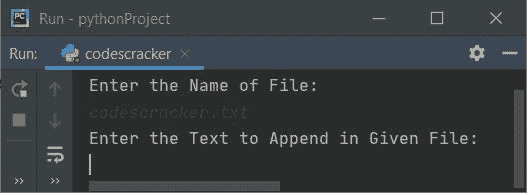

然后输入一些文本(内容)说:

*   这是 first append 的第一行
*   这是 first append 的第二行
*   这是 first append 的第三行

这三行的输入方式是，输入第一行文本，然后按`ENTER`，再次输入 第二行文本，按`ENTER`键，以此类推。最后按下`ENTER`键而不输入任何东西 停止在文件中追加内容。下面是使用完全相同的用户输入运行的示例(如上所示):

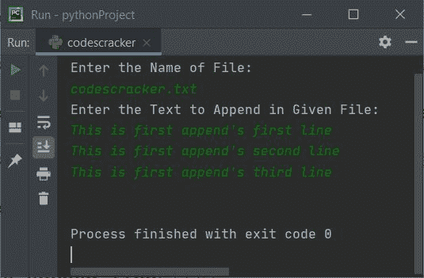

现在，如果您打开同一个文件 **codescracker.txt** ，那么这些内容将被追加(添加)到该文件中。这里 是打开文件的快照， **codescracker.txt** :

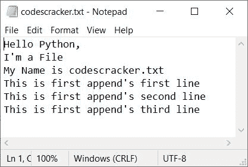

**注-****open()**函数用于打开一个文件。它返回一个文件对象。这需要两个参数。 第一个参数是文件名，第二个参数是文件的打开方式。

**注意-****break**关键字用于(在上述程序中)退出 **while 循环**

**注意-****write()**函数用于使用其对象比如 **fileHandle** 将内容写入文件

**注意-** 不要忘记使用 **close()** 函数关闭文件的对象

## 向文件追加文本并显示文件

这个程序类似于前一个程序，有一个额外的功能。额外的功能是，这个程序将用户输入的内容附加到给定的文件中，然后询问用户是否想看到文件的新内容。

```
print(end="Enter the Name of File: ")
fileName = str(input())
try:
    fileHandle = open(fileName, "r")
    print("This File is Available!")
    fileHandle.close()
    fileHandle = open(fileName, "a")
    print(end="\nEnter Texts to Append: ")
    while True:
        text = str(input())
        if len(text)>0:
            fileHandle.write("\n")
            fileHandle.write(text)
        else:
            break
    fileHandle.close()
    print("Texts Appended to the File Successfully!")
    print(end="Want to see the Content of File (y/n): ")
    ch = input()
    if ch=='y':
        fileHandle = open(fileName, "r")
        for content in fileHandle:
            print(end=content)
    else:
        print("Exiting...")
except IOError:
    try:
        fileHandle = open(fileName, "a")
        print("File Created Successfully!")
        print(end="\nEnter Texts to Append (Add): ")
        while True:
            text = str(input())
            if len(text)>0:
                fileHandle.write(text)
                fileHandle.write("\n")
            else:
                break
        fileHandle.close()
        print("Texts Appended to the File Successfully!")
        print(end="Want to see the Content of File (y/n): ")
        ch = input()
        if ch=='y':
            fileHandle = open(fileName, "r")
            for content in fileHandle:
                print(end=content)
        else:
            print("Exiting...")
    except IOError:
        print("Error Occurred!")
print()
```

现在输入同一个文件的名称，即 **codescracker.txt** ，按`ENTER`。以下是输出:

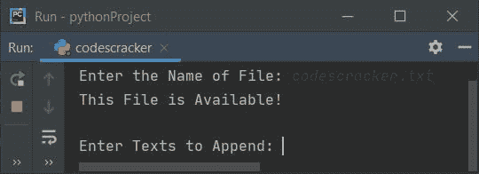

逐一输入以下文本:

*   这是第二个追加的第一行
*   这是 second append 的第二行
*   这是第二个追加的第三行

准确提供这些输入，并按下`ENTER`键，无需键入任何文本。以下是您将看到的输出:

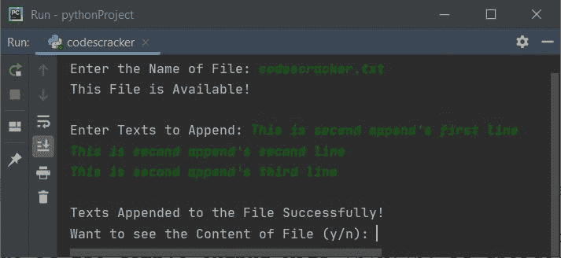

现在输入 **y** ，按`ENTER`键可以看到文件的内容， **codescracker.txt** 。 否则按 **n** 退出程序。以下是选择 **y** 的示例输出:

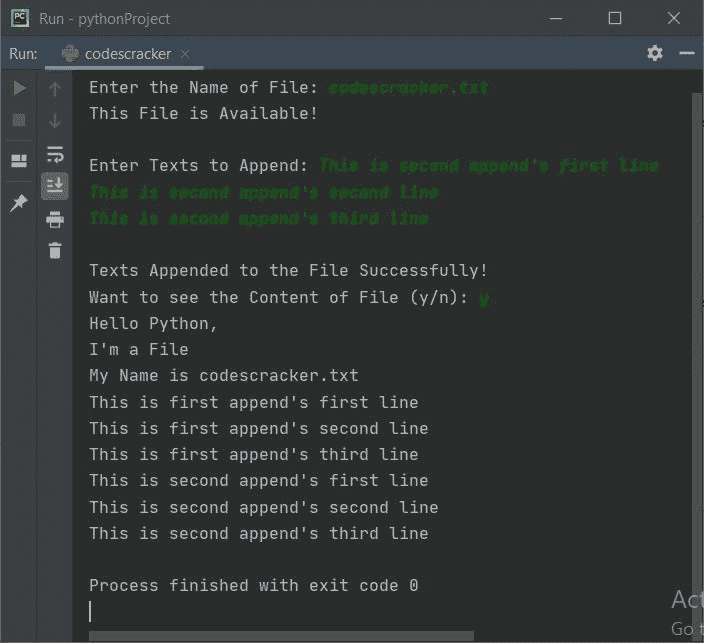

在执行完上面给出的所有内容后，这里是文件， **codescracker.txt** :

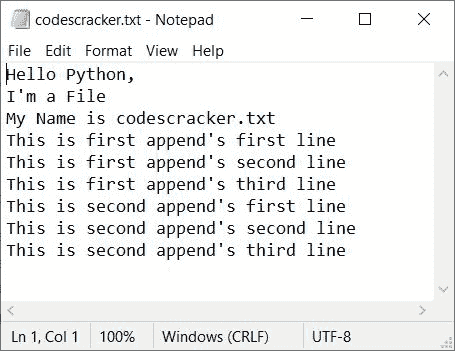

下面是另一个运行的例子，用户输入说**codescracker.html**，这个文件在 当前目录中不存在，有一些内容然后 **y** 作为选择来查看文件的内容:

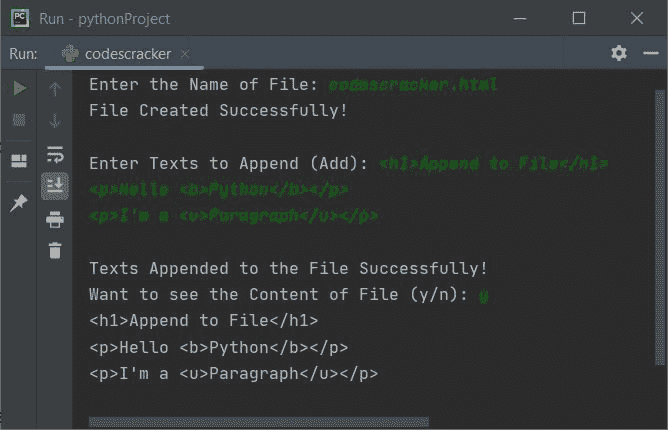

**注-****(追加)文件打开方式打开一个文件。如果文件不存在，则自动创建一个与 同名的新文件。**

 **现在，如果你打开这个新创建的文件，比如说**codescracker.html**，通过之前程序的样本运行，在 的网络浏览器中，比如**谷歌浏览器**，你会看到下面的输出:

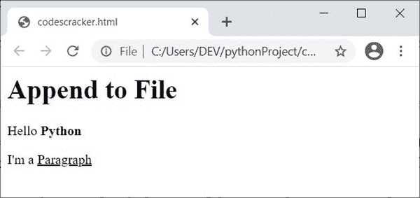

**注意-** 因为文件是 **HTML** 类型，所以产生了这个输出。要了解更多信息， 参考 [HTML 教程](/html/index.htm)以获得更深入的细节。

[Python 在线测试](/exam/showtest.php?subid=10)

* * *

* * ***