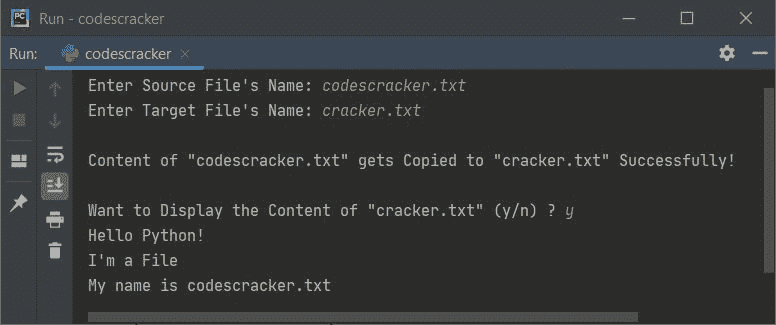

# Python 程序：将一个文件的内容复制到另一个文件

> 原文：<https://codescracker.com/python/program/python-program-copy-files.htm>

创建本文是为了介绍 Python 中的一些程序，这些程序将一个文件的内容复制到另一个文件中。用户必须在运行时输入两个文件的名称。以下是程序列表:

*   不使用 **copyfile()** 方法将一个文件的内容复制到另一个文件
*   使用 **copyfile()** 方法
*   使用带有和**的**作为**关键字**
*   复制文件内容的最短 Python 代码

### 计划前要做的事情

因为下面给出的程序将用户输入的一个文件的内容复制到另一个文件。因此，我们必须在当前目录下创建一个文件。当前目录是指保存将一个文件复制到另一个文件的 Python 源代码的目录。因此，创建一个名为 **codescracker.txt** 的文件，内容如下:

```
Hello Python!
I'm a File
My name is codescracker.txt
```

这是保存文件和 Python 源代码(用于复制文件内容)的文件夹的快照:


下面是打开文件 **codescracker.txt** 的快照:


现在让我们转到将用户输入的文件内容(这里是 codescracker.txt)复制到任何其他文件(也是用户输入的)的程序。

## 用 Python 将一个文件的内容复制到另一个文件

在 Python 中，要将一个文件的内容复制到另一个文件，需要让用户输入两个文件的名称。第一个文件称为源文件，而第二个文件称为目标文件。也就是说，源文件的内容被复制到目标文件，如下面给出的程序所示:

问题是，**编写一个 Python 程序，将用户在运行时输入的一个文件复制到另一个文件中**。以下是它的答案:

```
print("Enter the Name of Source File: ")
sFile = input()
print("Enter the Name of Target File: ")
tFile = input()

fileHandle = open(sFile, "r")
texts = fileHandle.readlines()
fileHandle.close()

fileHandle = open(tFile, "w")
for s in texts:
    fileHandle.write(s)
fileHandle.close()

print("\nFile Copied Successfully!")
```

这是这个 Python 程序产生的初始输出，要求用户输入源文件的名称。源文件是其内容被复制到另一个(目标)文件的文件:


现在提供输入比如说 **codescracker.txt** (新创建的文件)作为源文件的名称，按`ENTER` 键然后输入 **codes.txt** 作为目标文件的名称，再按`ENTER`键将源文件的内容 复制到目标文件。

如果目标文件在当前目录中不存在，则创建一个同名的新文件，并复制源文件的内容。下面是它的示例输出:


在提供了这些输入之后，如示例运行所示。一个名为 **codes.txt** 的文件在 的同一个文件夹中创建，其中保存了源代码(在程序之上)和文件(codescracker.txt)。以下是该文件夹的快照:


正如您所看到的，创建了一个与输入的目标文件名同名的新文件。如果你打开 **codes.txt** 文件，它包含的内容与 **codescracker.txt** 文件相同。

#### 先前程序的修改版本

这是前一个程序的修改版本。这个程序使用 **try-except** 来打印错误信息，当 发生任何奇怪的事情，比如用户输入的源文件不存在。

**end=** 用于跳过使用 **print()** 插入新行。如果用户输入 **y** 作为选择，该程序也显示复制的内容。

```
print("Enter Source File's Name: ", end="")
sfile = input()

try:
    filehandle = open(sfile, "r")

    print("Enter Target File's Name: ", end="")
    tfile = input()
    texts = filehandle.readlines()
    filehandle.close()

    try:
        filehandle = open(tfile, "w")

        for s in texts:
            filehandle.write(s)
        filehandle.close()

        print("\nContent of \"" +sfile+ "\" gets Copied to \"" +tfile+ "\" Successfully!")
        print("\nWant to Display the Content of \"" +tfile+ "\" (y/n) ? ", end="")
        chk = input()
        if chk.lower()=='y':
            try:
                filehandle = open(tfile, "r")
                contents = filehandle.readlines()
                for s in contents:
                    print(s, end="")
                filehandle.close()
                print()
            except IOError:
                print("\nError occurred while opening the file!")

    except IOError:
        print("\nError occurred while opening/creating the file!")

except IOError:
    print("\nThe file doesn't exist!")
```

下面是用户输入的运行示例， **codescracker.txt** 作为源文件名， **cracker.txt** 作为目标文件的 名， **y** 作为输入查看目标文件的复制内容:



**注意-** 如果你打开这个文件夹，你会看到另一个名为 **cracker.txt** 的新文件也有相同的内容。

在上面的程序中，如果语句:

```
filehandle = open(sfile, "r")
```

作为第一条语句写在 **try** 的主体内，当文件不存在时引发一个错误，然后 执行它的对应语句，即除之外的**语句。**

## 使用 shutil 的 Copy File()复制文件

这个程序使用 **copyfile()** 方法将一个文件的内容复制到另一个文件中。但是在使用 **copyfile()** 方法之前，我们必须从 **shutil** 模块导入 **copyfile** ，如下面给出的程序所示:

```
from shutil import copyfile

print("Enter Source File's Name: ", end="")
sfile = input()
print("Enter Target File's Name: ", end="")
tfile = input()

copyfile(sfile, tfile)
print("\nContent of \"" +sfile+ "\" gets Copied to \"" +tfile+ "\" Successfully!")

print("\nWant to Display the Content of \"" +tfile+ "\" (y/n) ? ", end="")
chk = input()

if chk.lower()=='y':
    filehandle = open(tfile, "r")
    print(filehandle.read())
    filehandle.close()
```

这个程序的工作方式与前面的程序类似。上面的程序也可以通过替换下面两条语句来创建:

```
from shutil import copyfile
copyfile(sfile, tfile)
```

随着

```
import shutil
shutil.copyfile(sfile, tfile)
```

## 使用 with 和 as 关键字复制文件

这个程序使用带有和**的**作为**关键字来做同样的工作，将一个文件的内容复制到另一个文件。**

```
print("Enter Name of Source and Target File: ", end="")
sfile = input()
tfile = input()

with open(sfile, "r") as shandle:
    with open(tfile, "w") as thandle:
        for line in shandle:
            thandle.write(line)

shandle.close()
thandle.close()

print("\nFile Copied!")
print("\nWant to Display the Content (y/n) ? ", end="")
chk = input()
if chk.lower()=='y':
    with open(tfile, "r") as fhandle:
        for line in fhandle:
            print(line, end="")
    fhandle.close()
    print()
```

下面是用户输入的示例运行， **codescracker.txt** (源文件的名称)， **file.txt** (目标文件的名称)，以及 **y** (选择查看内容):


## 复制文件内容的最短 Python 代码

这是用用户输入复制文件内容的最短的 Python 代码。

```
sfile = input()
tfile = input()

with open(sfile, "r") as shandle:
    with open(tfile, "w") as thandle:
        for line in shandle:
            thandle.write(line)
```

#### 其他语言的相同程序

*   [Java 复制文件](/java/program/java-program-copy-file.htm)
*   [C 复制文件](/c/program/c-program-copy-file.htm)
*   [C++复制文件](/cpp/program/cpp-program-copy-file.htm)

[Python 在线测试](/exam/showtest.php?subid=10)

* * *

* * *