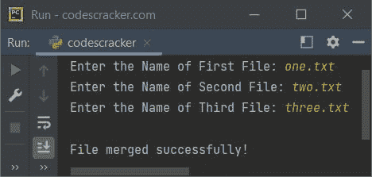

# Python 程序合并两个文件

> 原文：<https://codescracker.com/python/program/python-program-merge-two-files.htm>

使用 Python 程序将两个文件的内容合并到第三个文件中。然后，首先我们需要在当前目录下创建两个文件，这个目录就是保存 Python 源代码的目录。

因此，让我们创建两个文件，即 **one.txt** 和 **two.txt** ，其中包含一些内容。以及名为 **three.txt** 的第三个文件 ，包含或不包含任何内容。下面是当前目录的快照，连同所有这些 打开的三个文件:


现在让我们创建程序，将两个文本文件的内容合并到第三个文件中。创建第三个文件不是强制性的，因为当使用 **w** 模式写入内容时，如果 不可用，文件会自动创建。

## 用 Python 将两个文件合并成第三个文件

问题是，*写一个 Python 程序，把两个文件的内容合并成第三个文件。所有的 三个文件的名字必须在程序运行时被用户接收。*这个问题的答案，是下面给出的程序:

```
print("Enter the Name of First File: ", end="")
fileOne = input()
print("Enter the Name of Second File: ", end="")
fileTwo = input()
print("Enter the Name of Third File: ", end="")
fileThree = input()

content = ""
fh = open(fileOne, "r")
for line in fh:
    content = content + line + '\n'
fh.close()

fh = open(fileTwo, "r")
for line in fh:
    content = content + line + '\n'
fh.close()

fh = open(fileThree, "w")
fh.write(content)

print("\nFile merged successfully!")
```

下面给出的快照显示了上述程序的示例运行，用户输入 **one.txt** 和**two . txt**T6】作为第一个和第二个文件的名称，其内容将合并到名为 **three.txt** 的第三个文件中，用户也输入 作为第三个文件的名称:



以下是在执行上述程序后，使用快照中显示的示例运行的三个文件的新快照:


**注意-** 上述程序中使用的[结束参数](/python/python-end.htm)，以某种方式跳过自动 插入换行符。

**注意-** 用 **a** 代替 **w** 模式，这样第三个文件之前的内容不会被 删除或覆盖。

现在的问题是，如果用户输入的文件名在目录中不存在怎么办？
因此在那种情况下，将 [open()方法](/python/python-open-function.htm)，即打开一个文件，放入 **try** 块，这样就可以**捕捉**名为 **FileNotFoundError** 的异常。

下面是上述程序的修改版本，它处理当前目录中没有的文件名:

```
print("Enter the Name of First File: ", end="")
fileOne = input()
try:
    fhOne = open(fileOne, "r")
    print("Enter the Name of Second File: ", end="")
    fileTwo = input()
    try:
        fhTwo = open(fileTwo, "r")
        print("Enter the Name of Third File: ", end="")
        fileThree = input()

        content = ""
        for line in fhOne:
            content = content + line + '\n'
        for line in fhTwo:
            content = content + line + '\n'
        fhOne.close()
        fhTwo.close()

        fh = open(fileThree, "w")
        fh.write(content)
        print("\nFile merged successfully!")

    except FileNotFoundError:
        print("\nFile not found!")
except FileNotFoundError:
    print("\nFile not found!")
```

要详细了解[文件处理](/python/python-file-io.htm)，请参考其单独的教程。

#### 其他语言的相同程序

*   [Java 合并两个文件](/java/program/java-program-merge-two-files.htm)
*   [C 合并两个文件](/c/program/c-program-merge-two-files.htm)
*   [C++合并两个文件](/cpp/program/cpp-program-merge-two-files.htm)

[Python 在线测试](/exam/showtest.php?subid=10)

* * *

* * *