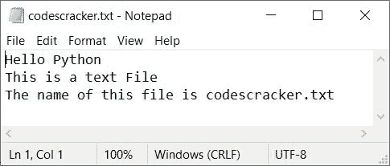

# Python 程序：统计文本文件中的元音，行，字符

> 原文：<https://codescracker.com/python/program/python-count-characters-in-text-file.htm>

本文涵盖了 Python 中许多与字符计数相关的程序，如元音、辅音、换行符、空格等。在运行时由用户在给定或输入的文本文件中。下面是本文涉及的程序列表:

*   统计文本文件中的元音
*   计算文本文件中的辅音
*   计算文本文件中的新行
*   计算文本文件中的空格数
*   统计文本文件中的全部字符

在进入程序之前，让我们做一些重要的事情来实现和执行基于文本文件的程序。

### 计划前要做的事情

因为下面给出的程序是用来计算文本文件中的字符数的。因此，首先我们必须创建一个文本文件，比如说 **codescracker.txt** ，其中包含一些内容:

```
Hello Python
This is a text File
The name of this file is codescracker.txt
```

将该文件保存在当前目录中。当前目录是保存计算该文件字符数的 Python 代码的目录。以下是保存文件 **codescracker.txt** 的文件夹的快照:


下面是打开文件 **codescracker.txt** 的快照:



现在让我们创建一些 Python 程序来完成像计算字符、元音、空格等任务。这个文本文件的。

## 统计文本文件中的元音

问题是，**写一个 Python 程序来计算文件**中存在的元音数。下面给出的程序是这个问题的答案:

```
print("Enter the Name of File: ")
fileName = str(input())
fileHandle = open(fileName, "r")
tot = 0
vowels = ['a', 'e', 'i', 'o', 'u', 'A', 'E', 'I', 'O', 'U']

for char in fileHandle.read():
  if char in vowels:
    tot = tot+1
fileHandle.close()

print("\nTotal Vowels are:")
print(tot)
```

下面是它的运行示例:


现在输入文件名，比如说 **codescracker.txt** (本文前面新创建的文件)，并按 `ENTER`来计算和打印该文件内容中出现的元音总数，如下图所示:


#### 先前程序的修改版本

让我们修改前面的程序。这个程序使用 **end** 来跳过自动换行的打印。 **try-except** 块用于异常处理。

```
print(end="Enter the Name of File: ")
fileName = str(input())
try:
  fileHandle = open(fileName, "r")
  tot = 0
  vowels = ['a', 'e', 'i', 'o', 'u', 'A', 'E', 'I', 'O', 'U']

  for char in fileHandle.read():
    if char in vowels:
      tot = tot+1
  fileHandle.close()

  if tot>1:
    print("\nThere are " + str(tot) + " Vowels available in the File")
  elif tot==1:
    print("\nThere is only 1 Vowel available in the File")
  else:
    print("\nThere is no any Vowel available in the File!")
except IOError:
  print("\nError Occurred!")
  print("Either File doesn't Exist or Permission is not Allowed!")
```

以下是使用相同的用户输入运行的示例，比如说 **codescracker.txt** 作为文件名:


下面是另一个使用用户输入运行的示例，比如说 **temp.txt** (一个不存在的文件):


## 计算文本文件中的辅音

问题是，**用 Python 写一个程序，计算文本文件中可用的辅音总数。**下面是它的回答:

```
print(end="Enter the Name of File: ")
fileName = str(input())
try:
  fileHandle = open(fileName, "r")
  tot = 0
  vowels = ['a', 'e', 'i', 'o', 'u', 'A', 'E', 'I', 'O', 'U']

  for char in fileHandle.read():
    if char>='a' and char<='z':
      if char not in vowels:
        tot = tot+1
    elif char>='A' and char<='Z':
      if char not in vowels:
        tot = tot+1

  fileHandle.close()

  if tot>1:
    print("\nThere are " + str(tot) + " Consonants available in the File")
  elif tot==1:
    print("\nThere is only 1 Consonant available in the File")
  else:
    print("\nThere is no any Consonant available in the File!")
except IOError:
  print("\nError Occurred!")
```

以下是它的运行示例，具有相同的文件名，如 **codescracker.txt** :


这个程序类似于前面的程序。唯一的区别在于逻辑代码，我们更改了以下代码:

```
if char in vowels:
  tot = tot+1
```

下面给出了代码块:

```
if char>='a' and char<='z':
  if char not in vowels:
    tot = tot+1
elif char>='A' and char<='Z':
  if char not in vowels:
    tot = tot+1
```

## 计算文本文件中的新行

要计算文本文件中新行的数量，请使用以下 Python 程序:

```
print(end="Enter the Name of File: ")
fileName = str(input())
try:
  fileHandle = open(fileName, "r")
  tot = 0

  for char in fileHandle.read():
    if char=='\n':
      tot = tot+1
  fileHandle.close()

  if tot>1:
    print("\nThere are " + str(tot) + " New Lines available in the File")
  elif tot==1:
    print("\nThere is only 1 New Line available in the File")
  else:
    print("\nThere is no any New Line available in the File!")
except IOError:
  print("\nError Occurred!")
```

下面是它的示例运行，文件名与前面创建的文件名相同:


这个程序与在文本文件中计算元音的程序的唯一区别是，我们改变了下面的代码块:

```
if char in vowels:
  tot = tot+1
```

下面给出了代码块:

```
if char=='\n':
  tot = tot+1
```

## 计算文本文件中的空格数

这个程序计算用户在运行时输入的文本文件中可用空格的总数。

```
print(end="Enter the Name of File: ")
fileName = str(input())
try:
  fileHandle = open(fileName, "r")
  tot = 0

  for char in fileHandle.read():
    if char==' ':
      tot = tot+1
  fileHandle.close()

  if tot>1:
    print("\nThere are " + str(tot) + " Blank spaces available in the File")
  elif tot==1:
    print("\nThere is only 1 Blank space available in the File")
  else:
    print("\nThere is no any Blank space available in the File!")
except IOError:
  print("\nError Occurred!")
```

下面给出的快照显示了这个程序的示例运行，同样使用了相同的文件名， **codescracker.txt** :


## 计算文本文件中的字符总数

这是本文的最后一个程序。创建这个程序是为了计算一个文本文件中的所有字符或字符总数。

```
print(end="Enter the Name of File: ")
fileName = str(input())
try:
  fileHandle = open(fileName, "r")
  tot = 0

  for char in fileHandle.read():
    if char:
      tot = tot+1
  fileHandle.close()

  if tot>1:
    print("\nThere are " + str(tot) + " Characters available in the File")
  elif tot==1:
    print("\nThere is only 1 Character available in the File")
  else:
    print("\nThe File is empty!")
except IOError:
  print("\nError Occurred!")
```

下面是它的运行示例:


**注-** 出 **74 个**字，有 **21 个**元音、 **39 个**辅音、 **11 个**空格、 **2 个**新行和 **1 个**点(。)

[Python 在线测试](/exam/showtest.php?subid=10)

* * *

* * *