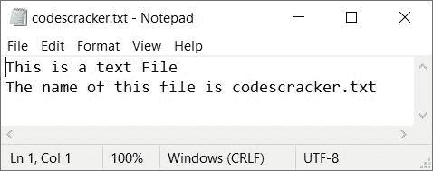
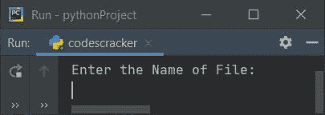
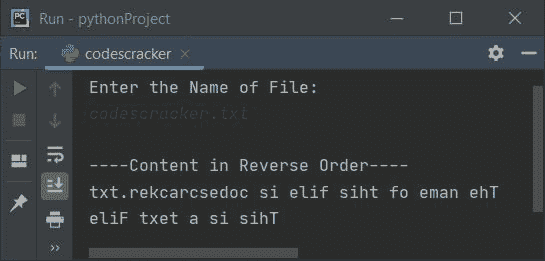
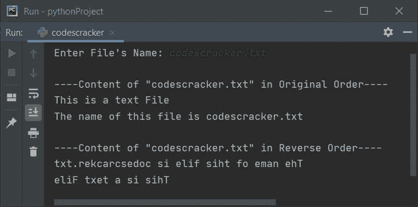
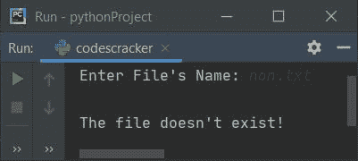

# Python 程序：以逆序打印文件内容

> 原文：<https://codescracker.com/python/program/python-print-file-content-in-reverse.htm>

创建本文是为了介绍 Python 中的一些程序，这些程序以逆序打印文件内容(由用户在运行时输入)。例如，如果一个文件说 *abc.txt* 包含:

```
Hello,
This is Python
```

如果用户输入文件名作为输入，在执行下面给出的程序后，说 **abc.txt** 。 然后这个文件的内容以相反的顺序输出。那看起来像:

```
nohtyP si sihT
,olleH
```

**条件** -文件和程序的源代码必须保存在同一个文件夹中(当前目录)。

### 计划前要做的事情

因为下面给出的程序是用来逆序打印文件内容(由用户输入)的。因此，我们必须创建一个包含一些内容的文件，比如说 **codescracker.txt** ，使用下面给出的 Python 程序以相反的顺序打印这个 文件的内容。创建包含以下内容的文件:

```
This is a text File
The name of this file is codescracker.txt
```

将文件名为 **codescracker.txt** 的文件保存在当前目录下(保存 python 程序 逆序打印文件内容的目录)。下面是打开文件的快照， *codescracker.txt* :



现在让我们继续，创建一个 Python 程序来读取这个文件的内容，并以相反的顺序打印。

## 以逆序打印文件内容

问题是，*编写一个 Python 程序，以逆序打印文件内容。*即将播出的节目是对这个问题的回答:

```
print("Enter the Name of File: ")
fileName = input()

fileHandle = open(fileName, "r")
fileContent = ""
for content in fileHandle:
  fileContent = fileContent+content

print("\n----Content in Reverse Order----")
fileContent = fileContent[::-1]
print(fileContent)
```

以下是该程序示例运行的初始输出:



现在输入新创建文件的名称，按`ENTER`键读取文件，并按相反的顺序打印其内容 ，如下图所示:



#### 先前程序的修改版本

如果用户输入了一个当前目录中不存在的文件，该怎么办？
如果程序无法访问用户输入的文件怎么办？如果出现这两个问题，那么我们有另一个程序，这是以前程序的修改版本。

这个程序使用 **try-except** 块来处理在用 文件操作时发生的这些错误。让我们看看下面给出的程序及其运行示例，以便更清楚地了解它。

```
print(end="Enter File's Name: ")
fname = input()

try:
  fhand = open(fname, "r")

  fcont = ""
  for cont in fhand:
    fcont = fcont + cont

  print("\n----Content of \"" +str(fname)+ "\" in Original Order----")
  print(fcont)
  print("\n----Content of \"" +str(fname)+ "\" in Reverse Order----")
  fcont = fcont[::-1]
  print(fcont)

except IOError:
  print("\nThe file doesn't exist!")
```

下面是它的示例运行，用户输入与前面的程序相同:



下面是另一个使用用户输入 **non.txt** (不存在的文件)运行的示例:



由于文件 **non.txt** 在当前目录中不存在，因此程序流程转到 到**除了**块并抛出一个错误消息说**文件不存在！**。你也可以根据需要修改程序。

[Python 在线测试](/exam/showtest.php?subid=10)

* * *

* * *